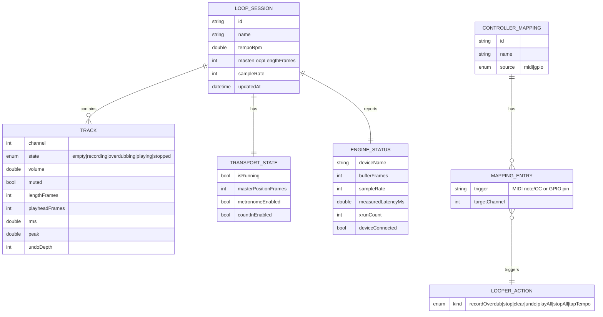

## ✨ Flutter Desktop Loopstation with Native Audio Engine — Extensive

> Scope decisions locked with the user during planning:
>
> - **Plan scope:** Software loopstation first — Flutter UI + native (miniaudio) audio engine via Dart FFI. Standard MIDI pedal support now; bespoke hardware (firmware/wiring) planned separately later.
> - **Hardware architecture:** Support *both* a divided system (desktop + MIDI/USB foot pedal) and a unified system (Raspberry Pi + GPIO pedals) behind one abstract control layer.
> - **Audio engine:** [miniaudio](https://miniaud.io) (single-header C), bound via Dart FFI.
> - **Pedal protocol:** Standard class-compliant USB-MIDI.

## Overview

Build **Loopy**, a cross-platform desktop loopstation modeled on Ed Sheeran's original *Chewie 2*. The app records, overdubs, loops, and mixes multiple audio tracks in real time through a professional external audio interface, with a Chewie-2-style multi-channel track grid on the primary screen and a full-screen waveform visualizer on a second screen.

The non-negotiable constraint is **ultra-low, jitter-free audio latency**. Flutter/Dart alone cannot meet this — a garbage-collected runtime must never touch the audio callback thread. The architecture therefore splits cleanly:

- **A native C audio engine** (miniaudio) owns the entire real-time signal path on the OS audio callback thread. No allocation, no locks, no GC, no syscalls in the callback.
- **Flutter** is the UI + orchestration layer. It controls the engine through a lock-free command queue and reads engine state (playheads, levels, waveform peaks) through lock-free published snapshots — all over Dart FFI.

This plan delivers the software loopstation across **macOS, Windows, and Linux**, with a hardware-control abstraction that drives the looper from either a MIDI foot pedal (divided) or Raspberry Pi GPIO (unified).

## Problem Statement

A live looping performer needs to layer parts (vocals, guitar, percussion) hands-free, in time, with imperceptible latency, while seeing what's looping. Existing options fall short for this build:

1. **General Flutter audio plugins** (`just_audio`, `audioplayers`) are playback-oriented. They offer no low-latency duplex (simultaneous in/out) capture+playback, no sample-accurate looping, and no overdub mixing.
2. **Pure-Dart audio** is disqualified outright: Dart's GC introduces unbounded pauses; audio callbacks demand bounded, sub-millisecond execution. Any allocation or lock on that thread causes dropouts (xruns).
3. **Multi-screen** live visualizers require driving a second window/display — historically weak in Flutter desktop and still maturing.
4. **Hardware control** must work both as a desktop+pedal rig and as a self-contained Raspberry Pi appliance, without forking the application logic.

The core engineering problem: **achieve a deterministic, real-time audio path in a Flutter app, expose it safely to Dart, and build a performant live UI on top — on three desktop OSes and an embedded target.**

## Proposed Solution

A VGV layered monorepo where the **data layer's lowest tier is a native FFI plugin** wrapping a hand-written miniaudio looping engine. The looper domain is orchestrated by repositories, driven by Blocs/Cubits, and rendered across two windows.

### Real-time boundary (the heart of the design)

```text
        ┌────────────────────────── Flutter (UI isolate) ──────────────────────────┐
        │  Presentation ► Bloc ► Repository ► loopy_engine (Dart FFI API)           │
        └───────────────┬───────────────────────────────────────────▲──────────────┘
            commands     │ (lock-free SPSC command ring)              │ snapshots (lock-free)
                         ▼                                            │
        ┌───────────────────────────── Native engine (C) ───────────────────────────┐
        │  control thread: drains command ring, manages tracks, computes waveforms    │
        │  ───────────────────────────────────────────────────────────────────────   │
        │  AUDIO CALLBACK THREAD (miniaudio, real-time):                              │
        │    capture in ─► active track buffer (record/overdub sum)                   │
        │    mix all playing track buffers ─► device out                              │
        │    publish playheads / RMS / peak (atomic stores) — NO malloc / NO locks    │
        └────────────────────────────────────────────────────────────────────────────┘
```

- **Commands** (record, overdub, stop, clear, set volume, set tempo) are enqueued by Dart into a single-producer/single-consumer lock-free ring; the engine drains them at the top of each callback. Parameters that must be sample-accurate are applied at the next loop boundary.
- **State** (per-track playhead, master loop position, RMS/peak levels) is published via atomic stores and read by Dart on a render-rate timer (~60 Hz). **Waveform peak data** is computed on the engine's non-RT control thread and double-buffered for lock-free reads.
- Dart **never** dereferences engine memory from the audio thread and never blocks it.

## Technical Approach

### Architecture

VGV four-layer layered monorepo. The only deviation from the canonical "pure-Dart data packages" rule is that the lowest data package is necessarily a **Flutter FFI plugin** (it bundles native platform code) — which the VGV data-layer definition explicitly allows ("platform plugins").

```text
loopy/
├── native/
│   └── loopy_engine_core/                  # Hand-written C engine (miniaudio vendored)
│       ├── src/
│       │   ├── engine.c / engine.h         # device lifecycle, callback, mix/record
│       │   ├── track.c / track.h           # per-track buffer, overdub, undo stack
│       │   ├── lockfree_ring.c / .h         # SPSC command ring + state publication
│       │   ├── loop_clock.c / .h            # master loop length, quantization
│       │   └── waveform.c / .h              # peak/RMS downsampling (non-RT thread)
│       └── third_party/miniaudio/miniaudio.h
├── packages/
│   ├── loopy_engine/                       # DATA — Flutter FFI plugin (ffigen bindings)
│   │   ├── lib/ (loopy_engine.dart + src/) # AudioEngine Dart API + generated bindings
│   │   ├── src/ (CMakeLists.txt)           # builds native/loopy_engine_core
│   │   ├── macos/ ios?/windows/linux/      # plugin platform glue
│   │   └── ffigen.yaml
│   ├── midi_client/                        # DATA — USB-MIDI input (FFI: RtMidi, or plugin)
│   ├── gpio_client/                        # DATA — Raspberry Pi GPIO input (libgpiod)
│   ├── local_storage_client/               # DATA — session files + WAV read/write
│   ├── looper_repository/                  # REPOSITORY — looper domain orchestration
│   ├── controller_repository/              # REPOSITORY — unifies midi+gpio → ControllerEvent
│   └── session_repository/                 # REPOSITORY — save/load/export sessions
├── lib/
│   ├── app/                                # App widget, MultiRepositoryProvider, theming
│   ├── audio_setup/  (cubit + view)        # device, sample rate, buffer, latency calib.
│   ├── looper/       (bloc + view)         # Chewie-2 track grid (PRIMARY window)
│   ├── visualizer/   (cubit + view)        # waveform visualizer (SECONDARY window)
│   ├── controller_mapping/ (cubit + view)  # MIDI-learn / GPIO pin mapping
│   ├── session/      (cubit + view)        # save / load / export
│   ├── window/                             # desktop_multi_window bootstrap + routing
│   ├── main_development.dart
│   ├── main_staging.dart
│   └── main_production.dart
└── docs/plan/2026-06-08-feat-flutter-desktop-loopstation-plan.md
```

#### Layer responsibilities

| Layer | Package / location | Responsibility |
| --- | --- | --- |
| **Data** | `packages/loopy_engine` (FFI plugin) | Typed Dart API over the native engine: `start/stop`, device enum, `armTrack`, `record/overdub/stop/clear/undo`, `setTrackVolume/Mute`, `setTempo`; exposes `EngineSnapshot` reads + waveform peaks. ffigen-generated bindings. |
| **Data** | `packages/midi_client` | Enumerate MIDI inputs, stream raw `MidiMessage` (Note/CC). |
| **Data** | `packages/gpio_client` | Read GPIO pins on Pi (libgpiod via FFI); debounced edge events. No-op/unavailable on non-Pi. |
| **Data** | `packages/local_storage_client` | Read/write `.loopy` project files (JSON manifest) and per-track WAV/PCM blobs. |
| **Repository** | `packages/looper_repository` | Owns `AudioEngine`; translates `EngineSnapshot` → domain (`Track`, `LoopSession`, `TransportState`, `EngineStatus`); exposes `Stream<LooperState>` + command methods. The single source of looper truth. |
| **Repository** | `packages/controller_repository` | Combines `midi_client` + `gpio_client`; applies the active `ControllerMapping`; emits hardware-agnostic `Stream<ControllerEvent>` (e.g. `FootswitchPressed(channel)`). MIDI-learn capture. |
| **Repository** | `packages/session_repository` | Save/load `LoopSession` via `local_storage_client`; export mixdown/stems to WAV. |
| **Business Logic** | `lib/looper/bloc` | `LooperBloc`: transport + track state machine; subscribes to `looper_repository` state and to `controller_repository` events (mapping footswitches → looper actions). |
| **Business Logic** | `lib/audio_setup/cubit` | Device/sample-rate/buffer selection, input monitoring, latency calibration. |
| **Business Logic** | `lib/visualizer/cubit` | Feeds waveform/level frames to the secondary window. |
| **Business Logic** | `lib/controller_mapping/cubit` | MIDI-learn / GPIO pin assignment UI logic. |
| **Business Logic** | `lib/session/cubit` | Save/load/export flows. |
| **Presentation** | `lib/looper/view` | Chewie-2-style channel grid: per-track record/play/stop/clear, level meter, volume, mute. |
| **Presentation** | `lib/visualizer/view` | Full-screen scrolling/loop waveforms, master loop ring, playhead. |
| **Presentation** | `lib/audio_setup`, `controller_mapping`, `session` | Settings & dialogs. |

Dependency direction stays strictly unidirectional: Presentation → Bloc → Repository → Data. The `LooperBloc` is the only place that *combines* two repositories' streams (controller events trigger looper commands) — repositories themselves remain isolated.

#### Domain model (ERD)



#### Multi-window strategy

Use [`desktop_multi_window`](https://pub.dev/packages/desktop_multi_window): the secondary visualizer window runs its own Flutter engine/isolate. **The native `AudioEngine` FFI handle is owned exclusively by the main isolate** (only one owner of the device). The visualizer receives downsampled waveform/level frames pushed over the plugin's inter-window method channel at ~60 Hz (payload is a few KB — trivial). This avoids cross-isolate pointer sharing entirely.

- **v1 transport:** method-channel frames (simple, robust).
- **Optimization (deferred):** native shared-memory snapshot mapped read-only in both isolates via FFI, if profiling shows the channel is a bottleneck.
- **Single-monitor fallback:** if `< 2` displays, the visualizer renders as an in-window panel/tab in the primary window instead of a separate window. Window↔display assignment is user-overridable.

#### Real-time safety contract (engine)

- Audio callback: **no** `malloc`/`free`, **no** mutexes, **no** file/socket I/O, **no** unbounded loops. All track buffers pre-allocated at device open.
- Control→audio communication: SPSC lock-free ring (commands) + atomics (parameters/state).
- Track buffers sized for a max loop length (default cap, e.g. 8 min @ 48 kHz stereo ≈ 88 MB/track) — configurable; longer loops are a deferred "stream-to-disk" enhancement.
- **Undo** = pre-overdub snapshot per track (one level minimum; ring of N snapshots configurable). Snapshots are swapped by pointer at a loop boundary on the control thread, never copied in the callback.

### Implementation Phases

#### Phase 1: Foundation & latency gate

- **Tasks / deliverables**
  - Scaffold monorepo: `very_good create flutter_app loopy` + `dart_package`/FFI-plugin packages.
  - Vendor `miniaudio.h`; create `loopy_engine` FFI plugin with CMake builds for macOS (CoreAudio), Windows (WASAPI; ASIO optional flag), Linux (ALSA + JACK).
  - Native PoC: **duplex passthrough** (input → output) + a round-trip latency measurement harness (loopback cable / virtual loopback).
  - `ffigen.yaml` + generated bindings; minimal `AudioEngine.start/stop` Dart API; "hello duplex" smoke app.
- **Success criteria (GATE)**
  - Measured round-trip latency **≤ 10 ms** at 48 kHz with a 64–128-frame buffer on a class-compliant interface, on at least macOS + one of Windows/Linux.
  - Zero xruns over a 5-minute passthrough soak.
  - If the gate fails, escalate (ASIO on Windows, JACK on Linux, buffer tuning) **before** building UI.
- **Estimated effort:** ~1.5–2.5 weeks.

#### Phase 2: Core single-track looper

- **Tasks / deliverables**
  - Native: record → set master loop length on first stop; overdub (sum into buffer); loop playback; mix to output; per-track volume/mute; lock-free command ring + state publication; one-level undo.
  - `loop_clock` quantization (overdubs align to master loop boundary).
  - `looper_repository` (domain models + `Stream<LooperState>` + commands) with a **fake `AudioEngine`** seam for tests.
  - `LooperBloc` + single-window track view: one channel with record/play/stop/clear, level meter, volume.
  - `audio_setup` cubit/view: device + sample rate + buffer selection.
- **Success criteria**
  - Record a loop, overdub layers, hear them looped in time; undo removes last overdub; clear resets.
  - No dropouts during a 30-min session; xrun counter surfaced in UI.
  - `looper_repository` + `LooperBloc` unit tests green with the fake engine.
- **Estimated effort:** ~2–3 weeks.

#### Phase 3: Multi-track, controller input & visualizer

- **Tasks / deliverables**
  - Native: N tracks mixed simultaneously; metronome/click + count-in; tap-tempo.
  - `midi_client` + `controller_repository` (hardware-agnostic `ControllerEvent`); MIDI-learn capture; default mapping (footswitch → record/overdub toggle, stop, clear, undo).
  - `LooperBloc` consumes `controller_repository` events → looper actions.
  - Secondary visualizer window via `desktop_multi_window`: per-track waveforms, master loop ring, playhead; method-channel frame feed; single-monitor fallback panel.
  - `controller_mapping` view (MIDI-learn UI).
- **Success criteria**
  - A MIDI foot pedal arms/records/overdubs/stops/clears hands-free with ≤ 10 ms footswitch-to-action latency.
  - Visualizer renders ≥ 60 fps across two displays; correctly degrades to single-monitor.
  - Multi-track overdub stays phase-locked to the master loop.
- **Estimated effort:** ~3–4 weeks.

#### Phase 4: Sessions, hardware abstraction (Pi), polish

- **Tasks / deliverables**
  - `session_repository` + `local_storage_client`: save/load `.loopy` sessions; export mixdown + per-track WAV stems.
  - `gpio_client` + `controller_repository` GPIO backend; Raspberry Pi (linux-arm64) build of the engine; pins→actions mapping (unified rig).
  - Robustness: audio device hot-plug/disconnect handling, sample-rate mismatch guard, xrun reporting, latency-calibration UI (input-monitoring + record-offset compensation).
  - Chewie-2 visual theme (Material 3 `ThemeExtension`), accessibility pass, golden tests.
- **Success criteria**
  - Save/reload reproduces a session bit-accurately; export opens in a DAW.
  - Same app binary logic drives both a MIDI pedal (desktop) and GPIO pedals (Pi) with no app-layer code change — only the controller backend differs.
  - Graceful recovery when the interface is unplugged mid-session (pause + clear status, no crash).
- **Estimated effort:** ~3–4 weeks.

## Alternative Approaches Considered

| Approach | Why rejected |
| --- | --- |
| **Pure-Dart audio engine** | Dart GC pauses are unbounded; impossible to guarantee bounded audio-callback execution → dropouts. Disqualifying. |
| **`just_audio` / `audioplayers`** | Playback-only; no low-latency duplex capture, no overdub mixing, no sample-accurate looping. |
| **Adopt `minisound`/`flutter_soloud` wholesale** | Great FFI/waveform *references*, but none expose a master-loop overdub looper with the control we need. We build a focused engine and borrow their FFI/waveform patterns. |
| **JUCE engine** | Heavier C++ interop, GPLv3-or-commercial licensing; user chose lightweight miniaudio. |
| **Engine as separate process + IPC** | Stronger isolation but adds IPC latency/complexity; in-process FFI is lower-latency and simpler. Revisit only if a crashy driver forces isolation. |
| **Single-window with embedded second view** | Doesn't satisfy true dual-display requirement; kept only as the single-monitor fallback. |
| **Web/mobile targets** | Out of scope; desktop + Pi only. |

## Acceptance Criteria

### Functional Requirements

- [ ] Select an external audio interface, sample rate, and buffer size; monitor input level (`lib/audio_setup/view/audio_setup_view.dart`).
- [ ] First recording defines the master loop length; subsequent overdubs quantize to it.
- [ ] Per track: record, overdub, stop, play, clear, mute, volume.
- [ ] Undo/redo the last overdub layer (≥ 1 level).
- [ ] Multiple independent tracks mix and stay phase-locked to the master loop.
- [ ] Metronome/click, count-in, and tap-tempo.
- [ ] MIDI foot pedal controls all transport actions hands-free; MIDI-learn remapping.
- [ ] Raspberry Pi GPIO pedals drive the same actions via the shared controller abstraction.
- [ ] Secondary-screen waveform visualizer (per-track waveforms, master loop position, playhead); single-monitor fallback panel.
- [ ] Save/load sessions; export mixdown and per-track WAV stems.

### Non-Functional Requirements

- [ ] **Latency:** round-trip ≤ 10 ms @ 48 kHz / 64–128-frame buffer on a class-compliant interface (measured & displayed).
- [ ] **RT-safety:** zero allocations/locks/syscalls on the audio callback thread (code-review-enforced + asserted in debug builds).
- [ ] **Stability:** no audible dropouts over a 30-minute session; xruns counted and surfaced.
- [ ] **Visualizer:** ≥ 60 fps on a second display.
- [ ] **Controller:** footswitch-to-action latency ≤ 10 ms (MIDI).
- [ ] **Portability:** runs on macOS, Windows, Linux desktop; engine cross-compiles for linux-arm64 (Pi).
- [ ] **Accessibility:** keyboard-operable transport, sufficient contrast, screen-reader labels on controls (WCAG AA where applicable).

### Quality Gates

- [ ] Phase-1 latency gate met before UI work proceeds.
- [ ] `looper_repository`, `controller_repository`, `session_repository` unit-tested with fakes/mocks; ≥ 90% line coverage on repository + bloc layers.
- [ ] Bloc/Cubit tests via `bloc_test`; widget + golden tests for `looper`/`visualizer` views.
- [ ] Native engine: unit tests for lock-free ring, quantization, mix math; automated duplex loopback soak.
- [ ] `very_good analyze` clean; `dart format` clean; CI green on all three desktop OSes.

## Success Metrics

- **Measured round-trip latency** (ms) per platform/interface — primary KPI, target ≤ 10 ms.
- **Xrun rate** per hour under load — target 0 in a 30-min set.
- **Visualizer frame time** p99 < 16.6 ms.
- **Footswitch-to-audible-action** latency — target ≤ 10 ms.
- **Cold start to "ready to record"** — target < 3 s.

## Dependencies & Prerequisites

- **miniaudio** (`miniaudio.h`, vendored) — MIT/public-domain.
- **Dart FFI** + `ffigen` (build-time binding generation).
- [`desktop_multi_window`](https://pub.dev/packages/desktop_multi_window) — secondary window.
- MIDI input: FFI to **RtMidi**, or an existing plugin (`flutter_midi_command`) — evaluate in Phase 3.
- GPIO: **libgpiod** via FFI (Pi only).
- `flutter_bloc`, `equatable`, `very_good_analysis`, `mocktail`, `bloc_test`.
- Toolchains: CMake + platform compilers (Xcode/MSVC/GCC); cross toolchain for linux-arm64.
- Hardware for validation: a class-compliant USB audio interface, a MIDI foot controller, (later) a Raspberry Pi.

## Risk Analysis & Mitigation

| Risk | Impact | Mitigation |
| --- | --- | --- |
| Latency target unmet on some driver/OS | High | Phase-1 gate before UI; ASIO (Windows) / JACK (Linux) escapes; buffer tuning; document per-platform results. |
| RT-safety regressions (alloc/lock slips into callback) | High | Strict review checklist; debug-build assertions trapping allocation on the audio thread; loopback soak in CI. |
| `desktop_multi_window` immaturity / maintenance | Medium | Method-channel frame feed (no pointer sharing); single-window fallback; track official Flutter multi-window to migrate later. |
| Memory blow-up on long loops | Medium | Configurable max loop length cap; deferred stream-to-disk enhancement. |
| Clock drift across separate in/out devices | Medium | Recommend a single duplex device; resampling/drift-correction deferred; warn on mismatched devices. |
| Device hot-unplug mid-session | Medium | Detect via miniaudio device notifications; pause engine, preserve buffers, surface reconnect prompt. |
| Cross-isolate state coordination bugs | Medium | Single FFI owner (main isolate); visualizer is read-only consumer of pushed frames. |
| FFI bundling per platform (CMake/podspec) friction | Medium | Mirror `minisound`/`flutter_soloud` plugin build setups as references. |

## Resource Requirements

- **Skills:** Flutter/Dart + Bloc (VGV layered), C with real-time/lock-free experience, Dart FFI/ffigen, desktop platform audio APIs, (later) embedded Linux/Pi.
- **Hardware:** USB audio interface, MIDI foot controller, Raspberry Pi + GPIO pedals (Phase 4).
- **Timeline:** ~10–13 weeks across four phases for the software loopstation (bespoke pedal hardware is a separate future plan).
- **CI:** macOS + Windows + Linux runners with native build + loopback soak.

## Future Considerations

- Bespoke hardware pedal (Teensy/Arduino firmware, enclosure, wiring) — **separate plan**.
- Effects/DSP chain (reverb, delay, EQ) per track.
- Stream-to-disk for unlimited loop length.
- Native shared-memory visualizer transport (perf optimization).
- Song mode / loop arrangement, scenes, setlists.
- Migrate to official Flutter multi-window when GA on all desktop OSes.
- Optional ASIO build for lowest Windows latency.

## Documentation Plan

- `README.md`: supported platforms, audio-interface setup, latency tuning guide.
- `packages/loopy_engine/README.md`: FFI boundary contract, RT-safety rules, build instructions per platform.
- Architecture decision record: native-engine + FFI rationale, multi-window approach.
- User guide: looping workflow, MIDI-learn, Pi/GPIO wiring map.

## References & Research

### Internal References

- VGV layered architecture conventions: four-layer monorepo, path deps, barrel exports, constructor-injected data clients — applied throughout (`packages/` data+repository, `lib/<feature>` bloc+view).
- App bootstrap wiring pattern: `lib/main_<flavor>.dart` creates clients + repositories, provides via `MultiRepositoryProvider`.
- Bloc/testing conventions: see VGV **bloc** and **testing** skills.

### External References

- miniaudio: https://miniaud.io
- `minisound` (miniaudio + FFI, configurable low latency): https://pub.dev/packages/minisound
- `flutter_soloud` (SoLoud + miniaudio + FFI, capture + visualization): https://github.com/alnitak/flutter_soloud
- `flutter_recorder` (miniaudio recorder, real-time waveform/FFT): https://github.com/alnitak/flutter_recorder
- `desktop_multi_window`: https://pub.dev/packages/desktop_multi_window
- Dart FFI / ffigen: https://dart.dev/interop/c-interop , https://pub.dev/packages/ffigen
- Ubuntu — multiple windows in Flutter desktop: https://ubuntu.com/blog/multiple-window-flutter-desktop

### Related Work

- Previous PRs: _none (greenfield)_
- Related issues: _none yet_
- Design reference: Ed Sheeran "Chewie 2" loopstation UI/workflow.
