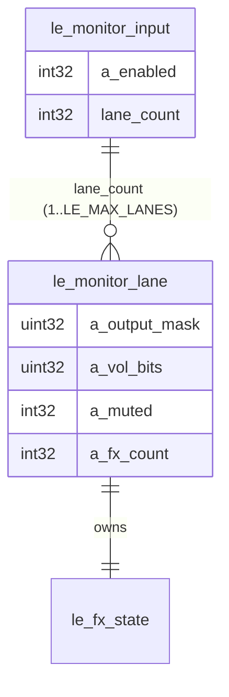

## feat: multi-lane input monitoring — Extensive

> No source brainstorm; design settled in discussion. Mirrors the multi-lane
> *tracks* work: [docs/plan/2026-06-10-feat-multi-lane-tracks-dual-route-monitoring-plan.md](./2026-06-10-feat-multi-lane-tracks-dual-route-monitoring-plan.md).
> A WIP native draft exists in `git stash@{0}` ("wip: multi-lane monitoring native layer (pre-plan)") as reference only.

> **Technical-review applied (2026-06-14).** Splitting agent: keep as **one PR**
> (the single breaking C-ABI/command seam can't be split without a throwaway
> shim). Refinements folded in below: migration moves to the existing
> `lib/app/monitor_migration.dart` behind a versioned flag (not the cubit);
> `MonitorLane` is a full `Equatable`/`copyWith` model with an immutable
> lane-replace helper; the UI section is rewritten as a **structural** rework
> with an explicit dead-code-removal list; a shared `le_fx_entry_reset` helper
> removes the 3rd copy of the per-slot FX clear. Monitor state is **not** carried
> in `EngineSnapshot` (cubit-owned), so no snapshot/mock-reflection work is
> needed — the mock just records calls and widget tests seed the cubit directly.

## Overview

Bring per-input live monitoring to parity with tracks: each hardware input
becomes a **multi-lane container**, where each **monitor lane** is an independent
parallel path with its own effect chain, output routing, volume, and mute. This
mirrors `le_lane` exactly but carries **no recording buffers** — monitoring is
live-only and never recorded.

Two settled decisions:

1. **Fold the dry send into lanes.** Drop `le_monitor_input.a_dry_output_mask`.
   A lane with an **empty effect chain is the clean (dry) path**; "wet + dry"
   becomes "an FX lane + a no-FX lane." This removes the special-case dry concept
   and makes the model fully general.
2. **Build the whole stack in one pass** (native → FFI → Dart domain → UI →
   tests), behind one PR.

Input-level `enabled` stays (gates the whole input, honours loopback exclusion +
the latency-measurement suppress/restore); **mute is per-lane** — exactly the
track model (`track.state` gates; `lane.muted` per lane).

## Problem statement

Today `le_monitor_input` is a **single** route per input: one fx chain, one
output mask, one parallel dry mask, one volume. You cannot, e.g., monitor a
guitar clean to the mains **and** through a reverb to a different out, or run two
different processed sends from one input. Tracks already solved this with lanes;
monitoring should match.

## Proposed solution

### Data model

```c
// engine_private.h
typedef struct le_monitor_lane {     // mirrors le_lane, minus recording buffers
  _Atomic uint32_t a_output_mask;    // outputs this lane plays to
  _Atomic uint32_t a_vol_bits;       // lane gain (float bits, 0..1)
  _Atomic int32_t  a_muted;          // 0/1
  _Atomic int32_t  a_fx_count;
  _Atomic int32_t  a_fx_type[LE_FX_MAX];
  _Atomic uint32_t a_fx_param[LE_FX_MAX][LE_FX_PARAMS];
  le_fx_state      fx;
} le_monitor_lane;

typedef struct le_monitor_input {
  _Atomic int32_t  a_enabled;        // input-level on/off
  int32_t          lane_count;       // 1..LE_MAX_LANES; control-thread plain int
  le_monitor_lane  lanes[LE_MAX_LANES];
} le_monitor_input;
```

Removed from `le_monitor_input`: `a_output_mask`, `a_dry_output_mask`,
`a_vol_bits`, `a_fx_count`, `a_fx_type`, `a_fx_param`, `fx` (all moved to lane).



**Memory:** `le_monitor_lane` embeds `le_fx_state` (~1.5 KB). `LE_MAX_INPUTS(8) ×
LE_MAX_LANES(8) = 64` lanes ≈ ~100 KB on the heap-allocated `le_engine`
(acceptable; delay rings stay lazily allocated, freed in destroy across lanes).

### Ring command set (`le_command_code`)

Repurpose the monitor block (internal wire contract; FFI is regenerated/hand-
synced in lockstep, no external consumers):

| Code | Command | arg packing |
|---|---|---|
| 30 | `LE_CMD_SET_MONITOR_INPUT` | `arg_i = input`, `arg_f = enabled` (was: input\|enabled + mask) |
| 31 | `LE_CMD_SET_MONITOR_LANE_FX` | `arg_i = (input<<16)\|(lane<<8)\|index`, `arg_f = type` |
| 32 | `LE_CMD_SET_MONITOR_LANE_FX_COUNT` | `arg_i = (input<<16)\|(lane<<8)\|count` |
| 33 | `LE_CMD_SET_MONITOR_LANE_OUTPUT` | `arg_f = input*LE_MAX_LANES+lane`, `arg_i = mask` |
| 34 | `LE_CMD_SET_MONITOR_LANE_VOLUME` | `arg_i = input*LE_MAX_LANES+lane`, `arg_f = 0..1` |
| 35 | `LE_CMD_SET_MONITOR_LANE_MUTE` | `arg_i = input*LE_MAX_LANES+lane`, `arg_f = 0/1` |

Removed: `LE_CMD_SET_MONITOR_INPUT_DRY`, `_VOLUME` (old single-input ones),
`_FX`, `_FX_COUNT` (single-input). Lane `fx_param` is set **directly** off the
ring (control-thread store), as today. `lane_count` is a control-thread plain
int (no ring command), like `le_track.lane_count`.

### Process loop

Snapshot per `(input, lane)` once per buffer, mirroring the track snapshot
arrays (`fx_type[LE_MAX_TRACKS][LE_MAX_LANES][LE_FX_MAX]` etc. — established
precedent; same stack budget added for monitors). Per frame, for each enabled
input, for each `lane < lane_count`, skip if muted, run its chain on the clean
input, then `le_fx_route(out, f, ch_out, mask, wet*g, wet_r*g, stereo)` — which
already handles the stereo-reverb spread. A no-FX lane routes the clean sample.

### C API (`loopy_engine_api.h` + `engine.c`)

Remove: `le_engine_set_monitor_input_dry`, `_volume`, `_fx`, `_fx_count`,
`_fx_param` (single-input). Change `le_engine_set_monitor_input(engine, input,
enabled)` (drop `output_mask`). Add:

- `le_engine_set_monitor_lane_count(engine, input, count)` — plain-int setter,
  mirrors `le_engine_set_lane_count`: grows/initialises new lanes via a new
  `le_monitor_lane_reset`.
- `le_engine_set_monitor_lane_output / _volume / _mute / _fx / _fx_count /
  _fx_param(engine, input, lane, …)` — mirror the `le_engine_set_lane_*` calls
  (incl. `le_fx_prepare_entry` for `_fx`, which lazily allocates the delay ring).

**Shared reset helper (review):** the per-slot FX-state clear (svf/lfo/delay/
fx_lp/grain/reverb) is currently copy-pasted in `le_lane_reset` and
`le_monitor_input_reset`, and would be a third copy in `le_monitor_lane_reset`.
Extract `static void le_fx_entry_reset(le_fx_state* fx, int slot)` and call it
from all three (and from the `SET_*_FX` ring handlers, which inline the same
clear). Net: removes ~30 LOC and a copy-paste hazard.

**Command packing (review):** the new monitor-lane commands deliberately use two
encodings — `(input<<16)|(lane<<8)|index` for the FX commands and
`input*LE_MAX_LANES+lane` for output/volume/mute — exactly mirroring the existing
track lane commands (the mask/value must travel in the *other* arg). Add a one-
line comment in the enum noting this matches the track convention, not a bug.

**Snapshot timing:** lane config is snapshotted **once per buffer** (like the
existing monitor + track snapshots); the frame loop reads the per-lane
mask/volume/mute from those arrays (the `vol[t][l]` / `out_mask[t][l]` pattern).
No per-frame atomic re-reads.

### Dart layers

- **FFI** (`generated/loopy_engine_bindings.dart`, hand-synced): update the
  command-enum constants; replace the monitor functions with the lane-addressed
  ones (`int`/`double` signatures, `ffi.Float` for volume).
- **`AudioEngine`** interface (`audio_engine.dart`): replace monitor methods with
  `setMonitorInputEnabled`, `setMonitorLaneCount`, `setMonitorLaneOutput/Volume/
  Mute/Fx/FxCount/FxParam`. Implement in `NativeAudioEngine`, `MockAudioEngine`,
  and the **3 fakes** (`test/helpers/fake_audio_engine.dart`,
  `packages/looper_repository/test/helpers/fake_audio_engine.dart`,
  `packages/session_repository/test/helpers/fake_session_engine.dart`).
- **`LooperRepository`**: monitor state maps become per-`(input, lane)`
  (`_monitorLaneRouting`, `_monitorLaneVolume`, `_monitorLaneMute`,
  `_monitorLaneEffects`, `_monitorInputEnabled`, `_monitorLaneCount`);
  re-applied on every (re)start (mirror the existing lane re-apply block).
- **Model** (`packages/looper_repository/lib/src/models/input_monitor.dart`):
  new `MonitorLane extends Equatable` — `const`, all fields `final`
  (`outputMask=0x3, volume=1, muted=false, effects=const []`), with `copyWith`
  and `props` listing every field (mirror `Lane`). `InputMonitor` becomes
  `{ int input, bool enabled, List<MonitorLane> lanes }`; drop
  `dryOutputMask`/`volume`/`outputMask`/`effects`. Add an immutable lane-replace
  helper `InputMonitor withLane(int index, MonitorLane lane)` (rebuilds the list
  with element `index` replaced) so cubit setters don't hand-roll list copies —
  this is the single biggest state-correctness lever (per review). `lane(int i)`
  convenience getter returns `lanes[i]` or a default `MonitorLane`.
- **`MonitorCubit`**: per-lane setters (`setLaneOutputMask`, `setLaneVolume`,
  `setLaneMute`, `addEffect(input, lane)`, `removeEffect`, `moveEffect`,
  `setEffectType/Param`), plus `setEnabled(input)`, `addLane(input)`,
  `removeLane(input, lane)`. Restore + **migration** on load.
- **`SettingsRepository`**: per-`(input, lane)` keys
  (`monitor_input_enabled.N`, `monitor_lane_count.N`, `monitor_lane_out.N.L`,
  `monitor_lane_vol.N.L`, `monitor_lane_mute.N.L`, `monitor_lane_fx.N.L`).

### Migration (old single-monitor saves → lanes)

Follow the repo's **existing** migration pattern, not the cubit. The project
already has `lib/app/monitor_migration.dart` (`runMonitorMigration`) run from
`runLoopy` at bootstrap, guarded by a versioned flag
(`SettingsRepository.loadMonitorMigratedV1` / `save…`). Add a **v2** step there:

- Guard with a new `monitor.migrated_v2` flag (`loadMonitorMigratedV2` /
  `saveMonitorMigratedV2`); run once, after v1, at bootstrap — **deterministic**,
  not key-absence-based.
- For each input, read legacy `monitor_input.N` (enabled + wet mask),
  `monitor_input_dry.N`, `monitor_input_vol.N`, `monitor_input_fx.N` and write
  the new lane keys:
  - **lane 0** = `{ outputMask: wet mask, volume: vol, effects: fx }`.
  - **lane 1** (only if dry mask ≠ 0) = `{ outputMask: dry mask, volume: vol,
    effects: [] }` — the dry path as a no-FX lane.
  - `monitor_input_enabled.N` = old enabled; `monitor_lane_count.N` = 1 or 2.
- Clear the legacy keys after writing, then set the v2 flag. Define ordering so
  v1 (global→per-input) runs before v2 (per-input→lanes) on a cold upgrade.

`MonitorCubit.load` then only ever reads the **new** keys. Covered by a
migration unit test (legacy save → expected lanes) **and** an idempotency test
(second run is a no-op once the flag is set). Impacted files:
`lib/app/monitor_migration.dart`, `lib/app/run_loopy.dart`,
`packages/settings_repository/lib/src/settings_repository.dart`,
`test/app/monitor_migration_test.dart`.

### UI (`lib/audio_setup/view/monitor_graph/`)

This is the largest surface and a **structural rewrite**, not a tweak — the
current monitor graph is one-row-per-input with a dual wet/dry routing model; it
becomes one-row-per-`(input, lane)`, structurally identical to the track
lane-graph. Approach: **copy-adapt** `lib/looper/view/lane_graph/` into the
monitor graph (input/output channel chips at the edges, a node per lane, the
per-lane effect chain, add-/remove-lane controls, the lane cap). Reuse the shared
`routing_graph` package and `LaneNode`-style nodes. `RoutePanel` becomes a
`MonitorLanePanel` mirroring `LanePanel` (lane label, mute, volume, remove-lane,
add-lane, effect editor) — no wet/dry segmented control.

**Dead code to delete (enumerated so the PR is complete):**

- `lib/audio_setup/view/monitor_graph/route_panel.dart`: the Effected/Dry
  `SegmentedButton` and its `wireDry` param.
- `lib/audio_setup/view/monitor_graph/route_legend.dart`: the whole wet/dry
  color legend (no longer a dual-route concept) — delete the file + its uses.
- `MonitorGraphView` state: `_wireDry`, `onWireModeChanged`, and the dual-color
  output-chip logic in `_outAppearance` (wet/dry union coloring).
- `MonitorGraphLayout`: `wetUnion` / `dryUnion` and the dashed dry edge drawing —
  becomes single per-lane-colored edges over a multi-row layout.
- `MonitorCubit.setDryOutputMask`; `InputMonitor.dryOutputMask`.
- `SettingsRepository.loadMonitorInputDry` / `saveMonitorInputDry` (and the old
  `monitor_input_dry.N` key, consumed by the v2 migration then dropped).

**l10n:** reuse the existing lane-graph keys where possible (`addLane`,
`removeLaneTooltip`, `muteLaneTooltip`, `unmuteLaneTooltip`, `laneNumberLabel`,
`addEffectToLaneTooltip`) to minimize ARB/cspell churn; add new keys only for
genuinely monitor-specific labels (en + es).

## Testing

- **Native** (`src/test/test_engine_core.c`, mingw gcc): two lanes from one input
  route to different outputs independently; a no-FX lane = clean, an FX lane =
  wet; per-lane mute silences only that lane; `lane_count` growth adds a default
  clean lane; invalid `(input, lane)` rejected; latency suppress/restore still
  works at input level.
- **Repository** (`looper_repository_test.dart`): per-`(input, lane)` setters
  defer + re-apply on restart. **Existing** single-route monitor tests
  (`setMonitorDry`, input-level volume/fx, restart re-apply) are **rewritten** to
  lane equivalents — not deleted — so no restart/re-apply coverage is dropped.
- **Cubit** (`monitor_cubit_test.dart`): add/remove lane, per-lane setters,
  `setEnabled(input, {required bool enabled})`, restore from the **new** keys.
  Existing assertions on the old single-route surface are replaced. A
  "no-FX lane = clean/dry path" case preserves the old dry-send coverage.
- **Model** (`input_monitor_test.dart`): `MonitorLane` defaults / `copyWith` /
  equality (`props`); `InputMonitor.lanes` + `withLane` immutability.
- **Settings** (`settings_repository_test.dart`): new per-`(input, lane)` key
  round-trips; `monitor.migrated_v2` flag round-trip.
- **Migration** (`test/app/monitor_migration_test.dart`): legacy single-monitor
  save → expected lanes (wet→lane 0, dry→lane 1); **idempotency** (second run is
  a no-op once the v2 flag is set); v1-then-v2 ordering on a cold upgrade.
- **Widget** (`monitor_graph_view_test.dart`): renders N lanes, add/remove lane,
  per-lane routing taps dispatch to the cubit. Driven by **seeding MonitorCubit
  state directly** (monitor state isn't in the snapshot), as the existing test
  does — the mock just records calls.
- **Gate**: `flutter analyze` clean; `flutter test` green; native test ALL
  PASSED; `flutter build windows --debug` compiles. Coverage: the monitor UI is
  testable (no new platform glue), so the 90% gate should hold.

## Acceptance criteria

- [ ] One input can run ≥2 parallel monitor lanes to different outputs, each with
      its own chain/volume/mute.
- [ ] A no-FX lane reproduces the old "dry send"; no `dryOutputMask` remains.
- [ ] Existing saved monitors migrate (wet→lane 0, dry→lane 1) with no user loss.
- [ ] Input enable/disable, loopback exclusion, and latency suppress/restore
      still behave at the input level.
- [ ] All gates green (analyze, dart test, native test, windows build).

## Risks & mitigations

- **Breaking API/command renumber** — internal only; FFI hand-synced in the same
  PR; no persisted command codes. Native + dart tests catch desync.
- **Process-loop stack growth** — adds monitor snapshot arrays sized like the
  existing track ones; precedent shows it's within the audio-callback stack.
- **Migration correctness** — dedicated settings + cubit tests; legacy keys read
  once then superseded.
- **UI scope** — largest surface; lean on the existing lane-graph components.

## Implementation order (one PR)

1. Native: struct + commands + process + reset/init/destroy + C API; native test; mingw build.
2. FFI bindings (hand-sync).
3. `AudioEngine` interface + Native/Mock/3 fakes.
4. `LooperRepository` per-`(input, lane)` state + restart re-apply.
5. Model (`MonitorLane` + `InputMonitor.withLane`) + `MonitorCubit` +
   `SettingsRepository` keys; the v2 migration in `monitor_migration.dart`
   (bootstrap, flag-guarded); their tests.
6. Monitor-graph UI rework + l10n + widget tests.
7. Verify: analyze, flutter test, native test, windows build → PR.
