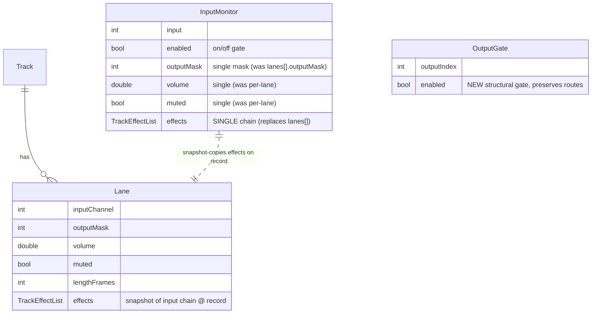

## Unified Input FX & Routing - Extensive

> Source brainstorm: [docs/brainstorm/2026-06-22-unified-input-fx-routing-brainstorm-doc.md](../brainstorm/2026-06-22-unified-input-fx-routing-brainstorm-doc.md)
> Branch: `feat/unified-input-fx-routing` · Builds on the multi-lane/dual-route rework (#12–#14) and the layer-boundary refactor (#65–#68).
>
> **Scope note (post technical review):** the reversible **commit/freeze** action
> was **deferred to a follow-up plan**. Non-destructive playback already reapplies
> the snapshot FX, so baking-into-the-buffer is a speculative CPU/export
> optimization whose need is unproven and whose uncommit guarantee is
> within-session only. This plan ships **4 PRs**; commit/freeze is tracked under
> [Future Considerations](#future-considerations).

## Overview

Collapse the two disconnected FX surfaces in the loopstation into one. Today an
input's FX is configured **twice** — once as per-input *monitor lanes* (what you
hear live) and again as per-track *lane FX* (what plays back) — and recording is
always clean, so **the sound you perform is not the sound that gets stored**.

This rework gives each hardware **input a single FX chain + single output mask +
on/off gate**. The chain you monitor live is the chain that is snapshot-copied
onto the track lane when you record, then **re-applied on playback**
(non-destructive: the recorded buffer stays clean). Outputs gain a **structural
on/off gate** that removes an output from the routing graph as a target while
preserving its stored routes.

The implementation is the **incremental fold**: reshape existing models in
place and reuse the already-shipped, proven per-lane stereo-FX DSP and the
non-destructive track-lane playback path. It ships as **4 stacked PRs**.

## Problem Statement

The multi-lane/dual-route rework (#12–#14) and the per-input live-monitor work
delivered a lot of capability, but left three concrete gaps:

1. **FX must be configured twice.** `InputMonitor.lanes` (live monitoring) and
   `Track.lanes[].effects` (playback) are independent. A performer dials in a
   tone for monitoring, records, and the take is clean — they then have to
   re-create the tone on the track lane.
   - Models: [packages/looper_repository/lib/src/models/input_monitor.dart:12](../../packages/looper_repository/lib/src/models/input_monitor.dart) (`MonitorLane`/`InputMonitor`), [packages/looper_repository/lib/src/models/lane.dart:11](../../packages/looper_repository/lib/src/models/lane.dart) (`Lane`).
2. **Recording does not carry the input's FX.** A lane records the clean
   hardware input; effects are only ever applied on playback if the user adds
   them manually. There is no snapshot-on-record path.
3. **The multi-lane *monitor* model is more than needed.** Parallel monitor
   lanes (wet-to-FOH / dry-to-monitor) add UI and state surface
   (`MonitorCubit` lane add/remove, [lib/audio_setup/cubit/monitor_cubit.dart](../../lib/audio_setup/cubit/monitor_cubit.dart);
   `monitor_graph_view.dart`) for a split most users do not use. Folding to one
   chain is the simplification that makes "configure once" possible.

Additionally, **outputs have no on/off concept** — only per-lane bitmasks.
Turning an output "off" today means clearing it from every mask, which is
destructive and irrecoverable. There is no structural gate.

## Proposed Solution

### Resolved decisions

| # | Decision | Resolution | Rationale |
|---|----------|-----------|-----------|
| D1 | **Single FX chain per input** | Each input collapses to one chain + one output mask + on/off, replacing `InputMonitor.lanes`. | Cleanest model; kills the monitor-FX-vs-track-FX doubling. |
| D2 | **Non-destructive by default (snapshot reapply)** | Record snapshots the input chain onto the new track lane (clean buffer + reapply-on-playback). No baking in this plan — commit/freeze deferred. | WYSIWYG without losing post-record editability; reuses shipped non-destructive DSP. |
| D3 | **Copy-on-record, not a live reference** | The track lane gets its **own copy** of the input chain. | Each take is its own entity; tweaking the input for the next take must not alter earlier tracks. |
| D5 | **Output on/off is structural** | "Off" removes the output as a selectable graph target, distinct from mute. New engine command + persistence key + graph state. | Matches user intent that toggling an output changes the graph, not the level. |
| D6 | **Output gate preserves routes** | Off keeps stored masks inactive; on restores them — mirrors the input enable gate. | Least destructive, consistent with the input gate. |
| D7 | **Output-off renders greyed, non-targetable** | Reuse the existing `RoutingNode.excluded` pattern ([lib/looper/view/tracks_routing_graph/routing_graph.dart:38](../../lib/looper/view/tracks_routing_graph/routing_graph.dart), [graph_node.dart:55](../../lib/looper/view/tracks_routing_graph/graph_node.dart)). | A render precedent already exists for dimmed/never-wired nodes (loopback inputs). |
| D8 | **Recording is independent of the monitor gate** | An input can be recorded even when its live monitor is off; the lane still snapshots the input chain. | Record arm ≠ monitor; flexible. (UI signpost for the "record FX you can't hear" case is **deferred** — behavior proceeds, the warning is added only if user testing shows confusion.) |
| D9 | **Migration v2→v3 fold rule** | Per input: take the **first non-empty FX chain** (lane 0 preferred, else the lowest lane that has FX — chains are **not** merged), and **OR-union all lanes' output masks**; take lane 0's volume/mute. Refines the brainstorm's "lane 0 wins" to avoid silently dropping FX on a non-lane-0 lane (flow-analysis M2/M3). | Deterministic, least-destructive on both FX and routing. |
| D10 | **Post-record per-lane track FX editor stays** | The lane FX editor remains as the "tweak this take" surface, **clearly labelled as a snapshot** distinct from the live input chain. "Configure once" holds **pre-record**; post-record per-lane editing is intentional (flow-analysis G1/G2). | Don't remove working capability; make scopes legible. |

### Capability delta

```
BEFORE                                    AFTER
──────                                    ─────
Input ── monitor lanes[] (live only)      Input ── one FX chain + output mask + on/off
Track ── lanes[].effects (playback only)  Track ── lanes[] each: clean buffer
Record ── always clean                              + FX snapshot @ record (reapply on play)
Output ── per-lane bitmask only           Output ── per-lane bitmask + structural on/off gate
```

## Technical Approach

### Architecture

Strict VGV layering is preserved: presentation → bloc → repository → data
(native engine via FFI). The `loopy_engine` dependency stays **transitive** —
`lib/` never imports it; the app composes via `LooperRepository.withNativeEngine`
(verified). Every change threads through the same seams the multi-lane rework
used.

```
lib/audio_setup/  MonitorCubit (Map<int,InputMonitor>)  ── collapses to single-chain InputMonitor
lib/looper/       LooperBloc lane events                ── + output-gate event
packages/looper_repository/  LooperRepository           ── single-chain monitor setters; record-snapshot; setOutputEnabled
packages/loopy_engine/       AudioEngine + native C      ── snapshot-on-record; LE_CMD_SET_OUTPUT_ENABLED
packages/settings_repository/ SettingsRepository         ── output_enabled.$out key; v3 migration helpers
lib/app/          monitor_migration.dart                 ── v3 fold step (single chain)
```

### Domain model changes (ERD)



**Key model edits:**
- `InputMonitor`: drop `lanes` / `MonitorLane`; promote `outputMask`, `volume`,
  `muted`, `effects` to single scalars/list on `InputMonitor`. Keep `input`,
  `enabled`. ([packages/looper_repository/lib/src/models/input_monitor.dart](../../packages/looper_repository/lib/src/models/input_monitor.dart))
- `Lane`: **no new field** — the snapshot lives in the existing `effects` list,
  filled by `_project()` from the engine snapshot. (No `committed` field — commit
  deferred.)
- New output-gate state on `LooperState`: an `outputEnabledMask` (int bitmask)
  derived from the engine snapshot, plus a persistence key.

### Output-gate bound (review C1)

There is **no `kMaxOutputs` constant** today (only `kMaxInputs`/`kMaxLanes` in
[packages/looper_repository/lib/looper_repository.dart:14](../../packages/looper_repository/lib/looper_repository.dart)),
and the output count is dynamic (`AudioConfig.outputChannels`, device-dependent,
unknown at bootstrap). Resolution:

- **Default-on, persist only the off entries.** Absence of an `output_enabled.$out`
  key means **enabled**. Only explicitly-disabled outputs are written. This
  needs no fixed bound and is self-cleaning when devices change.
- Add an engine-aligned `kMaxOutputs` (mirroring `LE_MAX_INPUTS == 8`) **only**
  as the iteration ceiling for the bootstrap reapply scan (`[0, kMaxOutputs)`),
  matching how the monitor reapply already scans `[0, kMaxInputs)`.
- A stored off-state for an output **beyond the current device's channel count**
  is ignored, never corrupting the graph (NF-3 / E11).

### Data flow: record → snapshot → playback

```
1. User dials input N FX chain  ── MonitorCubit.setEffect* → setMonitorEffects → engine monitor chain (live, heard)
2. User records into track T     ── LooperRecordPressed → repo.record
3. Engine, on finalize:          ── deep-copies input N's monitor FX chain onto the new lane's `fx` (snapshot)
                                    buffer stays CLEAN; playback reapplies the snapshot
4. Repo projects snapshot back   ── _project() fills Lane.effects from the engine snapshot; persists lane_effects.*
5. (optional) Tweak this take    ── LooperLaneEffects* on the lane's own chain — does NOT touch input N or other takes
```

### Implementation Phases (4 stacked PRs)

Each PR is independently mergeable and green **except** where an interim RED
build is intentional and called out (the multi-lane rework used the same
discipline — #14 shipped RED until its Dart PR).

---

#### Phase 1 (PR 1/4): Engine — single-chain input + record-FX snapshot

**Goal:** the native engine snapshots the live monitor chain onto a lane on
record, and the per-input monitor is a single chain.

- Native (`packages/loopy_engine/src/core/`):
  - Collapse the per-input monitor from N lanes to a **single chain**: retire
    `LE_CMD_SET_MONITOR_LANE_*` (output/volume/mute/fx/fx_count flat-indexed by
    `input*LE_MAX_LANES+lane`) in favour of single-chain
    `LE_CMD_SET_MONITOR_INPUT_FX` / `…_FX_COUNT` / `…_OUTPUT` / `…_VOLUME` /
    `…_MUTE` keyed by input only. ([src/core/loopy_engine_api.h](../../packages/loopy_engine/src/core/loopy_engine_api.h), `src/core/engine_commands.c`)
  - On record finalize, **deep-copy the input's monitor FX chain onto the
    recording lane's `fx`** (types + params, no shared pointer → D3), on the
    **control thread**, before publishing. Buffer stays clean.
- FFI: regenerate bindings (`dart run ffigen` + `dart format`, per PROGRESS.md
  gotcha), update [packages/loopy_engine/lib/src/native_audio_engine.dart](../../packages/loopy_engine/lib/src/native_audio_engine.dart)
  and the `AudioEngine` interface.
- Tests (native, deterministic — the real safety net),
  `packages/loopy_engine/src/test/test_engine_core.c`:
  - `test_monitor_single_chain`
  - `test_record_snapshots_input_fx`
  - `test_snapshot_is_independent_of_later_input_edits` (D3)
  - **`test_record_snapshot_is_rt_safe`** — assert the snapshot copy runs on the
    control thread, not `le_engine_process` (NF-1 / review C2). Use the existing
    RT-audit mechanism PROGRESS.md describes; if none is suitable, add a
    control-thread-only instrumentation guard.
- **Success:** native test binary green; FFI regenerated (no whole-file churn);
  `AudioEngine` fake updated. App build may be RED here (Dart not yet folded) —
  call it out in the PR description (R2).
- **Effort:** L (native + FFI; highest-risk RT code).

---

#### Phase 2 (PR 2/4): Engine + FFI — structural output gate

**Goal:** an output can be turned off structurally, preserving routes.

- Native:
  - New `LE_CMD_SET_OUTPUT_ENABLED` (arg_i = output index, arg_f = 0/1). A
    disabled output is **skipped in the mix fan-out** regardless of any lane mask
    pointing at it; masks are untouched (D6).
  - Expose an `output_enabled_mask` in the engine snapshot.
  - RT-safe: applies mid-record without artifacts (E4).
  - Stale gate state for outputs **beyond the device channel count** is ignored
    (E11).
- FFI + `AudioEngine` interface: `setOutputEnabled(int output, bool enabled)`;
  regenerate.
- Tests, `test_engine_core.c`:
  - `test_output_disabled_is_silent_routes_preserved`
  - `test_reenable_restores_audio`
  - `test_gate_beyond_channel_count_ignored`
- **Success:** native tests green; FFI regenerated. App build still RED (folds in
  Phase 3).
- **Effort:** S–M (smallest engine phase).

---

#### Phase 3 (PR 3/4): Dart repo/bloc + v2→v3 migration

**Goal:** the Dart domain layer exposes single-chain inputs and the output gate;
existing persisted state migrates. **This PR turns the app build green again.**

- Models ([packages/looper_repository/lib/src/models/](../../packages/looper_repository/lib/src/models/)):
  - Reshape `InputMonitor` to single chain (delete `MonitorLane`). Update
    `props`.
  - Output-gate state on `LooperState` (`outputEnabledMask`); update `props`.
- `LooperRepository` ([packages/looper_repository/lib/src/looper_repository.dart](../../packages/looper_repository/lib/src/looper_repository.dart)):
  - Retire the 5 `_monitorLane*` maps + `setMonitorLane*` methods; add
    single-chain `setMonitorEffects` / `setMonitorEffectParam` /
    `setMonitorOutput` / `setMonitorVolume` / `setMonitorMute` (remembered +
    reapplied on restart, like today).
  - `setOutputEnabled(int output, {required bool enabled})` (remembered +
    reapplied; default-on, store only off entries — C1).
  - `_project()` ([looper_repository.dart:312](../../packages/looper_repository/lib/src/looper_repository.dart))
    fills `Lane.effects` (snapshot) and `LooperState.outputEnabledMask` from the
    snapshot.
  - The 960-line file grows; extract the monitor-apply logic into a private
    helper/extension within this PR to keep it reviewable (in-scope refactor, not
    a split).
- `MonitorCubit` ([lib/audio_setup/cubit/monitor_cubit.dart](../../lib/audio_setup/cubit/monitor_cubit.dart)) — **full signature reshape** (review):
  - Remove `addLane` / `removeLane` / `setLaneOutputMask` / `setLaneVolume` /
    `setLaneMute`.
  - Change `setEffectType(input, lane, …)` → `setEffectType(input, …)`,
    `setEffectParam(input, lane, …)` → `setEffectParam(input, …)`,
    `addEffect(input, lane)` → `addEffect(input)`, `removeEffect`/`moveEffect`
    likewise drop the `lane` param.
  - Rewrite `restore()`/bootstrap reapply ([monitor_cubit.dart:270](../../lib/audio_setup/cubit/monitor_cubit.dart)) to the single-chain keys.
- `LooperBloc` ([lib/looper/bloc/looper_bloc.dart](../../lib/looper/bloc/looper_bloc.dart), `looper_event.dart`):
  - New event `LooperOutputEnabledToggled(output)` → `repo.setOutputEnabled` +
    persist.
- Persistence ([packages/settings_repository/lib/src/settings_repository.dart](../../packages/settings_repository/lib/src/settings_repository.dart)):
  - New key `output_enabled.$out` (bool; **absence = enabled**, store only off).
    Reapplied at bootstrap ([lib/app/audio_bootstrap.dart](../../lib/app/audio_bootstrap.dart)) scanning `[0, kMaxOutputs)`.
  - Collapse monitor keys to single-chain: `monitor_input_enabled.$input`,
    `monitor_out.$input`, `monitor_vol.$input`, `monitor_mute.$input`,
    `monitor_fx.$input`. Drop `monitor_lane_count` / `monitor_lane_*`.
- **Migration v3** ([lib/app/monitor_migration.dart](../../lib/app/monitor_migration.dart)):
  - Add `_runMonitorMigrationV3`, guarded by a new `monitor.migrated_v3` flag,
    run **after** v2 in `runMonitorMigration`.
  - Per input `[0, kMaxInputs)`: read `monitor_lane_count` + each lane's
    out/vol/mute/fx. Fold per **D9**: **first non-empty FX chain** (lane 0
    preferred), **OR-union all lanes' output masks**, lane 0's volume/mute. Write
    the single-chain keys; **clear** `monitor_lane_count` and all
    `monitor_lane_*` so `MonitorCubit` can't resurrect multi-lane state (M5).
- Tests (mock filenames):
  - `packages/looper_repository/test/src/looper_repository_test.dart` —
    single-chain monitor setters; `setOutputEnabled`; **snapshot
    non-propagation** (editing input chain leaves recorded lanes equal —
    G3/AC3); `_project()` maps snapshot + `outputEnabledMask`;
    `LooperState`/`InputMonitor` equality changes on edit (props rigor).
  - `packages/settings_repository/test/settings_repository_test.dart` — new keys,
    absence-means-on for `output_enabled`.
  - **Extend `test/app/monitor_migration_test.dart`** with a `v3` group (review):
    M1 (all-empty → identical clean chain), **M2/M3** (FX on lane 1 preserved,
    not merged; FX on both lanes 0+1 keeps lane 0), M5 (dead keys cleared),
    idempotency, **and a chained v1→v2→v3 cold-upgrade case**. (Do **not** create
    a separate `_v3` file.)
  - `test/looper/bloc/looper_bloc_test.dart` — `LooperOutputEnabledToggled` →
    repo call + persist.
  - `test/audio_setup/cubit/monitor_cubit_test.dart` — single-chain API **and the
    restore/bootstrap reapply path**.
- **Success:** all Dart tests green; **app build green**; migration idempotent.
- **Effort:** L (largest PR; group the diff models → repo → cubit → bloc →
  persistence → migration → tests in the PR description for tractable review).

---

#### Phase 4 (PR 4/4): UI fold + dead-code removal

**Goal:** the routing UI reflects single-chain inputs and the output gate;
superseded multi-lane monitor UI is removed.

> **UI conventions (PROGRESS.md / architecture-standards memory):** new widgets
> use `LooperTheme` `ThemeExtension` tokens — **no pixel dimensions in widget
> constructor APIs**, extract real widget classes (not `_buildX()` methods).

- Monitor UI ([lib/audio_setup/view/monitor_graph/](../../lib/audio_setup/view/monitor_graph/)):
  - Fold `monitor_graph_view.dart` to a single chain per input (no lane stack);
    remove lane add/remove and per-lane controls (`monitor_lane_node.dart`,
    `monitor_lane_panel.dart`) — repurpose to a single-chain editor.
- Track lane UI ([lib/looper/view/lane_graph/](../../lib/looper/view/lane_graph/)):
  - Show a **"snapshot of In N @ record"** chip on each lane, distinct from the
    live input chip (D10/G2/AC4); label the per-lane FX editor scope as "this
    take" vs. the live input chain (D10/AC5).
- Output gate UI ([lib/looper/view/tracks_routing_graph/](../../lib/looper/view/tracks_routing_graph/)):
  - Reuse the `RoutingNode.excluded` render for off outputs (greyed,
    line-through, non-targetable — D7); wire a toggle to
    `LooperOutputEnabledToggled`.
  - A lane routed **only** to an off output is discoverable: draw the edge to the
    greyed node (E2/E3).
  - Surface a non-blocking **"no active outputs"** notice when the last output is
    turned off (E1).
- Tests (widget): update/extend
  `test/audio_setup/view/monitor_graph/*_test.dart`,
  `test/looper/view/lane_graph/*_test.dart`,
  `test/looper/view/tracks_routing_graph/*_test.dart` — including **explicit
  accessibility assertions** (`find.bySemanticsLabel` / `meetsGuideline`) for the
  output-gate toggle and the greyed/disabled output node (NF-5).
- **Success:** widget tests green; no dangling references to removed lane APIs;
  `flutter analyze` clean.
- **Effort:** M–L.

## Alternative Approaches Considered

1. **Unified "channel strip" abstraction** — one `Channel` type shared by
   inputs and outputs. More symmetrical, but outputs carry no FX, so the symmetry
   is half-cosmetic (YAGNI) and the blast radius across engine/FFI/repo/blocs is
   large. **Rejected.**
2. **Engine-printed FX (destructive)** — apply input FX directly into the record
   buffer, no snapshot. Simplest engine, but loses non-destructive editability.
   **Rejected.**
3. **Reversible commit/freeze in this plan** — bake snapshot FX into the buffer
   now. **Deferred** post technical review: non-destructive playback already
   reapplies the snapshot, so baking is a speculative CPU/export optimization and
   uncommit would be within-session only (buffers aren't persisted across
   restart). Tracked under Future Considerations.
4. **Incremental fold (chosen)** — reshape existing models in place; reuse the
   shipped per-lane stereo-FX DSP and non-destructive playback path. Lowest risk,
   smallest blast radius, stackable PRs.

## Acceptance Criteria

### Functional Requirements

- [ ] **F-1** An input collapses to exactly one FX chain + one output mask +
      enable gate; the multi-lane monitor add/remove API and UI are removed (D1).
- [ ] **F-2** An input with an empty chain + enabled is audible as the clean
      (dry) path — the dry concept survives without a dedicated lane (M1).
- [ ] **F-3** Recording snapshots the input chain onto the new lane; editing the
      input chain afterwards leaves previously recorded lanes unchanged (param
      non-propagation asserted) (D3/G3).
- [ ] **F-4** A recorded lane visibly indicates it holds a **snapshot** of the
      input FX taken at record time, distinct from the live input chain (D10/G2).
- [ ] **F-5** Recording an input whose live monitor is off works (record
      proceeds); the explanatory signpost is deferred unless user testing shows
      confusion (D8).
- [ ] **F-10** An off output renders greyed + non-targetable (reusing
      `excluded`); its route masks are preserved and restored on re-enable
      (D5/D6/D7).
- [ ] **F-11** A lane routed only to an off output is discoverable, not silently
      inaudible (E2/E3).
- [ ] **F-12** A non-blocking notice surfaces when the last output is turned off
      (E1).
- [ ] **F-13** Migration v3 is flag-guarded (`migrated_v3`), idempotent, runs
      after v2, and clears dead `monitor_lane_*` keys (M5).
- [ ] **F-14** v3 folds per D9 (first non-empty chain, **not** merged + union
      masks); all-empty-lanes → identical-sounding single chain (M1); FX on a
      non-lane-0 lane is **not** silently dropped (M2/M3); a chained v1→v2→v3
      cold upgrade folds correctly.

### Non-Functional Requirements

- [ ] **NF-1** RT contract preserved: no malloc/lock/syscall/unbounded-loop in
      `le_engine_process`. The snapshot deep-copy runs on the **control thread**
      only — **asserted by a native test** (`test_record_snapshot_is_rt_safe`).
- [ ] **NF-2** Output-enable applies mid-record without audio artifacts (E4).
- [ ] **NF-3** Stale gate state for outputs beyond the device channel count does
      not corrupt the graph (E11).
- [ ] **NF-4** FFI bindings regenerated with `dart format` (no whole-file churn,
      per the ffigen gotcha).
- [ ] **NF-5** Accessibility: the output-gate toggle has a semantic label; greyed
      outputs are screen-reader-announced as disabled — **asserted in widget
      tests**.

### Quality Gates

- [ ] Native deterministic tests (`test_engine_core.c`) cover snapshot,
      snapshot-independence, RT-safety, and the output gate.
- [ ] Every changed/added Dart unit (repo, cubit incl. restore path, bloc,
      migration) has a test; `InputMonitor`/`LooperState`/`Lane` equality is
      proven (props rigor).
- [ ] `flutter analyze` clean; tests run via the absolute flutter path
      (PROGRESS.md gotcha).
- [ ] PROGRESS.md updated as each PR lands.
- [ ] Code review approval per PR.

## Success Metrics

- **Configure-once:** zero post-record manual FX re-creation required for a take
  to sound like the monitored input (verified by F-3/F-4 flows).
- **No regressions:** existing multi-lane track recording/playback/undo tests
  stay green across all 4 PRs.
- **Migration safety:** no audible change for an upgrading user with default
  (single clean) monitor config (M1).

## Dependencies & Prerequisites

- Builds on the multi-lane/dual-route rework (#12 engine core, #13 per-lane FX +
  per-input monitor, #14 Dart engine layer) and the layer-boundary refactor
  (#65–#68).
- Native toolchain for the deterministic engine test build (clang, frameworks —
  command in PROGRESS.md).
- ffigen for FFI regeneration after each header change.
- No external services, no new pub dependencies expected.

## Risk Analysis & Mitigation

| Risk | Likelihood | Impact | Mitigation |
|------|-----------|--------|-----------|
| **R1** RT-safety violation in snapshot copy on the audio thread | Med | High | Snapshot deep-copy on the control thread only; null-guard the audio thread; **`test_record_snapshot_is_rt_safe`** asserts the contract (NF-1). |
| **R2** Interim RED app build (PRs 1–2) confuses reviewers | High | Low | Explicitly flag the intentional RED window in each PR description, mirroring #14. Phase 3 restores green. |
| **R3** Migration data loss (FX on non-lane-0 lane) | Med | High | D9 "first non-empty chain, not merged"; dedicated v3 migration tests (M1/M2/M3) + chained-upgrade case. |
| **R5** Two FX editors re-introduce the doubling the feature kills | Med | Med | D10: keep the per-lane editor but scope-label it ("this take" vs live input); "configure once" applies pre-record. |
| **R6** Output gate default vs. union-mask migration interaction | Low | Med | Default-on (absence = enabled); union masks route only to enabled outputs at playback. |

## Resource Requirements

- One engineer; 4 stacked PRs sequenced 1→4. Phases 1–2 are native/FFI-heavy
  (highest review care), Phase 3 is the Dart fold + migration (largest), Phase 4
  is UI.

## Future Considerations

- **Commit/freeze (deferred)** — a reversible action to bake a lane's snapshot FX
  into the buffer (CPU savings + export of effected audio). Worth doing once the
  playback-FX CPU cost is measured and/or multi-lane export lands; would add
  `Lane.committed`, `LE_CMD_COMMIT_LANE`/`UNCOMMIT_LANE`, the undo-span
  interaction, and (if cross-restart) audio-buffer persistence. Track as its own
  plan.
- **Session export of committed lanes** — current session export is lane-0 only
  (documented follow-up); a natural pairing with commit/freeze.
- **Output FX** — the structural output gate leaves room for a future per-output
  FX/master-bus chain without the YAGNI symmetry rejected in alt #1.

## Documentation Plan

- Update [docs/PROGRESS.md](../PROGRESS.md): single-chain input monitor, record
  snapshot, output gate, v3 migration — one bullet per PR as it lands.
- Update the engine API header doc comments for the retired
  `LE_CMD_SET_MONITOR_LANE_*` and the new `LE_CMD_SET_OUTPUT_ENABLED`.
- Note the `monitor.migrated_v3` flag and key changes in the migration file
  doc comment.

## References & Research

### Internal References

- Brainstorm: [docs/brainstorm/2026-06-22-unified-input-fx-routing-brainstorm-doc.md](../brainstorm/2026-06-22-unified-input-fx-routing-brainstorm-doc.md)
- Domain models: [input_monitor.dart:12](../../packages/looper_repository/lib/src/models/input_monitor.dart), [lane.dart:11](../../packages/looper_repository/lib/src/models/lane.dart), [track.dart:11](../../packages/looper_repository/lib/src/models/track.dart)
- Constants (`kMaxInputs`/`kMaxLanes`, add `kMaxOutputs`): [looper_repository.dart:14](../../packages/looper_repository/lib/looper_repository.dart)
- Repository: [looper_repository.dart](../../packages/looper_repository/lib/src/looper_repository.dart) (lane + monitor setters; `_project()` ~:312)
- Monitor state: [monitor_cubit.dart](../../lib/audio_setup/cubit/monitor_cubit.dart) (restore ~:270)
- Migration precedent (v1/v2): [monitor_migration.dart:23](../../lib/app/monitor_migration.dart); tests in [test/app/monitor_migration_test.dart](../../test/app/monitor_migration_test.dart)
- Graph `excluded` render precedent: [routing_graph.dart:38](../../lib/looper/view/tracks_routing_graph/routing_graph.dart), [graph_node.dart:55](../../lib/looper/view/tracks_routing_graph/graph_node.dart)
- Engine API + commands: [loopy_engine_api.h](../../packages/loopy_engine/src/core/loopy_engine_api.h), `src/core/engine_commands.c`
- Persistence: [settings_repository.dart](../../packages/settings_repository/lib/src/settings_repository.dart)
- Bootstrap reapply: [audio_bootstrap.dart](../../lib/app/audio_bootstrap.dart)
- Build/test gotchas: [docs/PROGRESS.md](../PROGRESS.md) ("How to build / test")

### Related Work

- Multi-lane/dual-route rework PRs: #12, #13, #14
- Layer-boundary refactor PRs: #65, #66, #67, #68
