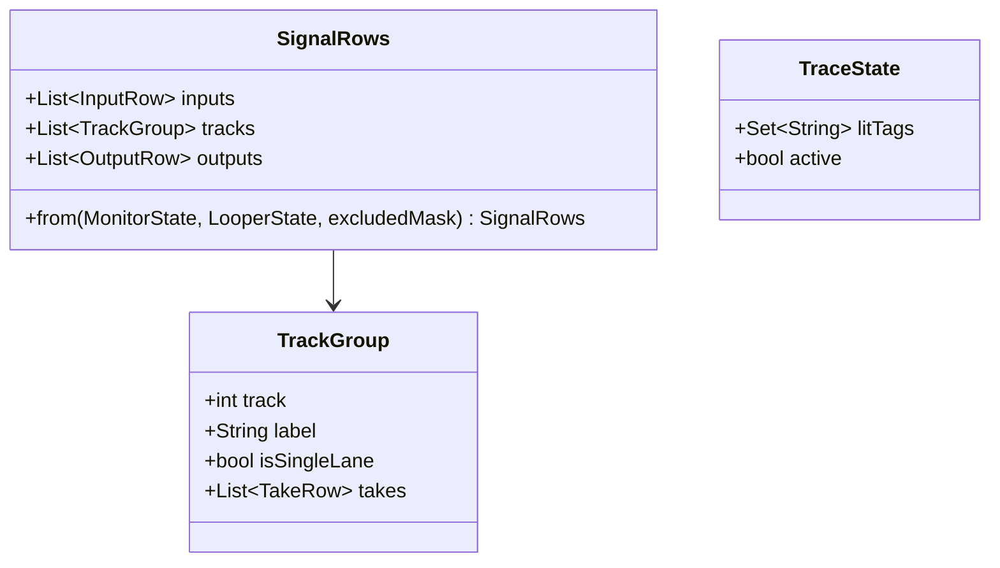

# refactor: Signal three-list routing surface

**Type:** refactor (presentation swap + test migration)
**Date:** 2026-06-22
**Branch:** `feat/unified-signal-surface` (evolves it; supersedes the node-graph
presentation from PR #70, which is still unmerged)
**Brainstorm:** [docs/brainstorm/2026-06-22-signal-list-surface-brainstorm-doc.md](../brainstorm/2026-06-22-signal-list-surface-brainstorm-doc.md)
**Mockup (interactive):** [docs/design/signal-list-surface-mockup.html](../design/signal-list-surface-mockup.html)

---

## Summary

Replace the full-screen **node-and-wire Signal graph** (PR #70) with **three
side-by-side scrolling lists** — `Inputs | Tracks | Outputs`. No wires: routing
is shown as **output-hued tappable chips**, "what connects to what" via
**tap-to-trace** (highlight related rows, dim the rest) plus consistent
per-output colour, and tracks are **grouped** so a single-lane track collapses to
the track itself (killing the duplicate "Lane 1" problem) while a multi-lane
track nests its takes.

This is a **presentation refactor**: the engine + state layer is unchanged, and
the PR #70 instrument-panel layer (tokens, fonts, gate pills, knob, dock) is
reused. Only the canvas/wires/geometry go away.

## Why

The node graph looks great at 2–6 channels but at ~16×16 every capture/playback
wire crosses one corridor and collapses into an unreadable ribbon; flattened
per-track lanes render as many identical "Lane 1"s. User decisions: scale is
**small most of the time, set-up-once**, and the chosen direction is a **flat
list with inline routing chips** (over hardening the graph or adding a matrix).

## Acceptance criteria

- [ ] The Signal surface renders three independent scrolling lists
      (Inputs | Tracks | Outputs); **no `GraphCanvas`/wires** anywhere.
- [ ] **Inputs list:** one row per hardware input — gate pill (LIVE/OFF), level,
      FX chain chips (tap → dock editor), output routing chips, mute/vol; loopback
      inputs struck-through + inert.
- [ ] **Tracks list:** grouped by track; a **single-lane track is one row that is
      the track** (its name/number, no "Lane 1"); a **multi-lane track** shows a
      header + nested `Take 1 / Take 2 …` rows. Each take shows its capture badge
      (`rec In N`), FX-snapshot marker, output chips, mute/vol.
- [ ] **Outputs list:** one row per output — structural on/off gate (greyed +
      struck when off), output id in its **fixed hue**, and a **"fed by"** summary;
      `liveRegion` "no active outputs" notice when all off.
- [ ] **Routing chips** wear the destination output's hue and toggle the route on
      tap (input chips → `MonitorCubit.setOutputMask`; take chips →
      `LooperLaneOutputChanged`). A **"+" chip opens an output picker** popover so
      the row never grows to a 16-wide strip (D6).
- [ ] **Tap-to-trace:** tapping any row highlights every related row + chip across
      all three lists and dims the rest; tapping it again / tapping background /
      `Esc` clears. View-local state, **no new cubit** (D3). **Dimming is visual
      only** — dimmed rows stay focusable + in the semantics tree, the lit state
      carries a non-colour semantic marker (not colour-alone, WCAG 1.4.1), and
      each clear path is tested.
- [ ] **Localized:** all new user-facing strings go through ARB (`app_en.arb` +
      `app_es.arb`) + `context.l10n` (D11); reuse `noActiveOutputsNotice`. The
      no-active-outputs notice is a **polite** `liveRegion`, asserted on the
      off→on transition. Pickers (output "+", capture badge) **restore focus to
      their trigger** on close.
- [ ] **Re-assign capture** without wires: a take's `rec In N` badge is tappable
      and opens an **input picker** (incl. "none/clean") → `LooperLaneInputChanged`
      (D7).
- [ ] **Responsive:** three panes side-by-side ≥ ~960 px; below that, a single
      stacked scrolling column with Inputs/Tracks/Outputs sections (D8).
- [ ] The contextual **dock** (input tone / take "this take" editor, `SignalKnob`,
      `EffectParamsEditor`) and PR #70 visual language are reused unchanged.
- [ ] Reached from the same entry (`showSignalPage`, the `bigpicture_openSignal`
      chrome button + `G`).
- [ ] Retired graph/canvas/layout code + tests removed; coverage migrated per the
      **old → new mapping table**; `flutter analyze` clean; tests green; macOS
      builds; goldens re-pointed (pixel regen is the author-only `screenshots`
      task).

## Non-goals (YAGNI)

- No matrix/patchbay grid; no wires; no pan/zoom canvas.
- No new state-management unit, no engine/native changes, no persistence changes.
- No deletion of `package:routing_graph` (still used by `big_picture_view`,
  `setup_surface`, `app_theme`, and for `FocusableTapTarget`); only its
  canvas/edge/geometry parts stop being used **by this surface**.

## Key decisions

| # | Decision | Why |
|---|----------|-----|
| D1 | **Presentation-only refactor.** Reuse `MonitorCubit` (inputs), `LooperBloc` lane/output events, the output gate, and capture-on-record. | The engine model is right; only the picture was wrong. |
| D2 | **Three lists, not a canvas.** A new `SignalListView` with three `_InputsPane` / `_TracksPane` / `_OutputsPane` widgets, each a `ListView`. | Scales by scrolling; zero crossing lines at any density. |
| D3 | **Tap-to-trace is view-local** via an immutable `TraceState` value object (`{Set<String> litTags; bool active}`), **not** twin nullable ints. No cubit. | Mirrors the existing view-local focus; one immutable value is clearer + easier to test than parallel fields. |
| D4 | **Track-grouped list model.** A pure helper builds rows: single-lane track → one "track row"; multi-lane → header + take rows. Lane numbers only when count > 1. | Fixes "Lane 1 ×8" structurally; testable without widgets. |
| D5 | **Per-output hue** via a new `outputColor(SurfaceTheme s, int out) => s.lanePalette[out % s.lanePalette.length]` in `signal_style.dart` — **token-sourced, no colour literals**; routing chips wear the destination hue. | The colour half of "what connects to what", kept on the theme token. |
| D6 | **Routing chips = lit routes + a "+" picker.** Show a chip per output the row routes to; a trailing "+" opens a popover of all outputs as toggles. No 16-wide chip row. | Keeps rows compact at 16 outputs. |
| D7 | **Capture via a tappable `rec In N` badge** → input picker popover (incl. clean/none). Replaces the canvas "focus lane, tap input node" gesture. | No wires to drag; explicit and discoverable. |
| D8 | **Responsive fallback** via `LayoutBuilder`: 3 panes ≥ a named `kSignalStackBreakpoint` (≈960 px), else one stacked column. | Narrow windows / second display; the breakpoint is a named constant, not a magic number. |
| D9 | **Keep the dock + style layer** (`signal_dock.dart`, `signal_knob.dart`, `signal_style.dart`, `EffectParamsEditor`) as-is; any `signal_dock` change is **additive only**. | They were never the problem; continuity with PR #70. |
| D10 | **Trace by tag-overlap.** Each row carries a tag set built from **`const` tag helpers** (`inTag(n)`→`'in{n}'`, `outTag(n)`→`'o{n}'`, `trkTag(n)`→`'trk{n}'`) defined once; a tapped row lights rows sharing ≥1 tag. | Simple, correct, matches the mockup; centralising the tag format avoids a typo silently breaking trace. |
| D11 | **All user-facing strings via l10n** (ARB `app_en.arb` + `app_es.arb`, `context.l10n`). Reuse `noActiveOutputsNotice`; add new keys for "fed by", `rec In {n}`, the output/input picker titles, and "+N". | The Signal surface is fully localized today; new strings must not regress `es`. |
| D12 | **`SignalRows` is pure presentation-model code** — it imports only `looper_repository` models + `MonitorState`/`LooperState`; **no `BuildContext`, no widgets, no data layer.** Lives in `lib/looper/view/signal_graph/`. | Keeps the model unit-testable and the layer boundary explicit. |

## Architecture

A small pure model + a stateful view; no new providers.

- `SignalRows.from(monitor, looper)` (pure, in a new `signal_rows.dart`) flattens
  `MonitorState` + `LooperState` into `InputRow` / `TrackGroup`(+`TakeRow`) /
  `OutputRow`, each carrying its **tag set** (for trace) and routing data. Single-
  lane collapse + labels happen here. Loopback exclusion comes from
  `LooperState.status.excludedInputMask` (it is **not** on `MonitorState`), read
  inside `from(...)` — no separate param.
- **"Fed by" is derived, not materialized.** `OutputRow` carries no `fedBy`
  field; the outputs pane computes each output's feeders at render from the
  already-built input/take rows (cheap, no sync risk).
- `SignalListView` (stateful) owns the existing dock focus **and** a single
  `TraceState _trace` (D3). It builds the three panes, dispatches the same engine
  events as today, and renders the dock. Rows + chips are **real widget classes**
  (`_InputRow`, `_TakeRow`, `_OutputRow`, `SignalRoutingChips`), not `_build`
  methods, styled from theme tokens only (no pixel params in their public APIs).
- Output hue helper `outputColor(SurfaceTheme, int)` added to `signal_style.dart`,
  sourced from `lanePalette` (D5).

## Implementation phases (stacked, each green & mergeable)

### Phase 1 — List model + three-pane scaffold (engine-wired)
- New `signal_rows.dart`: `SignalRows.from(...)` + row/group types + tags +
  single-lane collapse/labels. **Pure → fully unit-tested.**
- New `signal_list_view.dart` (`SignalListView`): three `ListView` panes
  (`_InputsPane`, `_TracksPane`, `_OutputsPane`) rendering rows from `SignalRows`,
  wired to `MonitorCubit` + `LooperBloc` (gate toggle, mute/vol via dock, output
  gate). Reuse the chrome bar + dock from PR #70.
- `showSignalPage` swaps `SignalView` → `SignalListView` (same providers/entry).
- Routing rendered **read-only** this phase (chips shown, not yet tappable) to
  keep the diff reviewable.
- Tests: `signal_rows_test.dart` (collapse, labels, tags, derived feeders), pane
  render tests (counts, loopback inert, gate states, a11y labels).
- **Success:** lists render + drive gate/mix/output-gate; analyze clean + tests
  green. **CI-green but not production-shippable on its own** — routing/trace
  land in Phase 2 and the old graph is removed in Phase 3; the three commits ship
  together in one PR (no two-surface intermediate state).

### Phase 2 — Routing chips + tap-to-trace + capture + responsive
- `SignalRoutingChips` widget (lit chips in output hues + "+" picker popover) →
  `setOutputMask` / `LooperLaneOutputChanged`.
- Tap-to-trace: `_traced` state + tag-overlap highlight/dim across panes; clear on
  re-tap / background / `Esc`. Outputs "fed by" summary + `liveRegion` no-active
  notice.
- Capture badge picker (`rec In N` → input picker) → `LooperLaneInputChanged`.
- `LayoutBuilder` responsive fallback (3 panes ↔ stacked column at
  `kSignalStackBreakpoint`).
- New ARB keys (D11) added to `app_en.arb` + `app_es.arb`; `flutter gen-l10n`.
- **Gate (review checkpoint):** no pixel doubles in any row/chip public API;
  `outputColor` resolves from `lanePalette` (no literals).
- Tests: chip toggle (both kinds → `setOutputMask` / `LooperLaneOutputChanged`),
  "+" picker, tap-to-trace (assert the exact lit vs dimmed set at 2×2 **and**
  16×16), capture re-assign (`LooperLaneInputChanged`), no-active-outputs polite
  notice on transition, a11y (chip/gate/trace semantics; dimmed-still-focusable;
  picker focus restore), responsive (stacked below breakpoint). **Migrate
  load-bearing assertions** from the old node/dock tests here.
- **Success:** full interaction matches the mockup; widget tests green.

### Phase 3 — Retire the graph + migrate tests + IA cleanup
- Delete `signal_graph_layout.dart`, `signal_input_node.dart`,
  `signal_lane_node.dart`, `signal_view.dart`; drop `GraphCanvas`/`GraphEdge`/
  `GraphEdgePainter`/`positionedNode`/`EffectChainCard`/`buildEffectDropZones`
  usage from this surface. (Revert the PR #70 glow added to `graph_edge_painter`
  if nothing else uses it; keep the kit + `FocusableTapTarget`/`ChannelChip`/theme
  mapper, still used elsewhere.)
- Update the `signal_graph.dart` barrel to export `showSignalPage` from
  `signal_list_view.dart`.
- **Old → new test mapping table** in the PR body; `git rm` the retired tests
  whose coverage moved (Phase 1/2). Re-point the `signal_surface` golden at the
  list surface (pixel regen = author `screenshots` task).
- **Success:** one list surface; no dangling refs; analyze clean; macOS builds;
  `MonitorCubit.load()` restore still drives the inputs list.

### Phase 4 — Review + ship
Standard ship ceremony: review pass, final analyze + tests + macOS build, update
`docs/PROGRESS.md`, update the PR.

## Old → new test mapping

| Retired (graph) test | New home |
| --- | --- |
| `signal_graph_layout_test` (geometry: edges, fan, fit) | **Dropped** — geometry retired; replaced by `signal_rows_test` (grouping/labels/tags/fed-by). |
| `signal_input_node_test` (gate a11y, level, excluded inert) | `_InputsPane` row tests in `signal_list_view_test`. |
| `signal_lane_node_test` (label, snapshot badge, tap) | `_TracksPane` take-row tests (capture badge, snapshot, grouping). |
| `signal_view_test` (capture-on-tap, output gate, focus, notice, a11y) | `signal_list_view_test` (chip routing, capture-badge picker, output gate, tap-to-trace, notice, a11y). |
| `signal_dock_test`, `signal_knob` behaviour | **Kept** — dock/knob reused unchanged. |

## File-by-file

**New:** `signal_rows.dart`, `signal_list_view.dart`,
`signal_routing_chips.dart`; tests `signal_rows_test.dart`,
`signal_list_view_test.dart`, `signal_routing_chips_test.dart`.
**Modify:** `signal_graph.dart` (barrel), `signal_style.dart` (+`outputColor` +
const tag helpers + `kSignalStackBreakpoint`), `signal_dock.dart` (additive only,
if a row→dock wiring tweak is needed), `lib/l10n/arb/app_en.arb` +
`app_es.arb` (new keys, D11), screenshot test (re-point), `docs/PROGRESS.md`.
**Delete:** `signal_graph_layout.dart`, `signal_input_node.dart`,
`signal_lane_node.dart`, `signal_view.dart` + their tests.
**Untouched:** `MonitorCubit`, `LooperBloc`/events, `LooperState`, fonts/theme,
`signal_knob.dart`, `EffectParamsEditor`, `package:routing_graph` (kept).

## Risks

- **R1 — Coverage silently dropped when graph tests go.** Mitigate: migrate
  assertions in Phase 1/2 (not Phase 3); ship the mapping table; Phase 3 is mostly
  `git rm`.
- **R2 — Trace correctness at scale.** Mitigate: tag-overlap is pure → unit-test
  the lit set for representative taps (input, take, output) at 2×2 and 16×16.
- **R3 — Chip popover a11y.** Mitigate: the "+" picker + capture badge are
  focusable, labelled, keyboard-operable (reuse `FocusableTapTarget`/menu).
- **R4 — Visuals may still change** after a `/frontend-design` pass. Mitigate:
  keep rows/chips as small widget classes with token-only styling so a restyle is
  contained.

## Out of scope

- Matrix view, wires, pan/zoom; persistence/engine changes; golden pixel
  regeneration (author `screenshots` task).

## Open questions — resolved here

- **Chip overflow (16 outputs):** lit chips for current routes + a single "+"
  popover picker (D6) — *not* a 16-wide row or horizontal scroll.
- **Capture without wires:** tappable `rec In N` badge → input picker (D7).
- **Narrow window:** stack to one column below ~960 px (D8).
