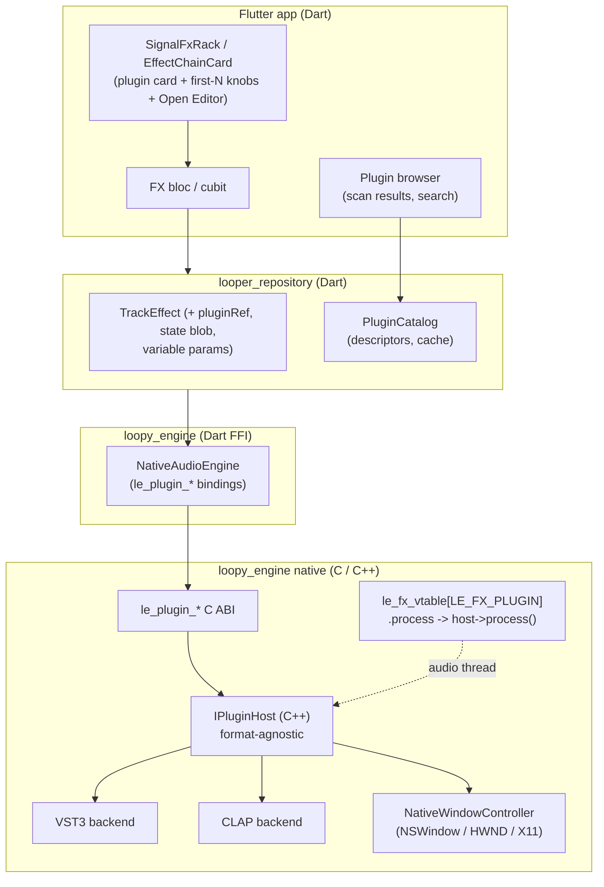
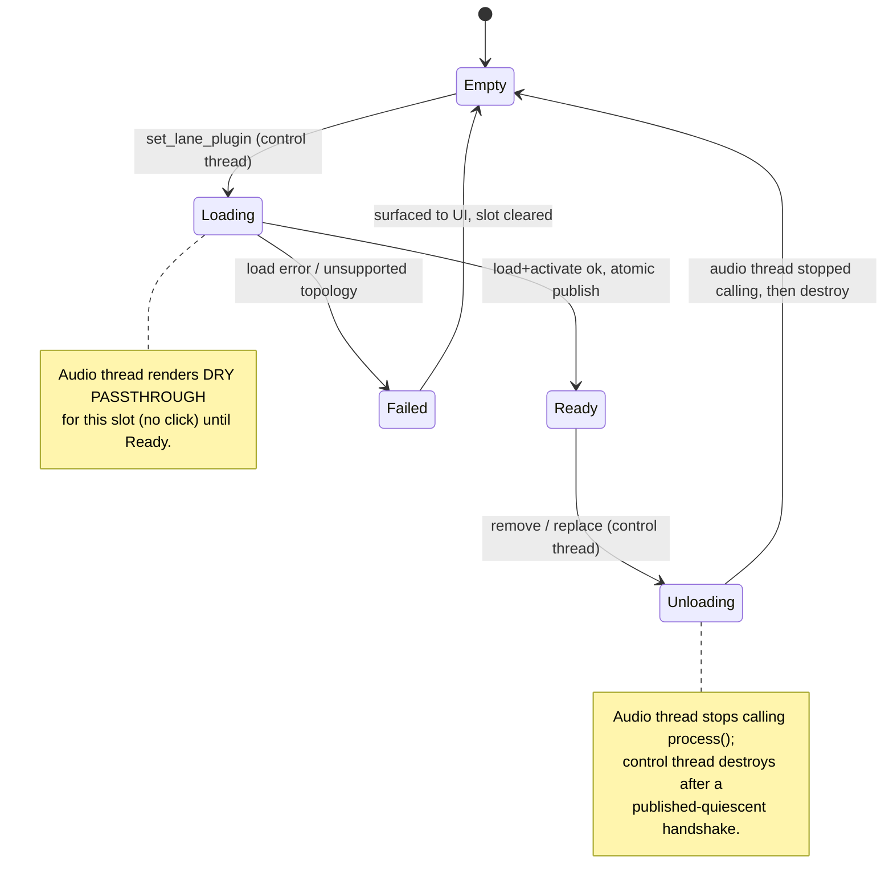
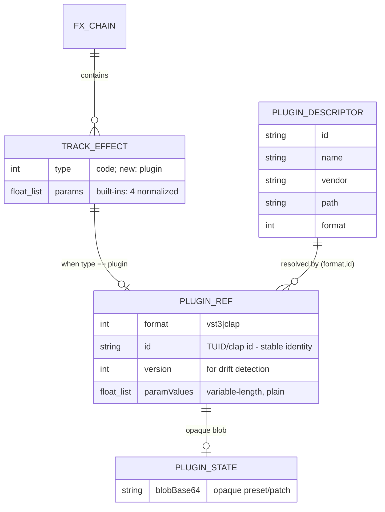

> **Umbrella plan — split into 9 parts.** This file holds the shared design,
> decisions (D-*), data model, edge cases, and acceptance criteria that every part
> references. The concrete work is in the standalone `-part-N` files below; each is
> independently mergeable and cites this umbrella for shared design:
> - [part 1 — SDK vendoring + build wiring](./2026-06-23-feat-vst3-clap-plugin-hosting-part-1-plan.md)
> - [part 2 — scan ABI + PluginCatalog](./2026-06-23-feat-vst3-clap-plugin-hosting-part-2-plan.md)
> - [part 3 — slot lifecycle + vtable row](./2026-06-23-feat-vst3-clap-plugin-hosting-part-3-plan.md)
> - [part 4 — topology guard + sealed model](./2026-06-23-feat-vst3-clap-plugin-hosting-part-4-plan.md)
> - [part 5 — dynamic params + knob UI](./2026-06-23-feat-vst3-clap-plugin-hosting-part-5-plan.md)
> - [part 6 — native editor window (macOS)](./2026-06-23-feat-vst3-clap-plugin-hosting-part-6-plan.md)
> - [part 7 — state persistence + missing-plugin resilience](./2026-06-23-feat-vst3-clap-plugin-hosting-part-7-plan.md)
> - [part 8 — Windows port (HWND)](./2026-06-23-feat-vst3-clap-plugin-hosting-part-8-plan.md)
> - [part 9 — Linux port (X11)](./2026-06-23-feat-vst3-clap-plugin-hosting-part-9-plan.md)
>
> Source: [VST3 & CLAP Plugin Hosting brainstorm (2026-06-23)](../brainstorm/2026-06-23-vst3-clap-plugin-hosting-brainstorm-doc.md).
> Grounded by an official VST3/CLAP host-API research pass, a user-flow analysis, and
> a three-agent technical review (simplicity, VGV conventions, plan-splitting) — all
> folded into the decisions, data model, and edge cases below.

## feat: VST3 & CLAP plugin hosting — Extensive (umbrella)

## Overview

Make Loopy **host third-party VST3 and CLAP audio-effect plugins** as entries in
the existing per-lane and per-input FX chains. A hosted plugin appears as just
another effect "type" alongside the built-in DSP kernels (drive, filter, delay,
reverb…), slotting into the engine's existing `le_fx_vtable` as a new
`LE_FX_PLUGIN` row whose `process` callback drives an in-process plugin host.
Users can scan for installed plugins, insert one into any FX slot, tweak a bounded
set of parameters via in-app knobs, open the plugin's **own native editor window**,
and have the plugin's full state round-trip through session persistence.

Targets **all three platforms** (macOS, Windows, Linux) and **both formats** behind
one format-agnostic host abstraction, but is **sequenced macOS-first** because that
is the only production-validated platform.

**Out of scope (explicit):** exporting Loopy's engine *as* a plugin (the inverse
direction) is a separate, later brainstorm. So are instrument plugins, multi-bus /
sidechain topologies, MIDI-driven plugins, and out-of-process sandboxing (named as
a future hardening phase, not MVP).

### Locked scope decisions (from planning Q&A)

| # | Decision | Choice | Consequence |
|---|----------|--------|-------------|
| **Q1** | Where a plugin may live | **Lane *and* monitor chains.** At record time, the monitor chain's plugin is serialized to its **opaque state blob** and lazily re-instantiated per recording lane on playback (a "frozen" plugin snapshot), preserving the dry-recording invariant. | Record-time path must serialize plugin state, not value-copy a live instance ([D-P1](#decisions)). |
| **Q2** | In-app parameter surface | **Native editor + first-N knobs.** The plugin card renders the first `N` (= `kPluginKnobs`, default 4) *automatable* params as in-app knobs, plus an **Open Editor** button for the full native window. | UI delta is bounded; full control lives in the native window + two-way sync. |
| **Q3** | RT / crash posture | **Sanitize + documented best-effort.** Plugin output is denormal-flushed and NaN/Inf-sanitized at the slot boundary. An in-process plugin *can* stall or crash the engine — blast radius documented honestly. **No** watchdog or sandbox in MVP; out-of-process is a named future phase. | No new audio-thread watchdog machinery in MVP; one cheap sanitize pass added. |

## Problem Statement / Motivation

The engine was designed for this from day one — both the FX vtable
([engine_fx.c:904](../../packages/loopy_engine/src/core/engine_fx.c)) and the
`le_fx_type` enum
([loopy_engine_api.h:169](../../packages/loopy_engine/src/core/loopy_engine_api.h))
carry comments stating a hosted VST3/CLAP plugin can "later slot in as just another
row whose `process` calls the plugin host." VST3 relicensed to **MIT** (VST 3.8,
Oct 2025) and CLAP is **MIT**, so neither blocks the MIT engine core.

But the current model assumes every FX slot is a **stateless 4-float pure function**
the audio thread can null-guard and reset for free:

- `LE_FX_PARAMS` is hardcoded to **4 normalized floats** per slot
  ([loopy_engine_api.h:167](../../packages/loopy_engine/src/core/loopy_engine_api.h)).
  Real plugins expose arbitrary param counts, plain (non-normalized) ranges, and an
  **opaque state blob** beyond exposed params.
- `TrackEffect` is `{type, List<double> params}` with **no place for opaque state,
  plugin identity, or a variable-length param list**
  ([track_effect.dart:117](../../packages/looper_repository/lib/src/models/track_effect.dart)).
- Type changes reset DSP state cheaply on the audio thread
  ([engine_process.c](../../packages/loopy_engine/src/core/engine_process.c)); a
  plugin **cannot** be created/destroyed/`prepare`d on the audio callback.
- `fromCode` silently falls back to `none`
  ([track_effect.dart:84](../../packages/looper_repository/lib/src/models/track_effect.dart))
  — acceptable for a built-in, **data loss** for a user's plugin.
- The chain is hardcoded **stereo** (`fx_apply_chain(... float* l, float* r ...)`).
- No `le_plugin_scan` ABI exists; no native-window plumbing exists.

This feature grafts an **unbounded, stateful, crash-prone, possibly-RT-violating**
object onto that model. Nearly every design decision below is a consequence of that
mismatch.

## Proposed Solution

A new **in-process host module** (C++ behind a C ABI) sits under the engine. A
single `LE_FX_PLUGIN` vtable row dispatches the audio callback into a live plugin
instance owned by a per-slot host handle. Loading, scanning, param enumeration,
native windows, and state (de)serialization all happen on the **control/main
thread**; only `process` runs on the audio thread. A new ABI section
(`le_plugin_*`) exposes scanning, instancing, dynamic params, native windows, and
state to the Dart FFI layer. The Dart/repository/UI layers gain a plugin-aware
extension of `TrackEffect` and a plugin browser.

### Architecture (chosen: A — in-process host behind the FX vtable)



**Why A.** Smallest delta to the current architecture; fastest path to a plugin
making sound. It follows the grain of everything already in the engine (hand-rolled
C core, miniaudio, hand-authored FFI). Out-of-process sandboxing (B) is rejected for
MVP on upfront cost; JUCE (C) is rejected on licensing (GPLv3) + fit. (Full
rationale in the brainstorm.)

### The `IPluginHost` abstraction (C++)

One format-agnostic interface with per-format backends, behind a C ABI so Dart FFI
and the C engine never see C++ types:

```cpp
// packages/loopy_engine/src/host/plugin_host.h  (C++ internal)
struct PluginDescriptor { std::string id, name, vendor; PluginFormat fmt; std::string path; };
struct ParamInfo { uint32_t id; std::string name, unit; double min, max, def;
                   int32_t stepCount; uint32_t flags; };

class IPluginHost {                       // one instance per loaded plugin slot
 public:
  virtual bool   load(const PluginDescriptor&, double sr, int maxBlock) = 0;  // main
  virtual void   activate() = 0;          // main; allocate, ready-but-bypassed
  virtual void   process(float* l, float* r, int n) = 0;  // AUDIO THREAD ONLY
  virtual int    paramCount() = 0;        // main
  virtual ParamInfo paramInfo(int idx) = 0;               // main
  virtual double paramGet(uint32_t id) = 0;               // main
  virtual void   paramSetQueued(uint32_t id, double plain) = 0; // thread-safe -> RT queue
  virtual bool   openEditor(void* parentNativeView) = 0;  // main
  virtual void   closeEditor() = 0;       // main
  virtual std::vector<uint8_t> saveState() = 0;           // main, opaque blob
  virtual bool   loadState(const uint8_t*, size_t) = 0;   // main
  virtual ~IPluginHost() = default;
};
// VST3Host : IPluginHost   — IComponent/IAudioProcessor/IEditController/IPlugView
// ClapHost : IPluginHost    — clap_plugin + params/gui/state extensions
```

Param-change flow is **never a direct store from the audio thread** (both SDKs
forbid it). `paramSetQueued` pushes onto a lock-free SPSC ring; the host drains it
at the top of `process()` into the SDK's native event/queue mechanism
(VST3 `IParameterChanges`, CLAP `clap_input_events`). Inbound changes (user turns a
knob in the native window) are drained from the SDK's output events / read back on a
low-rate main-thread poll and reconciled into app state — see [D-SYNC](#decisions).

### New C ABI surface (`le_plugin_*`)

Mirrors the existing `le_engine_*` style (opaque handles, `int32_t` result codes,
`out`-param structs, fixed-size char buffers for FFI). **No varargs** — every
per-slot call takes a concrete **opaque `le_plugin_slot*` handle** returned when the
plugin is loaded into a slot. This resolves the addressing question up front (review
finding C1/VGV) so ffigen binds clean signatures and dependent PRs inherit a stable
ABI. New header section in
[loopy_engine_api.h](../../packages/loopy_engine/src/core/loopy_engine_api.h):

```c
/* ---- Scanning (main thread; runs on a dedicated scan thread, see below) ---- */
typedef enum le_plugin_format { LE_PLUGIN_VST3 = 0, LE_PLUGIN_CLAP = 1 } le_plugin_format;

typedef struct le_plugin_desc {
  char     id[256];      /* VST3 TUID hex / CLAP descriptor id — stable identity */
  char     name[128];
  char     vendor[128];
  char     path[1024];   /* bundle / .clap file */
  int32_t  format;       /* le_plugin_format */
  uint32_t version;      /* packed for drift detection: VST3 major<<16|minor<<8|patch;
                          * CLAP major<<16|minor<<8|patch parsed from semver (N3) */
} le_plugin_desc;

/* le_plugin_scan_begin spawns ONE dedicated OS scan thread (the engine has no pool);
 * Dart polls le_plugin_scan_poll on a timer. The scan thread never touches the audio
 * callback. Each candidate is loaded under a per-candidate try + timeout so one
 * broken plugin yields a "failed" entry, not an aborted scan (D-SCAN). */
LE_EXPORT int32_t le_plugin_scan_begin(le_engine*, int32_t rescan);
LE_EXPORT int32_t le_plugin_scan_poll(le_engine*, int32_t* done, int32_t* found, int32_t* scanned, int32_t* total);
LE_EXPORT int32_t le_plugin_scan_get(le_engine*, int32_t index, le_plugin_desc* out);
LE_EXPORT int32_t le_plugin_scan_cancel(le_engine*);

/* ---- Opaque per-slot handle ---- */
typedef struct le_plugin_slot le_plugin_slot;  /* host-owned; valid until cleared */

/* ---- Per-slot instance lifecycle (control thread) ---- */
/* Loads + activates a plugin into a lane (channel, lane, slot) or monitor
 * (input, slot), BYPASSED, then atomically publishes "ready" so the audio thread
 * starts calling it. On success *out_slot receives the handle used by every call
 * below. Returns LE_ERR_* on load failure / unsupported topology (D-BUS). Clearing
 * the slot (set type back to none) destroys the handle after a quiescent handshake. */
LE_EXPORT int32_t le_engine_set_lane_plugin(le_engine*, int32_t channel, int32_t lane,
                                            int32_t slot, const char* plugin_id,
                                            le_plugin_slot** out_slot);
LE_EXPORT int32_t le_engine_set_monitor_plugin(le_engine*, int32_t input, int32_t slot,
                                               const char* plugin_id,
                                               le_plugin_slot** out_slot);

/* ---- Dynamic parameters (main thread) ---- */
typedef struct le_plugin_param_info {
  uint32_t id; char name[128]; char unit[32];
  double   min, max, def; int32_t step_count; uint32_t flags; /* automatable/readonly/bypass/hidden/stepped */
} le_plugin_param_info;

LE_EXPORT int32_t le_plugin_param_count(le_plugin_slot*, int32_t* count);
LE_EXPORT int32_t le_plugin_param_info_at(le_plugin_slot*, int32_t idx, le_plugin_param_info* out);
LE_EXPORT int32_t le_plugin_param_get(le_plugin_slot*, uint32_t id, double* plain);
LE_EXPORT int32_t le_plugin_param_set(le_plugin_slot*, uint32_t id, double plain); /* -> RT queue */

/* ---- Native editor window (main thread) ---- */
LE_EXPORT int32_t le_plugin_editor_open(le_plugin_slot*);  /* host owns the OS window */
LE_EXPORT int32_t le_plugin_editor_close(le_plugin_slot*);
LE_EXPORT int32_t le_plugin_editor_is_open(le_plugin_slot*, int32_t* open);

/* ---- Opaque state (main thread) ---- */
LE_EXPORT int32_t le_plugin_state_size(le_plugin_slot*, int32_t* bytes);
LE_EXPORT int32_t le_plugin_state_get(le_plugin_slot*, uint8_t* buf, int32_t cap, int32_t* written);
LE_EXPORT int32_t le_plugin_state_set(le_plugin_slot*, const uint8_t* buf, int32_t bytes);
```

> `kPluginKnobs` (the first-N cutoff, D-UI) is a **Dart UI-layer** constant, not an
> ABI concern: `le_plugin_param_count`/`_info_at` always return the full list and the
> card decides how many to render (review finding N1).

A new `LE_FX_PLUGIN` enum value is added to `le_fx_type`, with a vtable row whose
`process` forwards to the slot's `IPluginHost::process` and whose `defaults` is a
no-op (params come from the plugin, not a fixed table). `fx_apply_chain` gains a
plugin branch that calls the host and then **sanitizes** the output
(`flush-denormals + NaN/Inf -> 0`) before it re-enters the chain.

### Plugin-slot lifecycle (cross-thread)

This is the heart of [D-LIFE](#decisions). The audio thread must never load/free a
plugin; it only ever reads an atomically-published "ready" flag.



## Decisions

These resolve the brainstorm's Open Questions and the flow analysis's "DECISION
NEEDED" items.

| # | Topic | Decision |
|---|-------|----------|
| **D-P1** | Plugin in snapshot-copied monitor chain (the dry-recording hotspot, `_snapshotMonitorChainsOntoLanes` [looper_repository.dart:511](../../packages/looper_repository/lib/src/looper_repository.dart)) | Today this is a pure Dart by-value `List.of` copy. With plugins it must, **at record-stop**, call `le_plugin_state_get` (control thread) on the monitor slot and store the returned **opaque blob** on each recording lane's `PluginEffect`. On playback the lane **lazily instantiates a distinct *frozen* host** from that blob — a separate `IPluginHost` from the live monitor host, created at first lane playback and destroyed on take-delete (not pooled). If blob capture **fails** (plugin mid-load / `state_get` error), the lane entry falls back to **bypassed** and the capture error is surfaced; the captured **audio is byte-identical dry regardless** (the invariant does not depend on capture success). (Q1: lane + monitor, blob snapshot.) |
| **D-LIFE** | Cross-thread slot lifecycle | Control-thread **load → activate (bypassed) → atomic publish "ready"**; audio thread renders **dry passthrough** until ready and after unload is requested. Destroy happens control-thread-side after a published-quiescent handshake. **No** alloc/lock/dylib-load on the audio thread. |
| **D-RT** | RT-safety boundary | Plugin slots are **explicitly RT-exempt** ("best effort"): a stalling plugin can xrun the whole device callback and desync the master clock — **documented blast radius**, no watchdog in MVP. Output is **sanitized** (denormal flush + NaN/Inf→0) at the slot boundary so a misbehaving plugin can't poison downstream lanes or the master sum. (Q3.) |
| **D-PARAM** | Dynamic params vs fixed 4-float | Plugins carry a **variable-length** param list sourced live from the plugin; built-in effects keep their fixed 4-float surface unchanged. `le_plugin_param_*` is a **separate ABI section** — `LE_FX_PARAMS` is *not* widened. Param sets are **queued** into the SDK event mechanism, never stored from the audio thread. |
| **D-SYNC** | Two-way param/state sync (native window ↔ app) | App→plugin: queued param set. Plugin→app: re-read **full state on editor-close and on session-save**; a low-rate (≤10 Hz) main-thread poll mirrors the first-N knob values while an editor is open. On conflict, **the plugin is the source of truth**. **Sequencing:** the editor-close/save state re-read must run **after** the RT param queue is drained, never concurrently, or a just-queued in-app knob change is clobbered by the re-read. The poll **timer is owned by `LooperBloc` and cancelled on close** (no leaked timer). |
| **D-UI** | In-app knob surface | Card shows the first `kPluginKnobs` (=4) **automatable, non-hidden** params as knobs + **Open Editor**. A 0-param plugin shows name + bypass + Open Editor only. (Q2.) |
| **D-MISS** | Missing/moved/version-drift plugin on reload | Render a **placeholder/disabled slot** that **preserves the opaque blob + plugin ref** and shows "Plugin X unavailable" (relinkable later). The `none` silent-fallback **must not** apply to plugin entries. Identity = `format + id (+ version)`; same-id/different-version relinks with a "version changed" note. |
| **D-WIN** | Native window ownership | Host owns a **top-level OS window** (NSWindow / HWND / X11), *not* embedded in the Flutter tree (sidesteps the child-window limitation PROGRESS.md flags). Closing the owning **slot / lane / track / session** force-closes its editor; **app quit** closes all editors. Removing a plugin whose editor is open force-closes the window first. |
| **D-SCAN** | Scanning | **Async** control-thread scan with progress + cancel; **never** blocks the audio callback. Results cached keyed by **(path, mtime, size)** so a reinstalled/updated plugin re-scans; cache invalidated on app-version bump. A single broken plugin is caught per-candidate (try + timeout) → a "failed to scan" entry, **not** an aborted scan. (Out-of-process scan isolation is a named follow-up if in-process crashes prove common.) |
| **D-BUS** | Topology guard | MVP accepts **stereo-in/stereo-out effect** plugins only; **mono→stereo** is adapted (duplicate L→R). Instruments (no audio-in), multi-bus, and sidechain plugins are **rejected at insert** with a localized message; no partial slot is created. |
| **D-LICENSE** | Vendoring posture | Vendor VST3 SDK (MIT, 3.8+) + CLAP headers (MIT) under `third_party/`. Both MIT → clean for the MIT engine core. Windows is **already GPLv3** via the vendored ASIO SDK ([third_party/asiosdk](../../packages/loopy_engine/third_party)); VST3/CLAP being MIT **does not worsen** that — documented in `third_party/README.md`. |

## Data Model

`TrackEffect` becomes a **sealed hierarchy** — `BuiltInEffect` (the current
`{type, params:[4]}`) and `PluginEffect` (plugin ref + variable params + opaque
blob) — in **both** the engine model
([track_effect.dart](../../packages/loopy_engine/lib/src/track_effect.dart)) and the
repository mirror
([models/track_effect.dart](../../packages/looper_repository/lib/src/models/track_effect.dart)).
This avoids a half-null god-object (review finding: prefer sealed over nullable
plugin fields bolted onto the built-in class); `props`/`copyWith`/`==` are updated
per variant. The engine model is the source of truth and the repository mirrors it,
exactly as today — **no domain/engine drift**; the engine codec is added first, the
repository delegates to it.

**Wire format: no envelope.** Today `encodeTrackEffects` emits a **bare top-level
JSON array** `[{type,params}]` with no `schemaVersion` — there is no envelope to
bump, and inventing one would itself break every existing key. Instead,
`decodeTrackEffects` **dual-decodes by entry shape**: a built-in entry is unchanged;
a plugin entry is recognized by `type == LE_FX_PLUGIN` carrying a `plugin` key. A
pre-plugin (v1) session is simply an array with no plugin entries and decodes
untouched (back-compat is the presence/absence of the `plugin` key, not a version
field — review finding I1/VGV-critical).



Wire-format sketch (still a **bare array**, the engine serializer stays the single
source of truth — repository delegates to it):

```jsonc
// Bare top-level array, unchanged container. Built-in entries keep {type, params:[4]}
// and decode untouched; plugin entries are recognized by type == LE_FX_PLUGIN + "plugin".
[
  { "type": 1, "params": [0.5, 0.8, 0, 0] },              // built-in drive (unchanged)
  { "type": 8,                                            // LE_FX_PLUGIN
    "plugin": { "format": 0, "id": "56535444...", "version": 10203 },
    "paramValues": [0.7, 0.2, 1.0],                       // variable length, plain
    "state": "BASE64==" }                                 // opaque blob, optional
]
```

Files that change for the model:
[track_effect.dart](../../packages/loopy_engine/lib/src/track_effect.dart) (engine
serializer + new `LE_FX_PLUGIN` code),
[models/track_effect.dart](../../packages/looper_repository/lib/src/models/track_effect.dart)
(domain mirror + plugin ref/state; `fromCode` must **not** silent-drop plugin codes),
[looper_repository.dart](../../packages/looper_repository/lib/src/looper_repository.dart)
(`_snapshotMonitorChainsOntoLanes` blob capture for D-P1),
[settings_repository.dart](../../packages/settings_repository/lib/src/settings_repository.dart)
(blob-bearing persistence; the existing per-`(channel,lane)`/`input` string values
now hold base64 blobs — confirm the key scheme holds the larger payloads + add a
round-trip test).

## State Management & Engine Boundary

The repo drives every FX edit through **typed `LooperBloc` events**
([looper_event.dart](../../lib/looper/bloc/looper_event.dart)) and
`_pushLaneEffects`/`_pushMonitorEffects` — there is **no separate FX cubit** (the
architecture diagram's "FX bloc / cubit" box is the existing `LooperBloc`; do not add
a redundant state unit). The existing `LooperLaneEffectParamChanged` carries
`param: int (0..kTrackEffectParams-1)` + `value: 0..1` and **cannot** be reused for
plugins (params are a `uint32 id` with a *plain* range). This feature adds:

- **New `LooperBloc` events** (and monitor equivalents): `LooperLanePluginInserted`
  (channel, lane, slot, pluginId), `LooperLanePluginParamChanged` (slot, paramId,
  plainValue), `LooperLanePluginEditorOpened` / `…Closed`, `LooperLanePluginRelinked`
  (for D-MISS placeholders). UI **dispatches events** — no business logic / FFI calls
  in widgets (VGV).
- **Engine boundary is the `AudioEngine` interface, not `NativeAudioEngine`
  directly.** The boundary is `abstract interface class AudioEngine`
  ([audio_engine.dart](../../packages/loopy_engine/lib/src/audio_engine.dart)) split
  into capability interfaces (`EngineLifecycle`/`EngineRouting`/…) with
  `NativeAudioEngine` and **`MockAudioEngine`** implementations. Plugin calls land on
  a **new `EnginePluginHosting` capability interface**, mirroring that segregation.
- **`MockAudioEngine` parity is mandatory.** Every `le_plugin_*` capability must be
  stubbed in
  [mock_audio_engine.dart](../../packages/loopy_engine/lib/src/mock_audio_engine.dart)
  with deterministic fakes (fixed scan list, fake param enumeration, no-op editor) or
  `flutter test` goes red app-wide. This is per-PR, not deferred.
- **Localized strings (ARB, en + es).** New user-facing keys: `pluginScanProgress`
  (`{found}`/`{total}` placeholders), `pluginScanFailedEntry`, `pluginLoadFailed`,
  `pluginUnsupportedTopology` (D-BUS reject), `pluginUnavailable` (D-MISS),
  `pluginVersionChanged`, `pluginWaylandUnsupported`. Added to **both** `app_en.arb`
  and `app_es.arb` with `@`-metadata.
- **UI widget discipline.** The plugin card is its own extracted widget class
  (e.g. `_PluginDeviceCard`, sibling to the existing `_DeviceCard`/`_DraggableDevice`
  in [signal_fx_rack.dart](../../lib/looper/view/signal_graph/signal_fx_rack.dart)) —
  not a `_build` method — resolving sizing/colors from the existing `LooperTheme`
  `ThemeExtension`s ([signal_style.dart](../../lib/looper/view/signal_graph/signal_style.dart)),
  no pixel params in its public API.

## PR Sequence

A stacked multi-PR effort. Each PR is independently mergeable and leaves the tree
green (macOS, incl. `MockAudioEngine` stubs) unless explicitly noted. The split
below is the **9-PR decomposition from the plan-splitting review** — it separates the
build-wiring churn (vendoring) from logic, gives the safety-critical cross-thread
**lifecycle state machine its own focused PR**, and surfaces the domain-model + the
`fromCode` silent-drop fix as an explicit gate. To be formalized into `-part-N`
files by `/plan-technical-review`.

| PR | Title | Scope | Deps | Visible result |
|----|-------|-------|------|----------------|
| **1** | `feat(plugin): SDK vendoring + build wiring` | Vendor VST3 SDK (MIT 3.8) + CLAP headers under `third_party/`; wire SPM `Package.swift` + CocoaPods forwarders + CMake; D-LICENSE note in `third_party/README.md`. Headers only, **no new logic** — CI green is the pass/fail. | — | CI green with SDKs vendored. |
| **2** | `feat(plugin): scan ABI + PluginCatalog` | `IPluginHost` interface skeleton; VST3 **+** CLAP scan backends; `le_plugin_scan_*` ABI (dedicated scan thread, D-SCAN) + ffigen + `dart format`; `EnginePluginHosting` iface + `MockAudioEngine` scan stub; Dart `PluginCatalog` + cache (path,mtime,size). | 1 | App lists installed plugins. |
| **3** | `feat(plugin): slot lifecycle + vtable row` | `LE_FX_PLUGIN` vtable row; per-slot `load/activate/process`; **cross-thread lifecycle state machine (D-LIFE)** — atomic publish, quiescent handshake, dry passthrough; output **sanitize (D-RT)**; `le_engine_set_lane_plugin`/`set_monitor_plugin` + `le_plugin_slot` handle; ffigen; mock stubs. | 2 | A plugin makes sound. |
| **4** | `feat(plugin): topology guard + sealed model` | Topology guard (D-BUS, localized reject); sealed `TrackEffect` → `BuiltInEffect`\|`PluginEffect` with `pluginRef` (engine + repo mirror); **`fromCode` must not silent-drop plugin codes** (the data-loss fix). Pure Dart + small ABI. | 3 | Model carries plugins; unsupported rejected. |
| **5** | `feat(plugin): dynamic params + knob UI` | `le_plugin_param_*` ABI + RT param queue; FFI bindings + mock; `paramValues` variable-length on `PluginEffect`; `_PluginDeviceCard` first-N knobs (D-UI, theme tokens); new `LooperBloc` plugin-param events + `bloc_test`; app→plugin queued sets. | 4 | First-N knobs tweak a plugin in-app. |
| **6** | `feat(plugin): native editor window (macOS)` | `NativeWindowController` (NSWindow); `le_plugin_editor_*` + ffigen; window lifecycle/teardown (D-WIN); ≤10 Hz inbound poll + editor-close sync, drain-before-refresh (D-SYNC); editor-open/close events + `bloc_test`. macOS only. | 5 | Open a plugin's own editor window. |
| **7** | `feat(plugin): state persistence + missing-plugin resilience` | `le_plugin_state_*` + ffigen; dual-decode (no envelope) + `settings_repository` blob round-trip; `PluginEffect` blob field; **D-P1** record-time blob snapshot; **D-MISS** placeholder/relink + events; v1-array decode test; **dry-invariant byte-compare test**. | 6 | Sessions round-trip plugin state; dry invariant proven. |
| **8** | `feat(plugin): Windows port (HWND)` | Registry/Common-Files scan; HWND editor embedding; GPLv3 posture doc (D-LICENSE). | 7 | Plugins on Windows. |
| **9** | `feat(plugin): Linux port (X11)` | `/usr/lib/vst3`, `~/.clap` scan; X11 editor embedding (Wayland unsupported w/ message); confirm Linux GUI expectations (many plugins ship no Linux build). | 8 | Plugins on Linux. |

> **First-PR candidates for a contributor new to the area:** PR1 (mechanical
> vendoring, CI-green pass/fail) and PR4 (pure Dart, self-contained, well-specified).

> **Future hardening (separate brainstorm, not this stack):** out-of-process
> sandbox (architecture B), stall watchdog, out-of-process scan isolation,
> exporting Loopy *as* a plugin.

## Edge Cases

**Scanning** — 0 plugins found (empty state); plugin crashes/times out during scan
(per-candidate guard → "failed to scan" entry, scan continues); cache stale after
reinstall/update (re-scan via mtime/size key); scan while audio running (must not
block callback); rescan mid-scan; duplicate plugin id in two paths (**first wins**,
where "first" = scan order: user paths before system paths, then lexicographic by
path).

**Insert** — load failure (clear message, no slot created); slow load (async,
spinner, cancelable); mono-only adapted L→R; instrument / multi-bus / wrong channel
count rejected (D-BUS); insert into a full 8-deep chain (rejected as today); same
plugin inserted twice (two independent instances + two editor windows).

**Params** — 0-param plugin (card = name + bypass + Open Editor); 200-param plugin
(only first-N knobs in-app, rest in native window); param changed in native window
reflects in app (D-SYNC poll/close); app knob reflects in native window; output
NaN/denormal sanitized (D-RT).

**Editor window** — open/close; multiple editors open at once; close
session/track/lane while editor open (force-close); quit app with editors open
(close all); remove plugin while editor open (force-close first); multi-monitor
placement; focus stealing; window must never outlive its plugin instance.

**Persistence** — save+reload with plugin present; plugin uninstalled / moved /
version-drift on reload (placeholder preserves blob, relinkable — D-MISS); huge
state blob restore (async, slot bypassed until ready); corrupt/garbage blob (safe
fallback, slot disabled, no crash); pre-plugin (schema v1) session still decodes;
**dry-recording invariant**: the captured take is plugin-free; the plugin only
colors playback (D-P1).

**RT** — plugin allocates/locks/stalls on the callback (documented xrun blast
radius, D-RT); plugin emits NaN/Inf (sanitized); remove plugin slot while audio runs
(no use-after-free, D-LIFE); reorder a chain containing a plugin mid-stream; plugin
crash mid-callback (in-process ⇒ documented app crash; autosave is a follow-up).

**Cross-platform** — macOS session opened on Linux where the plugin has no build
(placeholder, D-MISS); X11 vs Wayland editor (X11 only MVP); Windows registry scan
vs macOS bundle scan; GPLv3-on-Windows posture unchanged by MIT VST3/CLAP
(D-LICENSE).

## Acceptance Criteria

- [ ] **Dry invariant.** A take recorded with a plugin in the (lane or
  snapshot-copied monitor) chain produces a captured buffer **byte-identical** to
  the same take with the plugin bypassed — the plugin affects playback color only.
  *(Automated engine test.)*
- [ ] **Output safety.** Plugin-slot output is denormal-flushed and NaN/Inf→0
  sanitized before re-entering the chain; a deliberately NaN-emitting test plugin
  cannot poison downstream lanes or the master sum. *(Engine test.)*
- [ ] **Lifecycle safety.** Insert/remove/reorder a plugin slot while audio runs
  causes **no use-after-free** and **no audio-thread allocation**; the audio thread
  renders dry passthrough (no click) during load/unload. *(Native test harness;
  ASan if available.)*
- [ ] **Missing-plugin resilience.** Reloading a session whose plugin is
  uninstalled yields a placeholder slot that preserves the opaque blob and is
  relinkable; the rest of the session loads; **no silent data loss.**
- [ ] **Window teardown.** Closing the owning slot/lane/track/session, and quitting
  the app, closes all child editor windows with **zero leaked native windows.**
- [ ] **Two-way param sync.** A param change in the native editor is reflected in
  app state and persisted on editor-close/session-save; an app knob change is
  reflected in the native editor.
- [ ] **Topology guard.** Inserting an unsupported plugin (instrument / multi-bus /
  wrong channel count) is rejected at insert with a localized message; no partial
  slot is created.
- [ ] **Scan robustness.** Scan reports progress, is cancelable, does not block the
  audio callback, caches by (path, mtime, size), and a single broken plugin neither
  aborts the scan nor crashes the app.
- [ ] **Format parity.** Every behavior above holds for **both** VST3 and CLAP
  (proven against one known plugin of each format on macOS).
- [ ] **Back-compat.** A pre-plugin (schema v1) session decodes unchanged.

## Testing Strategy

- **Engine (C/C++).** Extend the existing native CHECK/printf + `main()`-registered
  harness (see the test-runner gotcha in project memory — broken very_good MCP test,
  use the absolute flutter path; hand-authored FFI plugin). New tests: sanitize
  (NaN/denormal in → clean out), dry-invariant byte-compare, lifecycle (insert/remove
  under a simulated running callback), param-queue ordering. A tiny **stub plugin**
  (a hand-written minimal VST3 + CLAP that exposes 2 params, opaque state, and an
  optional NaN-emit mode) is the test fixture so CI needs no third-party install.
- **Dart (repository/model).** Sealed `TrackEffect` plugin round-trip
  (encode/decode, blob base64, **dual-decode**: the exact current bare-array string
  still decodes; plugin entry recognized by `type+plugin`), missing-plugin
  placeholder, `PluginCatalog` scan-cache keying, **D-P1 snapshot blob capture +
  capture-failure fallback**, `settings_repository` blob-bearing round-trip.
  `mocktail` for the engine boundary; `MockAudioEngine` deterministic fakes.
- **Bloc (`bloc_test`).** Each new `LooperBloc` plugin event — insert
  success/failure, plugin-param-set (queued), missing-plugin relink, editor
  open/close — seeded from realistic initial states. (A new state unit without a
  test is a VGV fail.)
- **Widget.** `_PluginDeviceCard` renders first-N knobs / 0-param layout /
  placeholder state; Open Editor wiring; topology-reject message; theme-token
  styling. Golden where the card design matters.
- **Manual (per platform PR).** Scan → insert → tweak → open editor → save → reload
  with a real plugin of each format; kill-the-plugin and missing-on-reload paths.
- **ffigen.** After every ABI change run `dart format` on the generated bindings
  (ffigen short-style drift — documented in project memory + `ffigen.yaml`).

## Risks & Mitigations

| Risk | Mitigation |
|------|-----------|
| In-process plugin crash takes down Loopy | Documented (D-RT); autosave-on-crash + out-of-process sandbox are named follow-ups. |
| Audio-thread stall desyncs master clock | Documented blast radius; sanitize bounds *value* corruption; watchdog deferred. |
| SDK build wiring (SPM macOS, CMake Win/Linux) churn | PR1 isolates vendoring + build; header-only/glob patterns per existing engine layout; `dart format` after ffigen. |
| Linux GUI embedding least standardized; many plugins ship no Linux build | PR7 confirms expectations first; X11 only, Wayland editors unsupported with a message; missing-build → placeholder. |
| `LE_FX_PARAMS=4` assumptions leak into plugin path | Plugins use a **separate** `le_plugin_param_*` section; `LE_FX_PARAMS` untouched; built-in path unchanged. |
| Schema migration breaks old sessions | `schemaVersion` + explicit v1 decode test; built-in entries unchanged on the wire. |

## Out of Scope

- Exporting Loopy's engine **as** a VST3/CLAP plugin (inverse direction) — separate
  brainstorm.
- Instrument plugins, MIDI-driven plugins, multi-bus / sidechain topologies.
- Out-of-process sandboxing (architecture B), stall watchdog, out-of-process scan
  isolation, autosave-on-crash — named **future hardening** phase.
- Plugin preset *browser* (factory presets beyond opaque state round-trip).
- Parameter automation/recording of plugin params over the loop timeline.

## References

- Brainstorm: [2026-06-23-vst3-clap-plugin-hosting-brainstorm-doc.md](../brainstorm/2026-06-23-vst3-clap-plugin-hosting-brainstorm-doc.md)
- Engine FX vtable: [engine_fx.c:904](../../packages/loopy_engine/src/core/engine_fx.c), `fx_apply_chain` (stereo) :951
- `le_fx_type` / `LE_FX_PARAMS`: [loopy_engine_api.h:167](../../packages/loopy_engine/src/core/loopy_engine_api.h)
- FX commands (lane/monitor): [loopy_engine_api.h:100](../../packages/loopy_engine/src/core/loopy_engine_api.h) (`LE_CMD_SET_LANE_FX` …)
- Domain model: [track_effect.dart](../../packages/looper_repository/lib/src/models/track_effect.dart)
- Dry-recording snapshot hotspot: [looper_repository.dart:511](../../packages/looper_repository/lib/src/looper_repository.dart) (`_snapshotMonitorChainsOntoLanes`)
- UI: [signal_fx_rack.dart](../../lib/looper/view/signal_graph/signal_fx_rack.dart)
- Vendoring posture: [third_party/README.md](../../packages/loopy_engine/third_party/README.md) (ASIO ⇒ Windows GPLv3 today)
- PROGRESS plugin-ready note: [PROGRESS.md:284](../PROGRESS.md)
- VST3 SDK (MIT, 3.8 Oct 2025): IPluginFactory2 / `kVstAudioEffectClass`, IComponent / IAudioProcessor / IEditController, IParameterChanges, IPlugView (`kPlatformTypeNSView`/`HWND`/`X11EmbedWindowID`), IComponent get/setState.
- CLAP (MIT): `clap_entry` / `clap_plugin_factory`, `clap_plugin_params` (event-based set via `clap_input_events`), `clap_plugin_gui` (`set_parent` embed vs `set_transient` floating), `clap_plugin_state`.
</content>
</invoke>
