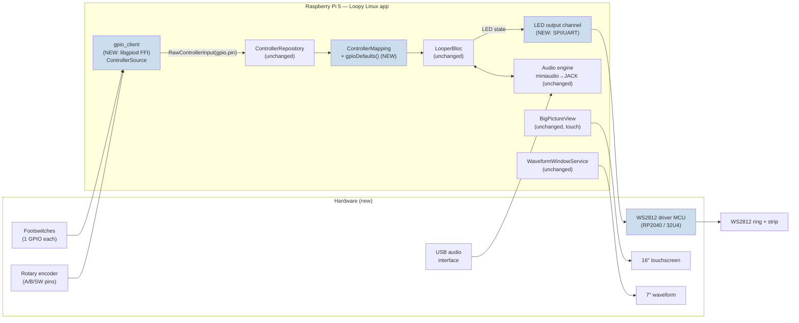

## feat: Raspberry Pi all-in-one floor console - Extensive

> **Note:** This plan has been split into parts. See the `-part-N` files in this directory (Part 1 → Part 8). This file remains the umbrella/overview; build from the part files.
>
> Part order & dependencies: **1** (ARM64 CI + kiosk/compositor spike, merge first) → **2** (gpio_client + footswitches + gpioDefaults wiring) → **3** (encoder) ∥ **4** (LED firmware) · **5** (kiosk + dual-display, depends on 1) → **6** (supervision + power-cut resilience) → **7** (foot-only recovery + fault surfacing) · **8** (hardware, parallel throughout).
>
> Review corrections applied across the parts: CI **does** run a 90% Dart test gate (FFI must sit behind a fake-able `GpioBindings`); `createNativeGpioSource()` lives in a repository file mirroring `native_midi_source.dart`; `gpioDefaults()` must be **wired** (selection + persistence decision); session loop-checkpoint, thermal warning, and the foot-only long-press retry are deferred/dropped; compositor + LED wire format + off-Pi detection are specified in their parts.
>
> Source brainstorm: [`docs/brainstorm/2026-06-26-raspberry-pi-console-brainstorm-doc.md`](../brainstorm/2026-06-26-raspberry-pi-console-brainstorm-doc.md)
>
> **Scope (confirmed):** Full console — software integration **+** LED-driver firmware **+** enclosure/BOM **+** on-hardware spikes.
> **Config input (confirmed):** the 16″ is a **touchscreen**; the existing touch UI handles all setup surfaces, foot controls handle performance.

## Overview

Build a standalone, rugged **Raspberry Pi 5 floor console** variant of Loopy: a tilted enclosure with a 16″ touchscreen (main UI), a 7″ waveform display, foot controls (footswitches + rotary encoder + WS2812 LED ring/strip), and a USB class-compliant audio interface. The unit boots straight into the existing Loopy Flutter Linux app in kiosk mode — no laptop, no separate pedal, no USB-MIDI bridge.

The headline finding from the codebase review holds up under verification: **this is mostly an integration job, not a rewrite.** The audio engine, MIDI stack, every BLoC, the entire UI, and the theme system are **unchanged**. The genuinely new software is one `gpio_client` package, a Pi-specific `ControllerMapping`, a kiosk/dual-display launcher, an ARM64 CI job, and the LED-driver firmware + Pi-side LED channel. The two heaviest non-app chunks are the **enclosure** and **kiosk/dual-display boot integration** — both larger than a single line implies.

This plan is **deliberately large and must be split** into independently mergeable PRs (see [Implementation Phases](#implementation-phases) — each phase ≈ one PR, several split further). Run `/plan-technical-review` (plan-splitting agent) before building.

## Problem Statement

Loopy today runs as a desktop/laptop app, optionally driven by an ATmega32U4 USB-MIDI pedal (PR [#85](https://github.com/tomassasovsky/loopy/pull/85)). For live performers this means carrying a laptop, a separate pedal, and a USB-MIDI bridge, and trusting a general-purpose OS not to misbehave on stage. There is no self-contained, stomp-it-and-go instrument.

The codebase is unusually ready for one:

- Loopy's **Linux build is a first-class, CI-green target** ([`.github/workflows/main.yaml`](../../.github/workflows/main.yaml) `build-linux`) running the exact PipeWire→JACK→ALSA path Pi OS uses ([`docs/RUNNING_ON_LINUX.md`](../../docs/RUNNING_ON_LINUX.md)).
- The waveform **already renders to a second OS window** purpose-built for a second physical display ([`WaveformWindowService`](../../lib/visualizer/waveform_window_service.dart:29) via `desktop_multi_window`, ~30 fps).
- The control layer **already exposes a `ControllerSourceKind.gpio` seam** literally labeled "Raspberry Pi GPIO pin edge" ([`controller_input.dart:12`](../../packages/controller_repository/lib/src/controller_input.dart)), with the full `RawControllerInput → ControllerMapping.resolve() → ControllerEvent → LooperBloc` pipeline already implemented and **already unit-tested with a fake GPIO source** ([`controller_repository_test.dart`](../../packages/controller_repository/test/controller_repository_test.dart)).

What's missing is the native GPIO driver, the appliance integration, and the hardware. And — surfaced by flow analysis — a set of **appliance-grade flows** that the desktop app never needed: a GPIO default mapping (today's `ControllerMapping.defaults()` is MIDI-CC, so a fresh console has **dead footswitches**), foot-only recovery from device loss, power-cut session checkpointing, app supervision, and non-pointer error surfacing.

## Proposed Solution

A second **product line**, not a replacement. The 32U4 USB-MIDI pedal (PR [#85](https://github.com/tomassasovsky/loopy/pull/85)) stays valid for "laptop + pedal" users; the Pi console is a standalone unit that shares ~95% of the app/engine.

Five software/firmware workstreams + one hardware workstream, each mapping to one or more PRs:

1. **`gpio_client` package** — a new `ControllerSource` implementation (libgpiod FFI) for footswitches + encoder, plus a **Pi `ControllerMapping.gpioDefaults()`** so the unit works on first boot.
2. **LED-driver firmware + Pi LED-output channel** — offload WS2812 timing to a small dedicated MCU; Pi pushes compact LED-state frames over SPI/UART, with a boot-time health handshake.
3. **ARM64 build/CI job** — cross-compile guard mirroring `build-linux`.
4. **Kiosk appliance integration** — boot-to-fullscreen across both displays, deterministic display pinning, app supervision/respawn, read-only rootfs + safe-shutdown, session checkpointing, and non-pointer fault surfacing.
5. **Appliance UX gaps** — GPIO default mapping, foot-only device-loss recovery + audio auto-restart, encoder semantics decision.
6. **Hardware** — enclosure (tilt-mount two screens + stompable footswitch panel + ruggedization), GPIO input protection, thermals/power budget, BOM, and the on-hardware spikes/latency gate.

**Explicitly out of scope / unchanged:** audio engine, MIDI stack, all BLoCs, the entire UI, and the theme system. No engine changes for audio.

## Technical Approach

### Architecture

The console reuses the entire existing control + audio + UI stack. Only the shaded nodes are new.



**Control pipeline (verified, unchanged):**

```
GPIO pin edge
  → gpio_client emits RawControllerInput(kind: gpio, id: pin, value: 0|1)   [NEW]
  → ControllerRepository._onInput()            controller_repository.dart:49
  → ControllerMapping.resolve(input)           controller_mapping.dart:67  (returns null unless isPress)
  → ControllerEvent(action, channel)
  → LooperBloc._onControllerEvent()            looper_bloc.dart:370
  → LooperEvent (LooperRecordPressed, LooperStopPressed, …)
  → LooperRepository commands
```

**`gpio_client` mirrors `midi_client`** ([`packages/midi_client`](../../packages/midi_client)) exactly:

- `GpioControllerSource implements ControllerSource` ([`controller_source.dart:7`](../../packages/controller_repository/lib/src/controller_source.dart)) — owns a broadcast `StreamController<RawControllerInput>`, exposes `Stream<RawControllerInput> get inputs`, and `Future<void> dispose()`.
- **Leading-edge per-trigger debounce**, copied from [`midi_controller_source.dart`](../../packages/midi_client/lib/src/midi_controller_source.dart) (map of `(kind,id) → last emit µs`; emit only if `now - last >= debounceUs`). Matches the deferred footswitch-debounce memory note (leading-edge for low latency).
- **`pushForTest()`** (`@visibleForTesting`) + a `FakeGpioBindings` test helper, mirroring `midi_client`'s `FakeLoopyEngineBindings`.
- Wired in [`run_loopy.dart:65`](../../lib/app/run_loopy.dart) alongside the MIDI source: `ControllerRepository(sources: [?midiSource, ?gpioSource])` via a `createNativeGpioSource()` factory that returns `null` off-Pi.

**Encoder gap (must be resolved in Phase 2):** `ControllerMapping.resolve()` returns `null` for anything that isn't a press ([`controller_mapping.dart:67`](../../packages/controller_repository/lib/src/controller_mapping.dart)), and `RawControllerInput` has no signed/relative value. Footswitches fit; a **rotary encoder's relative +1/−1 detents do not**. Two options, decided in Phase 2:
- **(A) Encoder = config-only / non-performance** — simplest; encoder press emits a normal `gpio` press, rotation is consumed only by touch-replaceable surfaces (or unused in v1). No pipeline change.
- **(B) First-class relative input** — extend `RawControllerInput`/`LooperAction` with an increment/decrement concept and a non-press `resolve()` path. More work; only if a performance role for rotation is required (e.g. loop volume / track scroll).
> Recommendation: ship **(A)** in v1 (encoder press mapped, rotation reserved), file (B) as a follow-up. Keeps the pipeline untouched and the touchscreen covers config.

**LED path** is deliberately *isolated from the audio path and the Pi's weak real-time timing*. The Pi computes LED state from `LooperState` and pushes compact frames to a dedicated MCU that runs FastLED-grade WS2812 timing. A **boot-time handshake** confirms the driver is alive (flow-analysis gap: silent dark LEDs otherwise).

**Audio is zero-code-change.** The engine already enumerates, selects, and auto-JACK-pins a chosen USB interface ([`engine_devices.c`](../../packages/loopy_engine/src/core/engine_devices.c), [`engine_linux.c:156`](../../packages/loopy_engine/src/platform/engine_linux.c)) and forces `PIPEWIRE_QUANTUM` ([`engine_linux.c:224`](../../packages/loopy_engine/src/platform/engine_linux.c)). Run the interface at **48 kHz** for full channel count and **Pro Audio** profile per [`docs/RUNNING_ON_LINUX.md`](../../docs/RUNNING_ON_LINUX.md).

### Implementation Phases

Each phase ≈ one mergeable PR (large ones noted for further splitting). Phases 0–6 are roughly ordered; HW (Phase 6) runs in parallel.

#### Phase 0: ARM64 build/CI guard + Pi bring-up spike

- **Tasks**
  - Add `build-linux-arm64` job to [`.github/workflows/main.yaml`](../../.github/workflows/main.yaml) mirroring `build-linux` (GTK deps), using `FLUTTER_TARGET_PLATFORM_SYSROOT` (the root [`linux/CMakeLists.txt:20`](../../linux/CMakeLists.txt) already honors it) or an ARM runner. Compile-only (no audio in CI).
  - On-device spike: boot Pi OS, run a hand-built ARM64 Loopy Linux bundle, confirm Skia renderer ([`linux/runner/main.cc:15`](../../linux/runner/main.cc)) + Material icons.
  - Spike: **kiosk target decision** — GTK-on-Wayland vs `flutter-pi`. ⚠️ `desktop_multi_window`/`window_manager` assume GTK; if `flutter-pi` breaks the second window, GTK wins. **This decision can invalidate the entire dual-display flow — resolve here, first.**
- **Deliverables:** green ARM64 CI job; a short `docs/RUNNING_ON_RPI.md` bring-up note; kiosk-target decision recorded.
- **Success criteria:** ARM64 bundle launches full-screen on the Pi with correct icons; second waveform window opens on the chosen compositor.
- **Effort:** M (CI) + S spike, but the kiosk-target spike is the single highest-risk item.

#### Phase 1: `gpio_client` package (footswitches) + GPIO default mapping

- **Tasks**
  - Scaffold `packages/gpio_client` mirroring [`packages/midi_client`](../../packages/midi_client) (barrel export, `lib/src/`, `test/helpers/`, pubspec depending on `controller_repository`, `ffi`, `flutter`, `meta`).
  - `GpioControllerSource implements ControllerSource` — libgpiod FFI; footswitch lines = one GPIO each (pull-up + leading-edge debounce). Emit `RawControllerInput(kind: gpio, id: pin, value: 0|1)`.
  - **`ControllerMapping.gpioDefaults()`** factory (new) in [`controller_mapping.dart`](../../packages/controller_repository/lib/src/controller_mapping.dart) — today `defaults()` is **MIDI-CC only** (`controller_mapping.dart:35`), so a Pi build must seed a GPIO map or footswitches are dead on first boot.
  - `createNativeGpioSource()` factory (returns `null` off-Pi) wired into [`run_loopy.dart:65`](../../lib/app/run_loopy.dart): `sources: [?midiSource, ?gpioSource]`.
  - Tests: `gpio_controller_source_test.dart` (parsing, debounce, stream emission via `pushForTest()`), `FakeGpioBindings` helper, `gpioDefaults()` mapping test.
- **Deliverables:** `gpio_client` package; GPIO default mapping; wiring.
- **Success criteria:** on the Pi, stomping a footswitch triggers the mapped transport action end-to-end; ≥90% package coverage; first boot has working footswitches with zero config.
- **Effort:** L (the one new native binding).
- **Mock files:** `packages/gpio_client/lib/gpio_client.dart`, `packages/gpio_client/lib/src/gpio_controller_source.dart`, `packages/gpio_client/lib/src/gpio_bindings.dart`, `packages/gpio_client/test/gpio_controller_source_test.dart`, `packages/gpio_client/test/helpers/fake_gpio_bindings.dart`.

#### Phase 2: Encoder support + semantics decision

- **Tasks**
  - Encoder A/B/SW reading (software quadrature; fine at human turn speed) in `gpio_client`.
  - Decide encoder semantics (A vs B above). Ship **(A)**: encoder press → normal `gpio` press in `gpioDefaults()`; rotation reserved/unused in v1. File **(B)** (relative-input pipeline extension) as a follow-up plan if a performance role is needed.
  - Software sanity gate for implausibly fast repeated edges (guards GPIO miswire/ESD spurious edges).
- **Deliverables:** encoder in `gpio_client`; documented semantics; spurious-edge guard.
- **Success criteria:** encoder press maps to an action; quadrature decoded correctly under test; no phantom transport actions from a floating pin in a soak test.
- **Effort:** M.

#### Phase 3: LED-driver firmware + Pi LED-output channel

- **Tasks**
  - **Spike/decide:** driver chip (RP2040/QT-Py vs reuse existing 32U4) + Pi↔driver protocol (SPI vs UART vs USB-serial).
  - Firmware: receive compact LED-state frames, drive WS2812 ring + indicator strip (FastLED-grade timing), expose a **health handshake**.
  - Pi-side LED-output channel: derive LED state from `LooperState`, push frames; **boot-time health check** → visible error state if driver missing/unflashed (flow-analysis gap).
  - Define + measure an **LED-vs-audio skew budget** (separate from the ≤10 ms audio gate).
- **Deliverables:** driver firmware (in `hardware/` or `firmware/`); Pi LED channel; health check; skew budget doc.
- **Success criteria:** LEDs reflect transport state in real time; missing driver produces a visible fault, not silent dark LEDs; measured skew within budget.
- **Effort:** L (firmware + protocol + integration).

#### Phase 4: Kiosk appliance integration & resilience

> ⚠️ Larger than one line implies — likely **2–3 PRs** (boot/launch, displays, resilience).

- **Tasks**
  - **Boot-to-kiosk:** auto-launch the app full-screen at boot (systemd unit + compositor config). The app is already chromeless on [`BigPictureView`](../../lib/looper/view/big_picture_view.dart:26).
  - **Deterministic dual-display pinning:** map the waveform second window ([`waveform_window_service.dart:64`](../../lib/visualizer/waveform_window_service.dart)) to the 7″ output reliably across boots (output-name pinning, `wlr-randr`). Handle the **silent 10 s ready-timeout** (`waveform_window_service.dart:77`) — surface an operator-visible indicator on failure instead of degrading silently. Single-display fallback with a visible notice.
  - **Per-display DPI/scale:** sensible Flutter logical-pixel scale for 16″ (~1080p) vs 7″ (800×480 if DSI), verified on real panels.
  - **App supervision:** watchdog/systemd respawn on crash; clean orphan waveform windows on respawn (reuse [`closeOrphanWindows()`](../../lib/visualizer/waveform_window_service.dart:36)).
  - **Read-only rootfs / overlayfs + safe-shutdown:** survive hard power-cut; SD integrity check on boot → "needs attention" screen rather than black display.
  - **Session checkpointing:** auto-checkpoint the live session to writable storage at a defined cadence (e.g. on loop-close / bank change) so a yanked plug loses ≤N s; offer restore on next boot. (Read-only root protects the OS, **not** the user's loop.)
- **Deliverables:** kiosk launcher + boot config; display-pinning config; watchdog; rootfs/shutdown story; session checkpoint + restore.
- **Success criteria:** cold boot → both displays correctly assigned, app running, footswitches live, no keyboard/mouse; pull power 20× mid-session → no SD corruption and ≤N s session loss; kill the app → respawns cleanly.
- **Effort:** XL (split into multiple PRs).

#### Phase 5: Foot-only resilience UX (audio device loss & recovery)

- **Tasks**
  - **Audio auto-restart:** on USB-interface hot-unplug the engine flips `device_present` and the app shows the touch-only `_AudioNotRunningBanner` ([`big_picture_view.dart:438`](../../lib/looper/view/big_picture_view.dart)). Add **auto-reselect + auto-restart** when the known device reappears — no pointer needed.
  - **Auto-select on boot:** persist the selected device; if present at boot, auto-start the engine (no banner/tap).
  - **Foot-only retry:** a documented footswitch combo (e.g. long-press) to retry device start.
  - **Non-pointer fault surfacing (cross-cutting):** every failure mode (no GPIO mapping, LED driver dead, second window failed, thermal throttle, device loss) gets an operator-visible signal (screen + LED pattern) that does **not** require touch/keyboard.
  - **Thermal warning:** surface Pi thermal-throttle as a visible warning.
- **Deliverables:** audio auto-restart + boot auto-select; foot-only retry; fault-surfacing pass; thermal warning.
- **Success criteria:** kick the USB cable mid-set → visible state + automatic recovery on reconnect with no touch; boot with known device → audio runs with no interaction.
- **Effort:** M.

#### Phase 6: Hardware — enclosure, protection, power, BOM (parallel)

> ⚠️ One of the two heaviest chunks. Tracked in `hardware/`, parallel to software.

- **Tasks**
  - **Enclosure:** tilted unit mounting the 16″ touchscreen + 7″ waveform up top and a stompable footswitch/encoder panel on the front edge; ruggedization; active cooling for the Pi 5.
  - **GPIO input protection:** Pi GPIO is **3.3 V, not 5 V-tolerant** — series resistors / clamping on footswitch + encoder lines (longer internal runs, ESD, contact bounce).
  - **Power & thermals:** single supply budgeted for Pi 5 + two screens + USB interface + LED driver; confirm active cooling prevents throttle under sustained load.
  - **Displays:** spike **7″ HDMI vs official DSI** (HDMI = uniform bus + clean second-window mapping but uses the 2nd micro-HDMI; DSI frees an HDMI port but is 800×480 + needs DSI compositor mapping — resolution matters little for a waveform).
  - **BOM + shopping list:** mirror [`hardware/loopy_pedal_shopping_list.md`](../../hardware/loopy_pedal_shopping_list.md) (Argentina-sourced) → new `hardware/loopy_console_shopping_list.md`. Include touchscreen 16″, 7″ display, Pi 5 + cooler, USB interface (Scarlett-class), footswitches, EC11 encoder, WS2812 ring + strip, driver MCU, protection passives, PSU, enclosure materials.
  - **On-hardware gates:** re-run the **≤10 ms round-trip latency** target on the chosen USB interface + Pi 5 + PipeWire quantum; ≥2 h thermal soak under audio + dual-display + GPU load in the closed enclosure (no throttle, no xrun regression).
- **Deliverables:** enclosure design + fab files; protection circuit; power/thermal budget; `hardware/loopy_console_shopping_list.md`; spike results; latency + soak reports.
- **Success criteria:** assembled unit passes latency gate and 2 h soak; no pin damage from miswire test; stompable panel survives stage abuse.
- **Effort:** XL.

## Alternative Approaches Considered

| Decision | Chosen | Rejected | Why |
|---|---|---|---|
| Form factor | All-in-one floor console | Desktop command-center; modular brain-box | 16″ implies tabletop/standing; one enclosure keeps control wiring internal/short (ideal GPIO) and makes a true performance instrument. |
| Controls | Hybrid GPIO + dedicated LED driver | All-direct-GPIO; reuse 32U4 board | WS2812 needs µs-precise timing the Pi handles awkwardly (SPI/PWM+DMA, root, 3.3→5 V, Pi-5 quirks). Offloading only the LEDs keeps hard real-time off the Pi + audio path. |
| Audio | USB class-compliant interface | I2S HAT | Zero new engine code (reuses JACK-pinning path); leaves **all** GPIO free (HAT consumes I2S pins); proper instrument/mic I/O; hits ≤10 ms fine. |
| Compute | Pi 5 | Pi 4 | Dual-display + low-latency audio + Skia UI needs Pi 5 GPU/headroom; Pi 4 marginal. RP1 gives dual micro-HDMI. |
| Config input | 16″ touchscreen | Encoder-menu; config-over-network | Simplest; reuses existing touch UI as-is, **zero new UI work** for setup surfaces. |
| Encoder semantics | Config-only (option A) in v1 | First-class relative input (option B) | Keeps the press-only `resolve()` pipeline untouched; touch covers config. (B) deferred. |

## Acceptance Criteria

### Functional Requirements

- [ ] On the Pi, stomping a mapped footswitch triggers the correct transport action end-to-end (rec/play/stop/track/bank).
- [ ] **First boot has working footswitches with zero config** (`ControllerMapping.gpioDefaults()` seeded on the Pi build).
- [ ] Encoder press maps to an action; rotation decoded by quadrature (role: config-only in v1, documented).
- [ ] WS2812 ring + strip reflect transport state in real time within the LED-vs-audio skew budget.
- [ ] Cold boot → app full-screen, **16″ = main UI, 7″ = waveform**, deterministically, with no keyboard/mouse.
- [ ] Touchscreen reaches all setup surfaces ([`BigPictureSettingsPage`](../../lib/looper/view/big_picture_settings_page.dart), [`SignalListView`](../../lib/looper/view/signal_graph/signal_list_view.dart)) — audio device, track rename, FX/routing.
- [ ] USB audio runs at 48 kHz / Pro Audio profile with no engine code changes; auto-selected + auto-started on boot if the known device is present.
- [ ] Hot-unplug of the USB interface → visible state + **automatic recovery** on reconnect, no pointer.
- [ ] Foot-only retry exists for "engine stopped" (footswitch combo).
- [ ] Live session auto-checkpoints; after a hard power-cut, the unit offers to restore the last session (≤N s lost).
- [ ] App is supervised: crash → respawn; orphan waveform windows cleaned on respawn.
- [ ] LED driver health-checked at boot; missing/unflashed driver → visible fault, not silent dark LEDs.
- [ ] Single-display fallback shows a visible notice rather than a half-blank console.

### Non-Functional Requirements

- [ ] **≤10 ms round-trip audio latency** on the chosen USB interface + Pi 5 + PipeWire quantum (re-measured on hardware).
- [ ] ≥2 h sustained soak (audio + dual-display + GPU load, closed enclosure) with **no thermal throttle and no xrun-rate regression**; thermal throttle surfaces an operator-visible warning.
- [ ] Hard power-cut ×20 mid-session → **no SD-card corruption** (read-only rootfs/overlayfs + integrity check on boot).
- [ ] GPIO input lines protected (series R / clamp) — a miswire/transient cannot kill a Pi pin (3.3 V, not 5 V-tolerant).
- [ ] Per-display logical-pixel scale is usable on both 16″ and 7″ (verified on real panels).
- [ ] Every failure mode has a non-pointer (screen + LED) operator signal.

### Quality Gates

- [ ] `gpio_client` package ≥90% coverage (mirrors `midi_client` test rigor) — note: **CI runs no Dart unit-test job today**, so run package tests locally / add to CI.
- [ ] New `build-linux-arm64` CI job green.
- [ ] `docs/RUNNING_ON_RPI.md` complete; BOM/shopping list complete.
- [ ] No changes to audio engine, MIDI stack, BLoCs, UI, or theme (diff review confirms).
- [ ] VGV architecture review passes (`lib/common` boundary, ThemeExtension tokens, widget classes not `_build` methods).

## Success Metrics

- A non-developer can power on a sealed unit and perform a full looping set foot-only, with the touchscreen used only for setup.
- Zero SD corruptions across a power-cut stress run.
- Latency + soak gates pass on the production interface/enclosure.
- App/engine code shared with desktop remains ~95% (measured by diff scope: new code confined to `gpio_client`, kiosk launcher, `gpioDefaults()`, resilience UX, firmware).

## Dependencies & Prerequisites

- **Hardware procurement:** Pi 5 + active cooler, 16″ touchscreen, 7″ display, USB interface (Scarlett-class), footswitches, EC11 encoder, WS2812 ring+strip, LED-driver MCU, protection passives, PSU, enclosure materials.
- **Toolchains:** ARM64 Flutter cross-build sysroot; libgpiod dev headers; firmware toolchain (RP2040 SDK / Arduino for 32U4).
- **Existing seams (verified present):** `ControllerSourceKind.gpio`, `ControllerSource`, `ControllerRepository`, `ControllerMapping.resolve()`, `WaveformWindowService`, Linux JACK audio path.
- **Reference packages:** [`packages/midi_client`](../../packages/midi_client) (source template), [`docs/RUNNING_ON_LINUX.md`](../../docs/RUNNING_ON_LINUX.md) (audio setup).

## Risk Analysis & Mitigation

| Risk | Severity | Mitigation |
|---|---|---|
| `flutter-pi` breaks `desktop_multi_window`/`window_manager` → no second display | **High** | Decide kiosk target in Phase 0 *first*; default to GTK-on-Wayland (compatible) unless the spike proves flutter-pi works. |
| Dual-display pin race (waveform lands on 16″) | High | Output-name pinning; visible indicator on the silent 10 s timeout; single-display fallback. |
| Pi GPIO pin killed by miswire/ESD | High | Series R / clamping (Phase 6); 3.3 V discipline. |
| SD corruption on power-cut | High | Read-only rootfs/overlayfs + boot integrity check + session checkpointing. |
| Thermal throttle in closed enclosure | Medium | Active cooling; 2 h soak gate; thermal warning surface. |
| WS2812 timing on Pi | Medium | Offloaded to dedicated MCU (by design). |
| Encoder doesn't fit press-only pipeline | Medium | Ship config-only (A); defer relative-input extension (B). |
| Latency misses ≤10 ms on chosen interface | Medium | Re-measure on hardware before committing to the interface model; tune PipeWire quantum. |
| Plan too large for one PR | High | Split per phase (and Phase 4 further) at `/plan-technical-review`. |

## Resource Requirements

- 1 developer for software (Phases 0–5), part-time firmware (Phase 3).
- Hardware/enclosure work (Phase 6) in parallel — fab time + bench testing.
- Bench: Pi 5 rig, USB interface, loopback cable (latency), thermal probe, the two displays.

## Future Considerations

- Encoder option **(B)**: first-class relative/scroll input for performance-time value control.
- Encoder-menu config (option b from brainstorm) for a fully pointer-free SKU.
- Config-over-network (phone/laptop) as an alternate config path.
- OTA/atomic update mechanism compatible with read-only root (delivery, trigger, rollback, version display) — flagged by flow analysis as a genuine gap; spec before shipping deployed units.
- Shared LED-state protocol between this driver and the 32U4 pedal.

## Documentation Plan

- New `docs/RUNNING_ON_RPI.md` (bring-up, kiosk, dual-display, audio, recovery, update).
- New `hardware/loopy_console_shopping_list.md` (BOM, Argentina-sourced, mirroring the pedal list).
- Update `docs/PROGRESS.md` with the console workstream + status.
- Firmware README in `hardware/`/`firmware/` for the LED driver + protocol.

## References & Research

### Internal References

- GPIO seam: [`packages/controller_repository/lib/src/controller_input.dart:12`](../../packages/controller_repository/lib/src/controller_input.dart)
- ControllerSource interface: [`packages/controller_repository/lib/src/controller_source.dart:7`](../../packages/controller_repository/lib/src/controller_source.dart)
- MIDI source template: [`packages/midi_client/lib/src/midi_controller_source.dart`](../../packages/midi_client/lib/src/midi_controller_source.dart)
- Mapping (MIDI-CC default — needs `gpioDefaults()`): [`packages/controller_repository/lib/src/controller_mapping.dart:35`](../../packages/controller_repository/lib/src/controller_mapping.dart)
- Pipeline → bloc: [`controller_repository.dart:49`](../../packages/controller_repository/lib/src/controller_repository.dart), [`looper_bloc.dart:370`](../../lib/looper/bloc/looper_bloc.dart)
- Source wiring: [`lib/app/run_loopy.dart:65`](../../lib/app/run_loopy.dart)
- Waveform second window: [`lib/visualizer/waveform_window_service.dart:29`](../../lib/visualizer/waveform_window_service.dart)
- Main UI: [`lib/looper/view/big_picture_view.dart:26`](../../lib/looper/view/big_picture_view.dart); device-loss banner: [`big_picture_view.dart:438`](../../lib/looper/view/big_picture_view.dart)
- Settings surfaces (touch): [`big_picture_settings_page.dart`](../../lib/looper/view/big_picture_settings_page.dart), [`signal_list_view.dart`](../../lib/looper/view/signal_graph/signal_list_view.dart)
- Linux runner (Skia force): [`linux/runner/main.cc:15`](../../linux/runner/main.cc); cross-build sysroot: [`linux/CMakeLists.txt:20`](../../linux/CMakeLists.txt)
- Audio engine (no changes): [`engine_devices.c`](../../packages/loopy_engine/src/core/engine_devices.c), [`engine_linux.c:156`](../../packages/loopy_engine/src/platform/engine_linux.c)
- CI: [`.github/workflows/main.yaml`](../../.github/workflows/main.yaml) (`build-linux`, no ARM64)
- Audio setup: [`docs/RUNNING_ON_LINUX.md`](../../docs/RUNNING_ON_LINUX.md)
- Pedal BOM template: [`hardware/loopy_pedal_shopping_list.md`](../../hardware/loopy_pedal_shopping_list.md)

### Related Work

- Source brainstorm: [`docs/brainstorm/2026-06-26-raspberry-pi-console-brainstorm-doc.md`](../brainstorm/2026-06-26-raspberry-pi-console-brainstorm-doc.md)
- 32U4 USB-MIDI pedal (parallel variant): PR [#85](https://github.com/tomassasovsky/loopy/pull/85)
- Windows/Linux native parity (prior big native effort, plan style): [`docs/plan/2026-06-11-feat-windows-linux-native-plan.md`](2026-06-11-feat-windows-linux-native-plan.md)
- Looper pedal firmware/protocol (firmware plan style): [`docs/plan/2026-06-14-feat-looper-pedal-protocol-firmware-plan.md`](2026-06-14-feat-looper-pedal-protocol-firmware-plan.md)

### Open Spikes (carried from brainstorm; resolve in the noted phase)

- 7″ HDMI vs DSI (Phase 6) · LED driver chip + protocol (Phase 3) · flutter-pi vs GTK kiosk (Phase 0) · dual-display pinning reliability (Phase 4) · per-display DPI (Phase 4) · GPIO 3.3 V protection (Phase 6) · read-only rootfs + safe-shutdown (Phase 4) · thermals/power (Phase 6) · on-hardware ≤10 ms latency gate (Phase 6).
