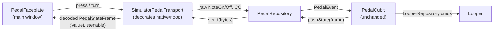

# feat: on-screen pedal simulator

**Type:** enhancement (feature)
**Date:** 2026-07-01
**Status:** ready to build (technical review folded in)

## Summary

Add an in-app **pedal simulator**: an on-screen faceplate that lets the user
drive the program exactly as if the physical bidirectional MIDI foot pedal were
plugged in — press the footswitches, turn the encoder — with live LED feedback,
so the looper can be exercised without the (large, uncomfortable) hardware.

The simulator drives the **real** `PedalCubit` through the **real** protocol
path: on-screen presses are encoded to raw MIDI, decoded by `PedalRepository`
into `PedalEvent`s, and handled by the actual cubit (so undo tap/long-press,
the Rec/Play record cycle, Play-mode mute/arm, mode/bank/clear all behave
identically to hardware). The cubit's outbound `PedalStateFrame` is captured,
decoded, and rendered on the faceplate LEDs.

## Motivation

The pedal is the primary control surface, but the physical unit is bulky and
awkward for day-to-day testing. There is currently **no** on-screen way to
exercise the pedal behavior — `PedalSettingsSection` only picks the MIDI output
device. This gives developers and the user a faithful, always-available control
surface.

## Prerequisite (done)

Builds on the pedal-cubit refactor (`PedalMode` enum, `selectedTrack`/
`playArmed`, Play-mode mute-vs-arm), committed first as its own commit on the
`feat/pedal-simulator` branch (green: 30 cubit + 35 app-pedal + 93 package
tests).

## Design

### Architecture (single cubit, loopback transport)

The single existing `PedalRepository`/`PedalCubit` is **unchanged**. Reviews
confirmed: the decorator transport is the only design that reaches undo tap/hold
timing and the codec round-trip (the cubit's partial public API can't), and **no
`PedalSimulatorCubit` is needed** — all pedal logic already lives in `PedalCubit`
and all render state in the decoded `PedalStateFrame` + `PedalCubit.state`.

### `SimulatorPedalTransport` (package `pedal_repository`)

A `PedalTransport` that **decorates an inner transport** (native, or
`NoopPedalTransport` on the mock/no-MIDI flavor) and adds a synthetic on-screen
pedal:

- **Constant id:** `const kSimulatorOutputId = 'loopy-sim'`, name "On-screen pedal".
- **`enumerateOutputs()`** → `[...inner.enumerateOutputs() where id != kSimulatorOutputId, simDevice]`.
  The sim device is **always present** and any real device colliding with the
  reserved id is dropped, so the 2 s hotplug `reconnect()` poll can never make
  the sim "vanish" and unbind it.
- **`input`** → a merge of `inner.input` and an internal
  `StreamController<PedalRawMessage>` that `press`/`turn` push into.
- **`openOutput(id)`** → `id == kSimulatorOutputId` → mark bound-to-sim, return
  `0` (required: `PedalRepository.bind` sets `error` on non-zero); else delegate.
- **`closeOutput()`** → clear bound-to-sim; delegate to inner.
- **`send(bytes)`** → bound to sim: `PedalCodec.decodeFrame(bytes)` → publish to a
  `ValueNotifier<PedalStateFrame> frame` (seeded `PedalStateFrame.blank()`);
  ignore the loop-top `0xFA` byte. Bound to inner: delegate to `inner.send`.
- **Injection API** (held-button ledger is transport-owned — the faceplate keeps
  no parallel "is held" bookkeeping):
  - `void press(PedalButton, {required bool down})` → pushes
    `(status: down ? 0x90 : 0x80, data1: button.note, data2: down ? 100 : 0)`
    and updates the held-set.
  - `void turn(int delta)` → single `(0xB0, PedalCodec.encoderCc, encodeEncoder(delta))`
    (clamped to ±63 — a drag can't exceed that; **no chunking**).
  - `void releaseAll()` → NoteOff for every held button (unmount/deactivate/
    focus-loss), so a held note never sticks and the cubit's undo timer clears.
- **`frame`** → `ValueListenable<PedalStateFrame>` the faceplate renders.
  `ValueListenable` (not a `Stream`) is deliberate: the faceplate needs the
  *current* frame synchronously on mount. The package is already a Flutter
  package (`native_pedal_repository.dart` imports `flutter/foundation`), so this
  is in-bounds.
- **`dispose()`** → **idempotent**; disposes the `ValueNotifier`, closes the
  injected `StreamController`, and disposes the inner transport.

Exported from the package barrel. Takes an **injectable inner transport** so
tests decorate a `FakePedalTransport`/`NoopPedalTransport`.

### Wiring (`lib/app`)

- New `createSimAwarePedalRepository(...)` factory (leaves `createNativePedalRepository`
  untouched) returns a record
  `({PedalRepository repo, SimulatorPedalTransport sim})`: builds the native
  inner transport (or `NoopPedalTransport`) and wraps it in
  `SimulatorPedalTransport`.
- `run_loopy.dart` builds the record and threads both into `App` (an optional
  `SimulatorPedalTransport? pedalSimulator`, symmetric with the existing optional
  `PedalRepository? pedalRepository`).
- `app.dart` provides `Provider<SimulatorPedalTransport>` next to the
  `PedalCubit` provider (falls back to one wrapping `NoopPedalTransport` when
  null, matching the existing `NoopPedalTransport` fallback).
- Selecting "On-screen pedal" in the existing `PedalSettingsSection` dropdown
  binds the sim — **no dropdown code change** (it renders `availableOutputs`).

### `PedalFaceplate` view (`lib/pedal/view`)

A stylized VAMP-style faceplate hosted as a **collapsible panel in the main
looper window**, shown only when
`context.watch<PedalCubit>().state.boundOutputId == kSimulatorOutputId` (the
mount is the sole gate — inbound is not gated by bind, so `press`/`turn` must be
unreachable when hidden). Controls only (no screens): a front row of
transport/track footswitches + the CLEAR/BANK pair + the encoder & LED ring.

Controls — all 10 `PedalButton`s so the whole cubit is reachable:

| control | gesture → action |
|---|---|
| REC/PLAY, STOP, MODE, BANK, CLEAR | tap → `press(btn, down:true)` then `false` |
| TRACK 1–4 | tap → press; each shows the LED for the **active bank's** channel |
| UNDO | pointer-down → `press(undo, down:true)`; pointer-up / cancel / exit-while-down → `press(undo, down:false)` (tap = undo, hold ≥500 ms = redo, timed by the cubit); ignore secondary/right button |
| ENCODER | drag/scroll → `turn(delta)`; keyboard +/- → `turn(±1)` |

Rendering (all from the decoded `frame`, via `ValueListenableBuilder` on the
provided transport's `frame`):

- **4 track LEDs** = `frame.trackLeds[bankBase + i]` for the active bank.
- **Bank indicator** = `frame.activeBank` (A/B).
- **Ring** = `frame.globalColor` (off/green/red/amber/blue) — activity color, not
  gain (the frame carries no gain; the encoder is send-only).
- **Loop length** = `frame.loopLengthMicros` as `mm:ss.mmm`, or "—" when `0`.
- Before the first `LooperState` tick the forced push is a no-op, so the seeded
  `PedalStateFrame.blank()` shows a dark idle plate — never empty.

**Colors come from theme tokens, never hardcoded `Colors.*`.** Add LED/ring
tokens to `SurfaceTheme` (`ledOff`, `ledGreen`, `ledRed`, `ledAmber`, `ledBlue`,
`ringGlow`) with **high-contrast** values, plus a small resolver
`PedalTrackLed`/`GlobalColor` → token. **All user-facing + a11y strings via
`context.l10n`** (ARB), including parameterized Semantics labels.

**Key scheme** (for widget tests): `pedalFaceplate_footswitch_<button>` (e.g.
`_recPlay`, `_track3`), `pedalFaceplate_led_track<n>`, `pedalFaceplate_ring`,
`pedalFaceplate_bank`, `pedalFaceplate_loopLength`, `pedalFaceplate_encoder`.

## Key decisions

1. **Placement (confirmed):** collapsible panel in the **main looper window**,
   shown when the sim is the bound output. The cubit + its timers live in the
   main isolate; a secondary window would need cross-window messaging per press
   and per frame.
2. **Activation** via the existing output picker ("On-screen pedal") — reuses the
   bind flow, status line, and persistence.
3. **Dual-drive acceptable:** a real pedal's input capture stays live; moot when
   no hardware is attached. Not suppressed in v1.
4. **No new cubit** (VGV-confirmed): the faceplate is a projection of existing
   state, like `PedalSettingsSection`. Held-button state is **transport-owned**.
   If view logic ever grows, promote to a `PedalSimulatorCubit`, not `setState`.

## Tasks

### 1 — Data/protocol: `SimulatorPedalTransport` (+ tests)
- [ ] `packages/pedal_repository/lib/src/simulator_pedal_transport.dart`:
  decorator + `kSimulatorOutputId`, `press`/`turn`/`releaseAll` (transport-owned
  held-set), `frame` `ValueListenable`, always-enumerate + id-collision guard,
  bound-to-sim `send` decode (ignore `0xFA`), single-clamped `turn`, idempotent
  `dispose`.
- [ ] Export from `packages/pedal_repository/lib/pedal_repository.dart`.
- [ ] `packages/pedal_repository/test/simulator_pedal_transport_test.dart`:
  enumerates sim always (inner empty / colliding id); `openOutput(sim)`→0 routes
  `send` to `frame` decode; `openOutput(realId)` delegates + `send` → inner (not
  `frame`); `press` encodes correct Note on/off; `turn` clamps to ±63; `releaseAll`
  emits NoteOff for held buttons; `input` merges inner + injected; **double-**
  `dispose` is idempotent and closes the notifier + stream. Target ≥90% coverage.

### 2 — Wiring: compose + provide the sim
- [ ] `packages/pedal_repository/lib/src/native_pedal_repository.dart` (or a
  sibling): `createSimAwarePedalRepository` returning the
  `({PedalRepository repo, SimulatorPedalTransport sim})` record;
  `createNativePedalRepository` unchanged.
- [ ] `lib/app/run_loopy.dart`: build the record (native inner; `NoopPedalTransport`
  on mock/no-MIDI) and thread `repo` + `sim` into `App`.
- [ ] `lib/app/view/app.dart`: optional `SimulatorPedalTransport? pedalSimulator`
  param + `Provider<SimulatorPedalTransport>` (Noop-wrapped fallback when null).

### 3 — Presentation: `PedalFaceplate` + theme tokens + l10n
- [ ] `lib/theme/surface_theme.dart`: add `ledOff/ledGreen/ledRed/ledAmber/
  ledBlue/ringGlow` tokens (default + `highContrast`) + a
  `PedalTrackLed`/`GlobalColor` → token resolver.
- [ ] `lib/l10n/arb/*.arb`: device name, control labels, parameterized Semantics
  labels (e.g. `pedalSimTrackLed(index, state)`, bank, loop length) — firm, not
  string-concatenated.
- [ ] `lib/pedal/view/pedal_faceplate.dart`: faceplate + extracted `_Footswitch`
  (Listener: `onPointerDown`/`Up`/`Cancel` + exit-while-down → release; ignore
  secondary button; no parallel held bookkeeping), `_TrackLed`/`_RingLed`
  renderers (theme tokens), `_Encoder` (drag/scroll + keyboard), bank + loop
  readouts. Widget classes (no `_build*`), no pixel params in public APIs, the
  Key scheme above, Semantics per LED + `liveRegion` for bank/loop, keyboard
  focus/activation. Gate on `boundOutputId == kSimulatorOutputId`; `releaseAll`
  on `deactivate`.
- [ ] Export from `lib/pedal/pedal.dart`; host in the main looper view as a
  collapsible panel (file located during build under `lib/looper/view/`).

### 4 — Presentation tests
- [ ] `test/pedal/view/pedal_faceplate_test.dart` (target ≥90%, same bar as
  `lib/pedal`): renders LEDs from a seeded `frame` (per-bank mapping, ring color,
  loop-length format, blank-before-frame); tapping each footswitch calls `press`
  down+up with the right `PedalButton`; undo pointer down/up + cancel + exit map
  to press down/up; encoder drag/scroll/keys call `turn`; **hidden when a non-sim
  output is bound + no injection reachable while hidden**; shown when sim bound;
  `releaseAll` fires on `deactivate` (the *transport* unit test already proves it
  emits NoteOff). Use `pump`/`pumpAndSettle` — the input path is async, so a
  synchronous `expect` right after `press()` will flake.

### 5 — Validate
- [ ] `/Users/Tomas/development/flutter/bin/flutter analyze` + `dart format` clean.
- [ ] Package + app pedal tests green via the **absolute** flutter path (very_good
  MCP test is broken; no CI Dart unit-test job — run locally).
- [ ] Manual `/run`: select "On-screen pedal", exercise footswitches + encoder,
  confirm LEDs + looper respond; switch back to None (faceplate hides).

## Acceptance criteria

- [ ] Selecting **"On-screen pedal"** binds the sim and reveals the faceplate in
  the main window; selecting None/another device hides it and stops it driving
  the looper (no injection reachable while hidden).
- [ ] All 10 buttons reach the real cubit behavior: REC/PLAY cycle, STOP, MODE
  (→ Play), BANK (A/B), CLEAR, TRACK 1–4, UNDO **tap = undo / hold ≥500 ms = redo**.
- [ ] The encoder adjusts master gain.
- [ ] LEDs reflect the live decoded frame: 4 track LEDs per active bank, ring =
  global color, bank + loop-length readouts; a freshly bound sim shows a dark
  idle plate, never empty. All colors from theme tokens (incl. high-contrast).
- [ ] The sim device is **always** enumerated (hotplug poll never unbinds it); a
  real device cannot masquerade as `loopy-sim`.
- [ ] No stuck notes: `releaseAll` on unmount/deactivate; UNDO can't leave the
  cubit's undo timer hanging on pointer leave/cancel.
- [ ] LED meaning available non-visually (Semantics) + every control keyboard-
  operable; all strings via l10n.
- [ ] `flutter analyze` + `dart format` clean; all new + existing pedal tests
  pass locally.

## Edge cases & risks

- **4 buttons / 8 LEDs:** 4 track buttons; LEDs show the active bank's 4 channels;
  BANK toggles which 4 are live.
- **Inbound not bind-gated:** the faceplate mount is the sole guard; `press`/
  `turn` unreachable when hidden (named test).
- **Output-switching:** real→sim, the `bound` handler nulls `_lastFrame` and re-
  pushes but early-returns until the first `LooperState`; the seeded `blank()`
  covers it. sim→real: unmount immediately.
- **Undo gesture:** deliver release on up / cancel / exit-while-down; ignore
  secondary button; no OS long-press menu on the widget.
- **Lifecycle:** focus loss / minimize / hot restart while held → `releaseAll`;
  `dispose` idempotent; repeated sim→None→sim leaks no timers/subs.
- **Multi-window:** sim stays in the main window (same isolate as the cubit).
- **Loop length:** `0` → "—"; else `mm:ss.mmm`; no tempo → no bars/beats.

## Files

**New**
- `packages/pedal_repository/lib/src/simulator_pedal_transport.dart`
- `packages/pedal_repository/test/simulator_pedal_transport_test.dart`
- `lib/pedal/view/pedal_faceplate.dart`
- `test/pedal/view/pedal_faceplate_test.dart`

**Modified**
- `packages/pedal_repository/lib/pedal_repository.dart` (export)
- `packages/pedal_repository/lib/src/native_pedal_repository.dart` (add
  `createSimAwarePedalRepository`)
- `lib/app/run_loopy.dart` (build record + thread the sim)
- `lib/app/view/app.dart` (provide `SimulatorPedalTransport`)
- `lib/theme/surface_theme.dart` (LED/ring tokens + resolver)
- `lib/l10n/arb/*.arb` (labels + a11y strings)
- `lib/pedal/pedal.dart` (export faceplate)
- main looper view host (collapsible panel) — file located during build under
  `lib/looper/view/`

## Out of scope

- Rendering the 7"/16" screens or a pixel-accurate 3D faceplate.
- Suppressing a real pedal's input while the sim is bound (dual-drive kept).
- A send-only master-gain read-back / numeric overlay on the encoder (the engine
  exposes no gain read-back — YAGNI, explicitly deferred).
- A separate `loopTop` listenable / animated ring (firmware-only; nothing on the
  faceplate consumes it in v1).
- A `PedalSimulatorCubit` (revisit only if view logic grows).
- An integration-style four-object loopback test (redundant with the existing
  cubit suite + the new transport unit tests).
