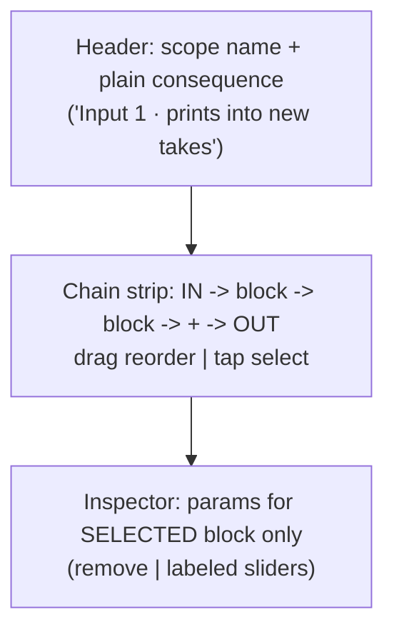

# feat: dedicated FX editor screen (FX redesign, part 2)

- Type: enhancement (UI, new screen)
- Status: planned
- Branch: `feat/fx-screen-redesign`
- Date: 2026-07-03

## Dependencies

Sequenced after **part 1** (shared aesthetic tokens land first, avoids rework).
Functionally standalone — does not require part 1 to build.

## Context (shared)

Part 2 of the FX-screen redesign. Full rationale and current-state map in the
overview:
[2026-07-03-feat-fx-screen-redesign-plan.md](2026-07-03-feat-fx-screen-redesign-plan.md).

Two FX scopes (the load-bearing mental model):
- **Input FX** = `InputMonitor.effects` — a live chain **snapshot-copied by
  value** into each new take at record (`input_monitor.dart:13-16`). Edits affect
  **future** takes only; never rewrites an existing recording. Header copy:
  "prints into new takes" — not "destructive".
- **Lane FX** = per-`Lane` snapshot `effects` — post-record, non-destructive.
- An empty `effects` list **is** the clean/dry path ("clean take"), not an error.

Editing APIs (symmetric, reuse — no new engine calls):
- Input FX — `MonitorCubit`: `addEffect`, `insertPlugin`, `relinkPlugin`,
  `removeEffect`, `moveEffect`, `setEffectType`, `setEffectParam`.
- Lane FX — `LooperBloc`: `LooperLaneEffectAdded/Removed/TypeChanged/Moved/ParamChanged`.

Navigation idiom: `showXPage()` + `MaterialPageRoute` (no go_router). All new
user-facing copy via `context.l10n` (add en + es ARB keys).

### Target design

- **State = color:** engaged block lit (`accent`), unselected neutral. No
  hue-per-block. (Bypass is deferred — see below.)
- **Empty chain:** `IN → + → OUT`; inspector shows the clean-take hint (reuse
  `signalLaneCleanHint`). Not an error.
- **Selection rules:** open → select first block (or none if empty); add →
  auto-select new block; remove → select previous neighbor (or clear if empty).
- **Chain cap:** carry the "+ disabled when full" affordance
  (`signal_fx_rack.dart:181-185`).
- **Lifecycle:** resolve the scope live each build off a **stable key**; auto-pop
  / empty-state when the target is gone (a pushed route lacks the inline dock's
  bounds-check safety net at `signal_list_view.dart:331-333`).

## Tasks

New files under `lib/looper/view/fx_editor/`:

- [ ] `fx_editor_page.dart` — `showFxEditorPage(context, scope)`
      (`MaterialPageRoute`, re-provides the blocs the scope needs), `FxEditorView`.
- [ ] `fx_scope.dart` — a scope-agnostic adapter:
  - `FxScope` with a **stable key** (input channel, or `(track, lane)`), an
    l10n'd `label` + `consequence`, `List<TrackEffect> effects`, and
    `add/remove/move/setType/setParam` callbacks. **No `bypass`** (deferred).
    Keep the interface to these fields only — not a general chain-editor framework.
  - `InputFxScope` (wraps `MonitorCubit`, keyed by input channel) and
    `LaneFxScope` (wraps `LooperBloc`, keyed by `(track, lane)`, re-validated
    against a fresh `LooperState` each build; bails on mismatch).
- [ ] `fx_chain_strip.dart` — the left→right block strip (`IN → blocks → + → OUT`),
      drag-reorder (reuse mechanics from `signal_fx_rack.dart`), tap-select,
      cap-aware "+".
- [ ] `fx_block_chip.dart` — a single block chip (built-in + plugin variants;
      unavailable/relink/version states preserved).
- [ ] `fx_inspector.dart` — params for the selected block only; built-in labeled
      controls + plugin controls ("Open Editor"/relink where applicable). Reuse
      the relink/Open-Editor wiring at `signal_list_view.dart:318-365`.
  - [ ] Plugin-state matrix, each with reorder/remove still functional:
        `unavailable` → relink placeholder (no live param pane); `unsupported` →
        "rejected" message; `versionChanged` → drift note + info.
- [ ] `fx_param_control.dart` — the redesigned control: **labeled sliders with
      numeric readouts, one control type** (no knob, no arc glow, no blurred
      pointer, no hardcoded gradient). Stays under `lib/looper/view/fx_editor/`
      (depends on `TrackEffect`) — do not hoist into `lib/common`.
- [ ] **Bypass is deferred out of this PR** (not a fake toggle). True bypass needs
      a persisted `enabled` bool, and `encode/decodeTrackEffects` delegate to the
      native C engine (`track_effect.dart:323`) → a C-engine + FFI + `ffigen`
      change. It lives in the switch-behavior plan
      ([2026-07-03-feat-fx-switch-behavior-plan.md](2026-07-03-feat-fx-switch-behavior-plan.md)).
      Here the chain dot is an engaged/selection indicator only.
- [ ] **l10n:** add scope labels/consequences and the "no longer exists" state to
      `app_en.arb` + `app_es.arb`; read via `context.l10n`. No literals in
      `FxScope`/views.
- [ ] **Widget conventions:** real `Stateless/StatefulWidget` classes (no
      `Widget _buildX()` helpers), no pixel params in public constructors,
      token-driven styling.

## Tests

- [ ] `test/looper/view/fx_editor/fx_editor_page_test.dart` — opens for input +
      lane scopes with correct header/consequence; auto-pops/empty-states when the
      target is removed while open; back-navigation returns focus to the origin row.
- [ ] `fx_chain_strip_test.dart` — add/reorder/select drive the right callbacks
      for both scopes; reorder round-trips through `moveEffect`/`LooperLaneEffectMoved`;
      "+" disabled at cap; selection rules hold.
- [ ] `fx_inspector_test.dart` — only the selected block's params render;
      `setParam` fires for built-in + plugin; each plugin state renders its pane
      and still allows reorder/remove.
- [ ] `fx_scope_test.dart` — a stale/removed lane index does **not** retarget a
      sibling lane (stable-identity guard).
- [ ] Golden(s): editor input scope, lane scope, empty "clean" state, plugin block.

## Acceptance criteria

- Input vs lane scope shows the correct label + consequence ("prints into new
  takes" / "shapes playback, non-destructive").
- Only the selected block's params are visible; empty chain reads as "clean".
- Add / remove / reorder / edit param work for both scopes via existing APIs; no
  new engine/FFI calls (bypass deferred).
- Editor reflects live external changes and never edits a stale/retargeted scope.
- Every plugin state renders correctly and supports reorder/remove.
- Grep: no `signalGlow`; control has no arc/pointer/gradient paint; no hardcoded
  hex; no user-facing string literals (all `context.l10n`); no `_buildX()` helpers.
- `flutter analyze` clean; tests + goldens pass.
