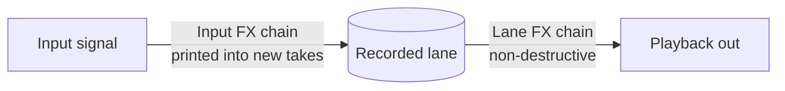
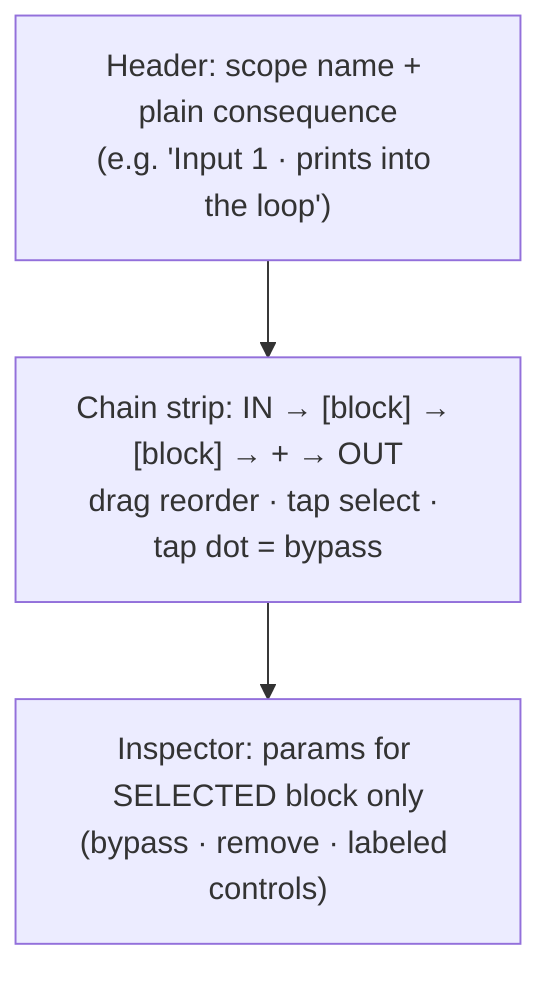
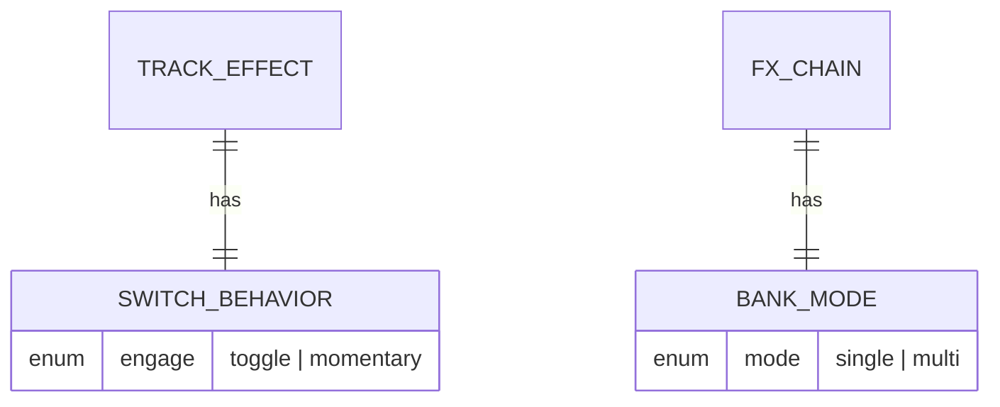

# feat: redesign the FX surface — separate editor, retire the instrument-panel look

- Type: enhancement (UI redesign, multi-PR)
- Status: planned
- Branch: `feat/fx-screen-redesign`
- Author: Tomás Sasovsky
- Date: 2026-07-03

> **Note:** This is the design overview. The buildable work is split into part
> files in this directory — build from those, not this file:
> - [part 1](2026-07-03-feat-fx-screen-redesign-part-1-plan.md) — retire the
>   instrument-panel aesthetic (standalone)
> - [part 2](2026-07-03-feat-fx-screen-redesign-part-2-plan.md) — dedicated FX
>   editor screen
> - [part 3](2026-07-03-feat-fx-screen-redesign-part-3-plan.md) — collapse the
>   Signal surface FX into chip strips (depends on part 2)
>
> The former "PR 4" (single/multi + toggle/momentary + persisted bypass) was cut
> to its own plan — it crosses the engine/FFI boundary:
> [feat-fx-switch-behavior](2026-07-03-feat-fx-switch-behavior-plan.md). Scenes
> remain deferred to a later plan. The PR 4 section below is retained for
> rationale only.

## Summary

The current FX experience lives inside the unified **Signal** surface as bottom
"docks" (`SignalInputDock` / `SignalLaneDock`) that render a horizontal
`SignalFxRack` of effect cards, each showing **all** its parameter knobs inline.
It is crowded (routing + FX + mixing on one surface), it reads as
"AI-designed" because of a deliberate *instrument-panel* aesthetic (monospace
"machine voice", letter-spaced uppercase labels, neon glows, colored card
rails, `LIVE`/`OFF` gate pills), and it hides an otherwise clean mental model
under visual noise.

This plan **separates FX editing into its own focused screen**, collapses the
Signal surface's FX to a compact chip strip, and **retires the instrument-panel
aesthetic** in favor of a calm, native look. It is delivered as a sequence of
PRs (PR 1 standalone; PR 3 and PR 4 depend on PR 2). PRs 1–3 are pure
presentation/UI; PR 4 is the only engine/FFI + persisted-model change and is a
candidate to become its own plan.

## Problem statement

Three distinct problems, confirmed against the code and a screenshot of the
current `goldens/signal_surface.png`:

1. **One surface, three jobs.** `SignalListView` shows routing
   (inputs → tracks → outputs), FX editing (docks), and mixing
   (volume/mute) at once. No pro loop station does this.
2. **Decorative color.** Per-output rainbow dots (`outputColor()` →
   `lanePalette`), blue snapshot chips, gold-vs-blue routing chips, accent-tinted
   headers. Color carries no consistent meaning, so it reads as noise.
3. **Over-designed "machine" chrome.** The three "screams AI" tells the user
   named, mapped to code:
   - **fingernail** → the 3px colored left **rail** on `_RowCard`
     (`lib/looper/view/signal_graph/signal_row_views.dart:453`), only on output
     cards (`:251` `rail: row.enabled ? hue : surface.line`).
   - **eyebrow** → **letter-spacing** on tracked-out uppercase labels via
     `signalMono`'s `tracking` (`lib/looper/view/signal_graph/signal_style.dart:49`).
   - **live indicator** → `SignalGatePill` reading `LIVE`/`OFF`
     (`lib/looper/view/signal_graph/signal_style.dart:80`).
   - Connective tissue: `signalGlow()` neon halos
     (`signal_style.dart:65`) + `_RowCard`'s selected `boxShadow` (blur 26,
     `signal_row_views.dart:423`), and IBM Plex Mono applied to *every* label,
     not just numerics.

## Goals

- Split FX editing out of the routing surface into a dedicated, focused screen.
- Make the two FX **scopes** legible in plain language:
  - **Input FX** — a live chain on the incoming signal, *snapshot-copied into
    each new take at record* (`InputMonitor.effects`). Editing it changes
    **future** takes only; it never retroactively alters an existing recording.
    Header copy: "prints into new takes" — **not** "destructive" (the recorded
    buffer itself stays as captured).
  - **Lane FX** — post-record, *shapes playback, non-destructive*
    (per-`Lane` snapshot `effects`).
- Show **only the selected effect's** parameters at a time (kill the wall of knobs).
- Retire the instrument-panel aesthetic: calm/plain/native, sans labels, mono
  only for genuine numerics, no glow, **color = state only**.
- Keep the change strictly presentational where possible; reuse existing bloc
  events and repository APIs.

## Non-goals (explicitly out of scope for now)

- **Scenes / snapshot recall** (Helix-style gapless on/off + param scene recall).
  Deferred — needs new state + persistence and a "section" concept the app does
  not yet have. Tracked for a later plan.
- Changes to the audio engine, effect DSP, or the set of available effect types.
- Reworking the routing model itself (inputs/tracks/outputs topology stays).

## Research synthesis (why this design)

Researched Boss (RC-505 mkII / RC-600 / RC-500 / RC-5), HeadRush Looperboard +
Pedalboard/MX5, Sheeran Looper+/X, Line 6 Helix/HX, Empress, Chase Bliss,
Pigtronix, EHX, TC Ditto. Convergent conventions:

- **Two scopes are universal:** input/pre-record (printed into the loop) vs
  track/post-record (non-destructive). This is the load-bearing mental model.
  (Boss INPUT FX vs TRACK FX; HeadRush/Sheeran rack "before vs after record".)
- **The chain is the canvas** (Line 6 Helix): left→right blocks, drag to
  reorder, tap to select, parameter inspector docked below the *selected* block.
- **Color = state, not decoration:** engaged = lit, bypassed = dimmed, in place.
  Color as the primary live-status channel across all hardware.
- **Context-sensitive params** (Helix re-labeling knobs; Empress "Thing 1/2"):
  show one block's controls, never all at once.
- Deferred patterns worth noting for later: Snapshots (scene recall),
  Boss single/multi + toggle/momentary switch behavior, Ditto "one FX + one
  toggle" quick mode.

Full sourced reports live in the task transcripts for this session; key sources:
Boss RC-505mk2 Parameter Guide, Roland support articles, Line 6 Helix manuals
(helixhelp.com, manuals.line6.com), HeadRush/Sheeran FAQs.

## Current-state map (files & entry points)

- Entry: `showSignalPage(context)` →
  `lib/looper/view/signal_graph/signal_list_view.dart:29` (a `MaterialPageRoute`,
  re-provides `LooperBloc`, `MonitorCubit`, `TracksCubit`). Same pattern used by
  `lib/app/loopy_navigator.dart`. **No go_router in this flow** — the new FX
  editor route follows the same `showXPage()` + `MaterialPageRoute` idiom.
- FX rack: `lib/looper/view/signal_graph/signal_fx_rack.dart` (device cards,
  drag-drop, knobs, plugin cards, add-card).
- Docks: `lib/looper/view/signal_graph/signal_dock.dart`
  (`SignalInputDock`, `SignalLaneDock`).
- Knob: `lib/looper/view/signal_graph/signal_knob.dart`.
- Shared aesthetic: `lib/looper/view/signal_graph/signal_style.dart`.
- Row cards: `lib/looper/view/signal_graph/signal_row_views.dart`.
- Theme tokens: `lib/theme/surface_theme.dart` (`context.surface`). Available:
  `background, surface, card, cardHigh, line, accent, onAccent, warning,
  textPrimary/Secondary/Tertiary, wetRoute, dryRoute, lanePalette,
  ledOff/ledGreen/ledRed/ledAmber/ledBlue, ringGlow`, `monoFont`.
- Editing APIs (symmetric across scopes):
  - Input FX — `lib/audio_setup/cubit/monitor_cubit.dart`: `addEffect`,
    `insertPlugin`, `relinkPlugin`, `removeEffect`, `moveEffect`,
    `setEffectType(input,index,type)`, `setEffectParam(input,index,param,value)`,
    plus plugin param setter, `setEnabled/setOutputMask/setVolume/setMute`.
  - Lane FX — `lib/looper/bloc/looper_bloc.dart`: `LooperLaneEffectAdded`,
    `LooperLaneEffectRemoved`, `LooperLaneEffectTypeChanged`,
    `LooperLaneEffectMoved`, `LooperLaneEffectParamChanged`
    (→ `repository.setLaneEffectParam` etc.).
- Models (`packages/looper_repository`): `TrackEffect` sealed union
  (`BuiltInEffect{type, params}`, `PluginEffect{ref, paramValues, params, name,
  state, unavailable, unsupported, versionChanged}`); `InputMonitor{effects,
  enabled, outputMask, volume, muted}`; `Lane{effects, ...}`.
- Tests/goldens: `test/looper/view/signal_graph/*_test.dart`;
  `test/screenshots/goldens/signal_surface.png` via
  `test/screenshots/settings_screenshots_test.dart`.

## Target design

### Mental model (two scopes)

- Input FX = `InputMonitor.effects` — a live chain, **snapshot-copied by value**
  into each new take at record (`input_monitor.dart:13-16`). Non-destructive to
  existing takes; affects future records only.
- Lane FX = `Lane.effects` snapshot (non-destructive, post-record).
- An empty `effects` list **is** the clean/dry path ("clean take"), not a broken
  or error state — the editor's empty state must read that way and preserve the
  existing `signalLaneCleanHint` copy.
- Both edited through the same scope-agnostic editor via an adapter.

### FX editor screen (new)

A dedicated route (`showFxEditorPage(context, scope)`), one scope at a time:

- **Header:** scope name + the plain-language consequence. No pills.
- **Chain strip:** effect blocks as chips (built-in + plugin), reorder via
  existing `moveEffect`/`LooperLaneEffectMoved`, `+` opens the add menu (built-in
  or plugin, reusing `_AddDeviceCard` logic), tap selects, dot toggles bypass.
- **Inspector:** the selected block's params only. Built-in → labeled controls;
  plugin → the plugin controls + "Open Editor"/relink where applicable.
- **State = color:** engaged block lit (`accent`), bypassed dimmed
  (opacity / `textTertiary`). No hue-per-block.
- **Empty chain:** with zero effects the strip is `IN → + → OUT` and the
  inspector shows the clean-take hint (reuse `signalLaneCleanHint`). Not an error.
- **Selection rules:** on open, select the first block (or nothing if empty);
  on add, auto-select the new block; on remove, select the previous neighbor (or
  clear if the chain is now empty).
- **Chain cap:** carry the existing "+ disabled when full" affordance forward
  (`signal_fx_rack.dart:181-185`).
- **Lifecycle:** the editor resolves its scope **live from bloc/cubit state on
  every build**, keyed off a **stable lane/input identity** — not a bare index
  captured at push time. If the target lane/input disappears (or a sibling lane
  is removed and would retarget the index), the editor auto-pops (or shows a
  "no longer exists" state) rather than silently editing the wrong take. This is
  the one behavior the inline dock got "for free" via bounds checks
  (`signal_list_view.dart:331-333`) that a pushed route does not.

### Signal-surface changes

- Each input/lane's FX area collapses from inline knobs to a **chip strip**
  (named blocks, on/off state only), tapping opens the editor. Docks removed
  from the routing view.
- Remove the two instruction bars in `signal_list_view.dart`.

### Visual system (retire instrument panel)

Fully retire the aesthetic; calm/plain/native.

## PR breakdown

PRs are **sequenced**, not independently mergeable: PR 3 depends on PR 2
(`showFxEditorPage`), and PR 4 depends on PR 2's editor. PR 1 is standalone. Each
PR is independently *verifiable* (goldens + widget tests). Order: 1 → 2 → 3 → 4.

---

### PR 1 — retire the instrument-panel aesthetic (visual system)

Presentational only. No new screens, no structural change.

Files & tasks:

- [ ] `lib/looper/view/signal_graph/signal_style.dart`
  - [ ] Remove `signalGlow()`; strip neon halos from focused rings, gate dots,
        selected chips.
  - [ ] Replace `SignalGatePill` (`LIVE`/`OFF`) with a minimal lit-vs-dim state
        (filled dot when open, dimmed row/opacity when closed) — no capsule, no
        caption. **Preserve the semantic state for assistive tech**: the pill
        currently carries a `LIVE`/`OFF` label for a11y (`signal_style.dart:80`);
        the replacement must still expose on/off via `Semantics` (label or
        toggled), not convey it by color/opacity alone — else it's a silent a11y
        regression.
  - [ ] `signalMono` → keep a single mono style for **numerics only**
        (dB, `%`, take counts); drop the `tracking` parameter (the eyebrow).
        Introduce/adopt a plain sans label style from the app text theme.
  - [ ] Replace hardcoded neon consts (`kSignalSnapshotBg/Line/Ink`,
        `kSignalInset`, `kSignalMenu`, `kSignalLine2`) with `SurfaceTheme`
        tokens (`card`, `cardHigh`, `line`, `accent`, `ledBlue`, …). **Sweep all
        consumers**, not just this file — `signalMenuShape()` uses `kSignalLine2`,
        and dropdown call sites in `signal_dock.dart` reference these; leave no
        dangling helper.
  - [ ] Rewrite the file's aesthetic-declaring doc comment.
- [ ] `lib/looper/view/signal_graph/signal_row_views.dart`
  - [ ] Remove `_RowCard.rail` param + the `Stack`/`ClipRRect` rail paint
        (`:442-463`) (the fingernail). Collapse the
        `railColor == null ? 13 : 14` padding to a constant.
  - [ ] Drop the selected `boxShadow` glow (`:423-431`); selection = accent
        border only.
  - [ ] Output enabled/routed state now reads via text + opacity.
- [ ] Color de-rainbowing: stop using `outputColor()`/`lanePalette` for
      per-output identity. Use a neutral resting state and a single `accent`
      for the actively traced path only. (Keep `lanePalette` in the theme; just
      stop wearing four hues at rest.)
- [ ] `lib/looper/view/signal_graph/signal_list_view.dart`
  - [ ] Remove the two instruction bars ("Tap any row to trace its signal…" /
        "Tap an input to dial its tone…").

Deferred out of PR 1 (handled in PR 2 with the inspector): the knob's
arc/pointer/face gradient in `signal_knob.dart`.

Tests:

- [ ] Update `test/looper/view/signal_graph/signal_fx_rack_test.dart` and
      `signal_dock_test.dart` for removed pill/rail semantics (behavior
      unchanged; only status affordances change).
- [ ] Regenerate `test/screenshots/goldens/signal_surface.png` and any
      dock/rack goldens.

Acceptance criteria (checkable):

- Grep: no `signalGlow`, no `SignalGatePill`, no `_RowCard.rail`, no `letterSpacing`
  / `tracking` on labels remaining under `lib/looper/view/signal_graph/`.
- Grep: no hardcoded `Color(0x…)` in `signal_style.dart` (tokens only); the
  removed `kSignal*` consts are gone.
- Grep: `outputColor(`/`lanePalette` no longer used to color output rows at rest;
  color appears only for the traced path / engaged state.
- The two instruction bars are removed from `signal_list_view.dart`.
- `flutter analyze` clean; widget tests + goldens pass (goldens regenerated and
  the diff reviewed/approved).

---

### PR 2 — dedicated FX editor screen

New focused screen; scope-agnostic; reuses existing editing APIs.

New files & tasks:

- [ ] `lib/looper/view/fx_editor/fx_editor_page.dart` — `showFxEditorPage(context,
      scope)` (`MaterialPageRoute`, re-provides the blocs the scope needs),
      `FxEditorView`.
- [ ] `lib/looper/view/fx_editor/fx_scope.dart` — a scope-agnostic adapter over
      the two editing surfaces:
  - `FxScope` with a **stable key** (input channel, or `(track, lane)`), an
    l10n'd `label` + `consequence`, `List<TrackEffect> effects`, and
    `add/remove/move/setType/setParam` callbacks. **No `bypass`** (deferred).
    Keep the interface to these fields only — do not grow it into a general
    chain-editor framework.
  - `InputFxScope` (wraps `MonitorCubit`, keyed by input channel) and
    `LaneFxScope` (wraps `LooperBloc`, keyed by `(track, lane)`, re-validated
    against fresh `LooperState` each build).
- [ ] `lib/looper/view/fx_editor/fx_chain_strip.dart` — the left→right block
      strip: `IN → blocks → + → OUT`, drag-reorder, tap-select, dot = bypass.
      Reuse drag mechanics from `signal_fx_rack.dart`.
- [ ] `lib/looper/view/fx_editor/fx_block_chip.dart` — a single block chip
      (built-in + plugin variants; unavailable/relink states preserved).
- [ ] `lib/looper/view/fx_editor/fx_inspector.dart` — params for the selected
      block only; built-in labeled controls + plugin controls
      ("Open Editor"/relink where applicable).
- [ ] `lib/looper/view/fx_editor/fx_param_control.dart` — the redesigned control:
      **labeled sliders with numeric readouts, one control type** (no knob, no arc
      glow, no blurred pointer, no hardcoded face gradient). Committing to
      sliders-only avoids maintaining bespoke knob paint code.
- [ ] **Bypass is deferred out of PR 2 (not shipped as a fake toggle).** True
      "keep-the-effect, disable-it" bypass needs a persisted `enabled` bool on
      `TrackEffect`, and `encode/decodeTrackEffects` **delegate to the native C
      engine** (`track_effect.dart:323`) — so it is a C-engine + FFI + `ffigen`
      regen change, not presentational. It belongs with the engine/model work, not
      here. In PR 2 the chain dot is an **engaged/selection indicator only** (every
      present effect is engaged today); no bypass toggle. (`TrackEffectType.none`
      remains the existing "empty built-in slot," a distinct concept, untouched.)
- [ ] **Lifecycle & stable identity:** resolve the scope live each build. The
      adapter must carry the **full stable key** — input channel for
      `InputFxScope`, `(track, lane)` pair for `LaneFxScope` — **never a bare
      index**. `LaneFxScope` re-validates against a fresh `LooperState` snapshot
      each build and bails/auto-pops on mismatch, so a removed sibling lane can't
      silently retarget. Add tests.
- [ ] **l10n (hard convention).** All new user-facing copy — scope labels,
      "prints into new takes" / "shapes playback, non-destructive" consequences,
      the "no longer exists" state — goes through `AppLocalizations`: add keys to
      **both** `app_en.arb` and `app_es.arb`, read via `context.l10n`. No string
      literals in `FxScope` or the views.
- [ ] **Widget conventions.** New view files expose real
      `StatelessWidget`/`StatefulWidget` classes (no `Widget _buildX()` helpers),
      no pixel params in public constructors, token-driven styling. `fx_param_control`
      stays under the `lib/looper/view/fx_editor/` feature path (it depends on
      `TrackEffect`) — do not hoist it into `lib/common`.
- [ ] **Selection & empty state:** implement the selection rules and empty-chain
      layout from Target design; preserve the cap-reached disabled "+".
- [ ] **Plugin-state matrix in the inspector** — render distinct states, each with
      reorder/remove still functional on the placeholder block:
      - `unavailable` → relink placeholder (no live param pane).
      - `unsupported` → "rejected" message.
      - `versionChanged` → drift note + info affordance.
      Reuse the relink / Open-Editor wiring at `signal_list_view.dart:318-365`.

Tests:

- [ ] `test/looper/view/fx_editor/fx_editor_page_test.dart` — opens for input +
      lane scopes, shows correct header/consequence; **auto-pops/empty-states when
      the target lane/input is removed while open**; back-navigation returns focus
      to the originating row.
- [ ] `fx_chain_strip_test.dart` — add / reorder / select / bypass drive the
      right callbacks for both scopes; **reorder round-trips** through
      `moveEffect` / `LooperLaneEffectMoved`; "+" disabled at the cap; selection
      rules (auto-select on add, neighbor on remove, clear on empty).
- [ ] `fx_inspector_test.dart` — only the selected block's params render;
      `setParam` fires for built-in and plugin; **each plugin state**
      (unavailable / unsupported / versionChanged) renders its distinct pane and
      still allows reorder/remove.
- [ ] `fx_scope_test.dart` — a stale/removed lane index does **not** retarget a
      sibling lane (stable-identity guard).
- [ ] Golden(s) for the editor (input scope + lane scope, empty "clean" state,
      and a plugin block).

Acceptance criteria:

- Opening FX for an input vs a lane shows the correct scope label + consequence.
- Only the selected block's params are visible.
- Add / remove / reorder / edit param work for both scopes via the existing
  repository/bloc APIs. No new engine/FFI calls (bypass is deferred).
- Editor reflects live external changes and never edits a retargeted/stale scope.
- Empty chain shows the clean-take state, not an error.
- Grep checks: no `signalGlow` in the new files; the control has no
  arc/pointer/gradient paint; no hardcoded hex (tokens only); no string literals
  for user-facing copy (all via `context.l10n`); no `_buildX()` view helpers.

---

### PR 3 — collapse the Signal surface FX into chip strips

Wire the editor into the routing surface; remove the docks.

Files & tasks:

- [ ] `lib/looper/view/signal_graph/signal_dock.dart` — remove `SignalFxRack`
      from `SignalInputDock`/`SignalLaneDock`; replace with a compact FX **chip
      strip** summary (named blocks, on/off) that calls `showFxEditorPage`.
  - [ ] **Multi-lane tracks:** a track has up to `kMaxLanes` lanes that play back
        together, each with its own `effects`. Render **one chip strip per lane**
        (not one per track); each opens the editor for that lane's scope.
  - [ ] **Relocate add/remove-lane** controls that currently live in
        `SignalLaneDock` (`signal_dock.dart:317-336`) — they must survive the
        dock's removal (keep on the track's routing card).
  - [ ] **Mix controls decision — resolved:** volume/mute (`_MixControl`,
        `signal_dock.dart:11`) **stay on the routing surface**; the FX editor is
        tone only. Keep `_MixControl` on the input/lane routing card.
- [ ] `lib/looper/view/signal_graph/signal_list_view.dart` — remove the dock's
      expanded rack; ensure focus → chip strip → editor flow; preserve the
      `signalLaneCleanHint` for empty lanes.
- [ ] **Delete `signal_fx_rack.dart` outright** (the editor supersedes it and
      reuses its drag mechanics). No conditional "slim if superseded" — remove it
      and its exports.

Tests:

- [ ] Update `signal_dock_test.dart` / `signal_list_view_test.dart` for the chip
      strip + navigation to the editor.
- [ ] Regenerate `signal_surface.png` golden (now dock-free).

Acceptance criteria:

- The Signal surface shows routing + a compact FX summary only; no inline knob
  walls.
- Tapping an input/lane FX summary opens the editor for that scope.
- Multi-lane tracks render one chip strip per lane; add/remove-lane controls
  survive the dock removal; volume/mute stay on the routing card.
- Grep: zero remaining `SignalFxRack` references (dead code fully removed).
- All new chip-strip copy via `context.l10n` (en + es ARB keys added).
- `flutter analyze` clean; tests + goldens pass.

---

### PR 4 — single/multi + toggle/momentary block behavior

The "full redesign" performance layer (minus scenes). **This is the only part
that crosses the data/domain layer and the FFI/engine boundary** — every
persisted chain field goes through `engine.encode/decodeTrackEffects`
(`track_effect.dart:323`), so it needs a **C-engine change + FFI binding + `ffigen`
regen** (run `dart format` after regen per the ffigen drift gotcha) + a
persistence migration. It also absorbs the **deferred bypass `enabled` flag**.

Because it is engine/FFI + persisted-model work — a different review lens than the
presentational PRs 1–3 — it is a strong candidate to be pulled out as its **own
plan**, and internally split into **4a** (model + persistence + migration + FFI)
and **4b** (inspector UI + pedal wiring). See the handoff decision.

Files & tasks:

- [ ] `packages/looper_repository` + **native engine + FFI** — extend the model:
  - [ ] per-block `enabled` (the deferred uniform bypass; default `true`).
  - [ ] per-block `engage` behavior: `toggle` (latch) vs `momentary` (hold).
  - [ ] per-chain `bankMode`: `single` (radio — one block on at a time) vs
        `multi` (independent on/off). Confirm where this belongs (chain-level).
  - [ ] Persistence: the C engine owns `encode/decodeTrackEffects` — extend the
        engine struct + FFI binding, regen `ffigen` (`dart format` after), and add
        a migration defaulting `enabled=true` / `toggle` / `multi` for existing
        data.
- [ ] Editor UI: expose the two toggles in the inspector; single-mode enforces
      radio behavior in the chain strip.
- [ ] **Touch momentary gesture (define explicitly).** There is no existing touch
      "hold" gesture on chips. Spec: **long-press-and-hold** a chip → engaged
      while the finger is down, released on lift, **cancelled if the finger slides
      off** the chip; distinct pressed-visual from a latched toggle. Alternatively
      scope momentary to **pedals only** in v1 and mark touch-momentary a
      follow-up — decide at PR 4 start.
- [ ] Pedal mapping: pedals already emit raw press/release with tap/hold derived
      by timing (`pedal_codec.dart:186`) but have **no** existing FX momentary
      binding. Wire momentary/hold into the footswitch handling
      (`pedal_repository`), coordinating with the existing pedal FX toggle path.

Tests:

- [ ] Repository encode/decode + migration tests (defaults preserved).
- [ ] Editor tests for single vs multi and toggle vs momentary.
- [ ] Bloc/state test for the pedal→FX momentary seam: engage-on-hold /
      release-on-lift, and single-mode radio enforcement through the bloc.

Acceptance criteria:

- Existing persisted chains load unchanged (defaults applied).
- Single mode enforces one-active-at-a-time; momentary engages only while held.

## Testing strategy

- Widget tests per new component (chain strip, inspector, param control, editor
  page) for both scopes, with a plugin block included.
- Golden updates gated per-PR (PR 1 signal_surface; PR 2 editor goldens; PR 3
  dock-free signal_surface).
- Repository unit tests for PR 4 model + migration.
- Note (from project memory): **CI runs no Dart unit-test job** — run
  `flutter test` locally (absolute flutter path per the test-runner gotcha) and
  include results in each PR description.

## Risks & mitigations

- **Golden churn is large** (aesthetic overhaul). Mitigate by staging goldens
  per PR and reviewing diffs deliberately.
- **`signal_fx_rack.dart` reuse vs rewrite** — the editor should reuse its
  drag/plugin logic; avoid a parallel implementation, then delete the dock rack
  in PR 3.
- **Plugin cards** carry transient state (unavailable/relink/version). The
  editor inspector must preserve these paths; cover with a plugin-block golden.
- **Mixing controls placement** — volume/mute currently live on the docks;
  decide in PR 3 whether they stay on the routing surface or move.

## Open questions

1. **Bypass modeling — resolved: deferred.** True bypass = a persisted `enabled`
   flag, and `encode/decodeTrackEffects` cross the FFI into the C engine, so it is
   not presentational. It moves to the engine/model work (alongside PR 4's
   fields). PR 2 ships no bypass toggle; the chain dot indicates engaged/selected.
2. **Mixing controls — resolved.** Volume/mute stay on the routing surface; the
   FX editor is tone only. (Kept `_MixControl` on the routing card in PR 3.)
3. **Per-output identity — resolved: label-only.** `Out 1`/`Out 2` labels suffice;
   consistent with "color = state only." No traced-path hue.
4. **Touch momentary vs pedals-only** for PR 4 — decide whether v1 ships the
   long-press-hold touch gesture or scopes momentary to pedals. See PR 4 task.

## Acceptance criteria (overall)

- FX editing is a separate, focused screen reached from the Signal surface;
  back-navigation returns focus to the originating row.
- The two scopes are labeled in plain language (Input FX "prints into new takes";
  Lane FX "shapes playback, non-destructive") and behave correctly.
- Only the selected block's params show; empty chains read as "clean," not broken.
- The editor never edits a stale/retargeted scope and reflects live external
  changes (e.g. a pedal toggle) while open.
- Every plugin state (unavailable / unsupported / versionChanged) renders a
  correct pane and still supports reorder/remove.
- The instrument-panel aesthetic is gone: no pills, rails, letter-spacing, glow;
  mono only for numerics; color = state; tokens only.
- Scenes remain out of scope and are documented for a future plan.
