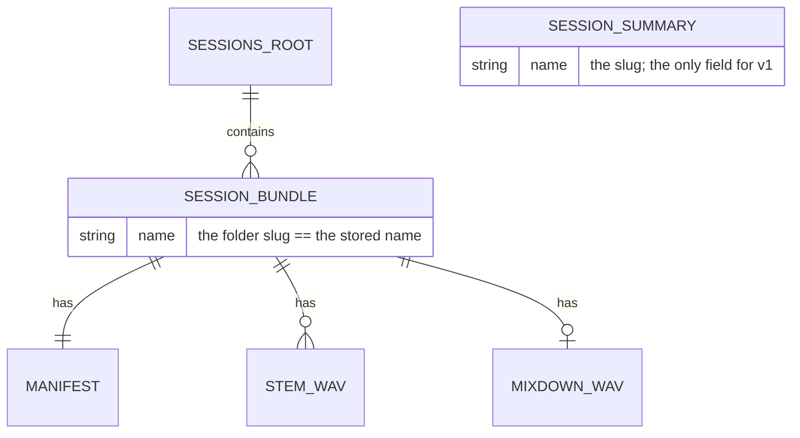

## feat: named sessions with a CRUD manager — Standard

> **Note:** This plan has been split into parts. See the `-part-N` files in this
> directory (part 1 data catalog → part 2 bloc → part 3 UI + wiring). This file
> is the consolidated design; build from the part files in order.

> **Status (2026-07-04):** planned from
> docs/brainstorm/2026-07-04-named-sessions-brainstorm-doc.md and refined by a
> plan-technical-review (VGV + simplicity + splitting agents).
> **Builds on PR #112** (FX state robustness): the `read(dir)` / `save(dir,
> {chains})` split, `LooperRepository.applySession(SessionRig)`, and
> `lib/session/session_mapping.dart` come from #112. The build branch MUST be
> based on #112 (`fix/fx-state-robustness`) or on master once #112 merges —
> **not plain master**, where none of that exists yet. Rebase onto master after
> #112 lands.

## Overview

loopy has one session slot: `defaultSessionDirectory()` resolves a single
`loopy_session/` bundle and Save overwrites it in place. This adds **named,
multiple sessions** with full CRUD and a document-editor UX: sessions are
`.loopy` bundles under a `sessions/<name>/` root, a tracked "current session"
lets plain Save write back silently, and one **Sessions-manager** dialog handles
list / load / save-as / rename / delete.

The design reuses #112 verbatim and adds three thin things: a **name-keyed
catalog** on `SessionRepository` (that does NOT change the pure path-addressed
`read`/`save`/`export*`), a **current-session concept** on `SessionCubit`, and
the **manager dialog**. No engine or looper-repository surface changes.

## Context / findings

- `packages/session_repository/lib/src/session_repository.dart` — `read(dir)`,
  `save(dir, {chains})`, `exportMixdown/exportStems(path)` are **path-addressed,
  pure I/O**. The catalog is added *beside* them; these methods are NOT re-keyed
  by name (C2 — export targets an arbitrary path, not a slug, and #112's tests
  pin these signatures).
- `packages/session_repository/lib/src/models/session.dart` — v2 `Session`
  manifest (`manifestName == 'session.json'`); models are `@immutable` with
  **hand-rolled** `==`/`hashCode` (the package does not use Equatable).
  `SessionSummary` follows that house style.
- `packages/session_repository/lib/src/session_exception.dart` — sealed
  `SessionException`; the cubit switches over it **exhaustively**, so a new
  sealed variant forces a new switch arm.
- `lib/session/cubit/session_cubit.dart` — composes both repositories; its
  `_run` helper emits a **fresh `const SessionState(...)`** each call (C1: this
  wipes any durable fields unless converted to `copyWith`). Uses
  `chainsFromLooper` / `rigFromBundle` from `lib/session/session_mapping.dart`.
- `lib/session/cubit/session_state.dart` — `SessionState` is `Equatable`, no
  `copyWith` today.
- `lib/looper/view/tracks_chrome.dart` — the `SessionMenu` popup (Save / Load /
  export) to restructure.
- `lib/session_directory.dart` — `defaultSessionDirectory()` → generalize to a
  **sessions-root** resolver; the new root `<documents>/sessions` is a *sibling*
  of the legacy `<documents>/loopy_session`, so the old bundle is never listed.
- `lib/app/view/app.dart` (~L42/99/280/595), `lib/app/run_loopy.dart` (~L126),
  `lib/looper/view/looper_page.dart` (~L21/41), `lib/main_mock.dart` — thread
  the resolver (and update the now-stale `sessionDirectory` doc comments).
- `lib/looper/view/rename_track_dialog.dart` — `showDialog` + `AlertDialog` +
  `TextField` name-input precedent for save-as / rename.
- `lib/looper/view/signal_graph/plugin_browser.dart` — searchable-list picker
  precedent for the manager list.

### Data model

`SessionSummary` is **name-only** for v1 — the name IS the folder slug (there is
no separate persisted display name). Listing is a directory scan for folders
that contain a `session.json` (a `stat`, never a manifest parse), so a
newer-version / corrupt manifest never throws during enumeration; it surfaces
its typed error on actual load instead. The current-session pointer is
**cubit-only state, never persisted** (no "last opened session" in prefs).

## Acceptance Criteria

- [ ] Save-As a named session → a `sessions/<slug>/` bundle is written (manifest
      + stems + mixdown) and it becomes the current session; the top bar shows
      its name.
- [ ] Plain Save (toolbar button / Cmd/Ctrl+S) writes back to the current
      session with no prompt; with no current session it opens the Save-As name
      dialog.
- [ ] The Sessions manager lists every `sessions/*/` folder that contains a
      `session.json`, **alphabetically**; a folder without a manifest is
      skipped. Tapping a row loads it and sets it current.
- [ ] Rename a session → the bundle folder is renamed; renaming the current
      session updates the shown name; a **slug** collision is rejected with an
      inline error (no overwrite).
- [ ] Delete a session → a confirm dialog, then the bundle folder is removed;
      deleting the **current** session keeps the live rig playing and clears the
      current-session pointer (next Save becomes Save-As).
- [ ] Save-As with a duplicate slug is rejected inline; an empty / whitespace /
      unsanitizable name is rejected inline; neither writes anything. The
      **repository is the authority** on collisions (atomic FS check → typed
      error); the dialog's inline check is a fast-feedback affordance only.
- [ ] Load surfaces the existing typed failures (sample-rate mismatch /
      unsupported version) through the SnackBar unchanged.
- [ ] The legacy `loopy_session/` bundle is left untouched and not shown.
- [ ] A save/load/export never wipes `currentSessionName` or the session list
      (the `SessionState.copyWith` conversion holds across transitions).
- [ ] `flutter analyze` clean; `dart format` stable; full suite +
      `session_repository` package suite green; repository unit tests, cubit
      bloc tests, and manager widget tests included; en/es l10n at parity;
      coverage ≥ 90.

## Tasks

### Phase A — the catalog (data layer)

- [ ] `SessionSummary` (name only) in
      `packages/session_repository/lib/src/models/session_summary.dart` —
      `@immutable`, hand-rolled `==`/`hashCode` (match `session.dart`, no
      Equatable). Barrel-export it. (No trackCount/sampleRate — YAGNI for v1.)
- [ ] Session-name **slug/validate** helper: fold a display name to a
      folder-safe slug (trim, allowed charset, collapse separators); reject
      empty / whitespace-only / unsanitizable. The stored name IS the slug;
      **collisions are slug collisions** (two inputs can fold to one folder).
      Unit-tested for those edges.
- [ ] `SessionRepository` gains name-keyed **catalog** methods, leaving
      `read`/`save`/`export*` path-addressed and untouched:
      `String bundlePath(String name)` (public — the cubit resolves name→path
      and passes the path into the unchanged `read`/`save`), `listSessions()`
      (scan the sessions root for folders with a `session.json`, alphabetical,
      no manifest parse), `renameSession(from, to)` (rename the dir; throw
      `SessionNameCollision` when the target slug exists), `deleteSession(name)`
      (remove the dir; a missing dir is a no-op).
- [ ] `SessionException` gains **only** `SessionNameCollision` (sealed). No
      `SessionNotFound` — delete-missing is a no-op and rename-missing falls to
      the generic failure (single-user desktop app; no concurrent-mutation race
      to model).
- [ ] Tests (`packages/session_repository/test/`): `listSessions` includes a
      folder with a `session.json` and skips one without; a present-but-
      newer-version manifest is still LISTED (not parsed at list time) and only
      errors on load; create/rename/delete round-trip on a temp dir;
      rename/save-as into an existing slug throws `SessionNameCollision`;
      delete-missing is a no-op; slug helper edges incl. two inputs folding to
      one slug.

### Phase B — current session + CRUD (bloc layer)

- [ ] `SessionState`: add a **`copyWith`** and convert `_run` to
      `emit(state.copyWith(status: …, outcome: …, error: …))` so a transition
      preserves the durable fields (C1). Add `currentSessionName` (nullable) and
      `sessions: List<SessionSummary>`.
- [ ] `SessionError.nameCollision` + the mandatory
      `SessionNameCollision => SessionError.nameCollision` arm in the cubit's
      exhaustive `SessionException` switch (I2 — not optional; the sealed
      variant forces it).
- [ ] `SessionCubit` orchestration (composes both repositories; resolves
      name→path via `repository.bundlePath` and calls the path-addressed
      `read`/`save`): `refreshSessions()`; `saveAs(name)` (repo throws on
      collision → set current → refresh); `save()` (write back to
      `currentSessionName`; if none, signal the UI to open Save-As);
      `loadNamed(name)` (read → `applySession(rigFromBundle(...))` → set current
      → refresh); `renameSession(from, to)` (inline
      `current == from ? to : current`); `deleteSession(name)` (clears the
      current pointer when it was current — rig untouched).
- [ ] `lib/session_directory.dart` → `defaultSessionsRoot()` returning
      `<documents>/sessions` (same `Future<String> Function()` shape).
- [ ] Tests (`test/session/cubit/session_cubit_test.dart`): a save **preserves**
      `currentSessionName` + `sessions` (C1 regression); each action emits
      working→success/failure with the right outcome/error; save-with-no-current
      routes to the save-as path; a collision emits `SessionError.nameCollision`
      (paired with the widget test); `deleteSession` of the current clears the
      pointer and calls `verifyNever(applySession)` (rig untouched);
      `loadNamed` applies the rig AND sets current AND refreshes.

### Phase C — the Sessions manager + wiring (presentation)

- [ ] `SessionsManagerDialog` (`lib/session/view/sessions_manager_dialog.dart`)
      via `showDialog`: a list of `SessionSummary` rows, load-on-tap, trailing
      rename/delete per row, a header "Save as…" action, and an empty state.
- [ ] Name-input dialog (save-as / rename) mirroring `rename_track_dialog.dart`,
      with an **inline** sanitize + slug-collision error (fast feedback only —
      the repository stays the authority).
- [ ] Delete-confirm: a small `AlertDialog` before `deleteSession` (explicit —
      delete removes a saved bundle irreversibly).
- [ ] `tracks_chrome.dart`: replace the `SessionMenu` Save/Load items with a
      **Sessions…** entry opening the manager (keep export items); add a quick
      **Save** action + **Cmd/Ctrl+S** shortcut (write-back, falls back to
      Save-As); show the current session name (or "Unsaved") in the top bar.
- [ ] Thread `defaultSessionsRoot` through `run_loopy.dart` / `app.dart` /
      `looper_page.dart` / `main_mock.dart`; rename the `sessionDirectory` param
      and update its now-stale doc comments (LooperPage + the cubit `directory`
      param). Remove the dead single-bundle Save/Load path and stale
      `defaultSessionDirectory` references (legacy folder left on disk).
- [ ] l10n: add the keys (Sessions…, Save as…, Rename, Delete, delete-confirm
      title/body, New session, name hint, duplicate-name error, empty-state,
      "Unsaved") to `app_en.arb` **and** `app_es.arb`; regenerate; keep parity
      (no untranslated keys).
- [ ] Widget tests (`test/session/view/sessions_manager_dialog_test.dart` +
      tracks_chrome additions): list renders rows + empty state; tapping a row
      loads; rename/delete fire the cubit (delete goes through the confirm);
      save-as shows the inline duplicate error; the quick Save action + shortcut
      invoke `save()`; the top bar shows the current name / "Unsaved".

## Files touched (primary)

`packages/session_repository/lib/src/{session_repository,session_exception,models/session_summary}.dart`
(+ barrel), `packages/session_repository/test/*`,
`lib/session/cubit/{session_cubit,session_state}.dart`,
`lib/session/session_mapping.dart` (reused, unchanged),
`lib/session/view/sessions_manager_dialog.dart` (new) + the name-input dialog,
`lib/looper/view/tracks_chrome.dart`, `lib/session_directory.dart`,
`lib/app/view/app.dart`, `lib/app/run_loopy.dart`, `lib/main_mock.dart`,
`lib/looper/view/looper_page.dart`, `lib/l10n/arb/app_{en,es}.arb`,
mirrored test files throughout.

## Verification

1. `flutter analyze` clean; `dart format --set-exit-if-changed` stable.
2. `flutter test` + `flutter test packages/session_repository` + coverage ≥ 90.
3. Manual: Save-As "A" and "B"; edit the rig; plain Save (writes back to the
   current, no prompt); open the manager, load "A" (rig swaps, name updates);
   rename "A" → collision with "B" rejected inline; rename to "C" succeeds;
   delete the open session (confirm → music keeps playing, top bar "Unsaved",
   next Save prompts); relaunch → both sessions still listed; confirm the old
   `loopy_session/` is untouched on disk.

## Dependencies & Prerequisites

- **PR #112 (or a branch based on it).** Reuses `read`/`save`/`applySession`/
  `session_mapping.dart` from #112 — do not rebuild them. If #112 is unmerged at
  build time, base `feat/named-sessions` on `fix/fx-state-robustness` and rebase
  onto master after #112 lands.
- No new packages. `path_provider` (already used) resolves the documents dir.

## Notes / accepted trade-offs

- **No migration** of the legacy `loopy_session/` — sibling of the new root, so
  it is simply never listed. Importing it can be a later follow-up.
- **Reject duplicate slugs** (no overwrite / auto-suffix); the repository is the
  atomic authority, the dialog check is fast-feedback UX.
- **List is a `stat`, not a validation**: a folder with a `session.json` is
  listed even if it is a newer/unloadable version; the typed error surfaces on
  load. This keeps enumeration cheap and parse-free.
- Manifest schema unchanged (still v2). Session stems stay lane-0-only and lane
  routing stays out of the manifest (pre-existing #112 follow-ups), independent
  of this work.
