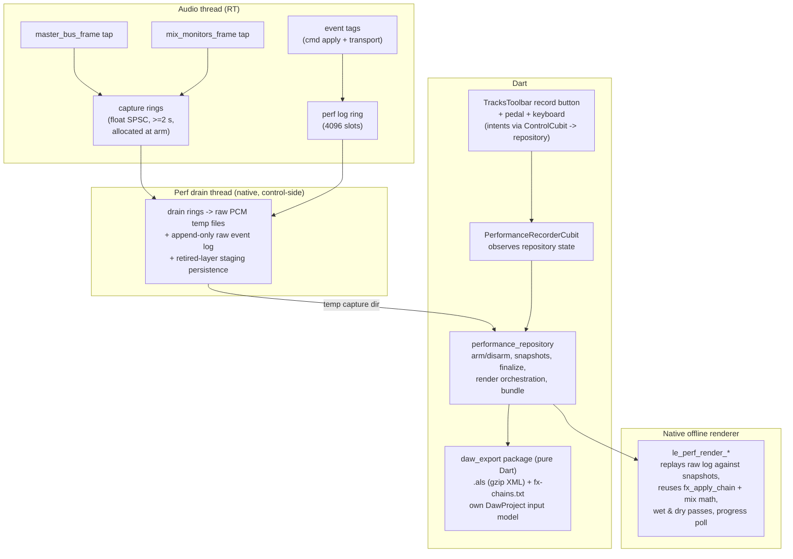
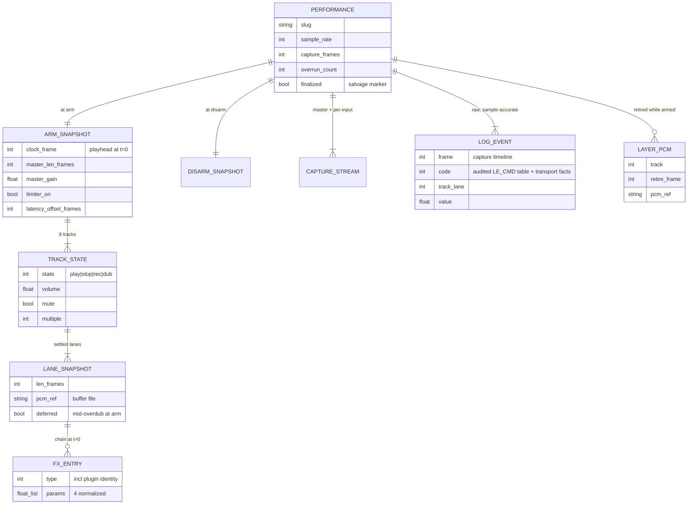

> **Umbrella plan — split into 12 parts.** This file holds the shared design,
> decisions (D-*), data model, edge cases, and acceptance criteria that every
> part references. The concrete work is in the standalone `-part-N` files;
> each is independently mergeable and cites this umbrella for shared design:
>
> - [part 1 — capture rings + audio-thread taps](./2026-07-05-feat-performance-recording-daw-export-part-1-plan.md)
> - [part 2 — perf drain thread + raw PCM + sidecar](./2026-07-05-feat-performance-recording-daw-export-part-2-plan.md)
> - [part 3 — sample-accurate event log](./2026-07-05-feat-performance-recording-daw-export-part-3-plan.md)
> - [part 4 — laned export ABI](./2026-07-05-feat-performance-recording-daw-export-part-4-plan.md)
> - [part 5 — retired-layer persistence (D-LAYER)](./2026-07-05-feat-performance-recording-daw-export-part-5-plan.md)
> - [part 6 — wav_codec extraction + performance_repository](./2026-07-05-feat-performance-recording-daw-export-part-6-plan.md)
> - [part 7 — offline renderer core (dry replay)](./2026-07-05-feat-performance-recording-daw-export-part-7-plan.md)
> - [part 8 — wet pass + golden master parity](./2026-07-05-feat-performance-recording-daw-export-part-8-plan.md)
> - [part 9 — daw_export core (.als builder + corpus)](./2026-07-05-feat-performance-recording-daw-export-part-9-plan.md)
> - [part 10 — daw_export automation + fx-chains](./2026-07-05-feat-performance-recording-daw-export-part-10-plan.md)
> - [part 11 — recorder UI + app state](./2026-07-05-feat-performance-recording-daw-export-part-11-plan.md)
> - [part 12 — pedal firmware parity](./2026-07-05-feat-performance-recording-daw-export-part-12-plan.md)
>
> Source: [Performance Recording & DAW Export brainstorm (2026-07-05)](../brainstorm/2026-07-05-performance-recording-daw-export-brainstorm-doc.md).
> Grounded by two codebase research passes (engine internals + app layers), a
> nine-flow user-flow analysis (14 decision items, all resolved below), an
> `.als`-format research pass, and a three-agent technical review (simplicity,
> VGV conventions, plan splitting) whose findings are folded into the
> decisions, data model, and part scopes below. Two scope questions were put
> to the user and are locked: **full Loopy-pedal firmware parity is in scope**
> (new note + LED field) and the `.als` generator targets **Live 12**.

## feat: performance recording & DAW export — Extensive (umbrella)

## Overview

Add a **performance recorder** that captures an entire live-looping session,
and a **DAW export pipeline** that turns it into an editable Ableton Live
project. While armed, the engine live-captures the two streams that cannot be
reconstructed — the post-limiter **master output** (bit-exact audio for video
sync) and the **live monitor inputs** (playing/singing over loops that never
becomes a loop) — alongside a sample-accurate **event log** of every looper
action. On disarm, an offline render pass replays the log against snapshotted
dry loop buffers to produce **full-length per-track stems (wet and dry)** plus
**loop-cycle stems for all lanes**, and an **`.als` generator** lays the
performance out on an Ableton timeline with clips, volume/mute automation,
session-view loop clips, and FX-chain documentation.

Deliverables land in one movable bundle:

```
{documents}/exports/<performance-slug>/
  master.wav            # post-limiter capture, video-sync reference
  live-input-<n>.wav    # one per monitor input active at arm
  stems/wet/            # full-length per-track stems, playback FX baked
  stems/dry/            # same renders without FX chains
  loops/                # loop-cycle stems, all lanes (track<t>-lane<l>.wav)
  project.als           # Ableton Live 12 set, relative file refs
  fx-chains.txt         # human-readable FX chain summary
  performance.json      # capture manifest / sidecar — canonical machine-readable record
```

**Out of scope (explicit):** screen/camera capture (user films separately),
recreating Loopy's built-in FX as Ableton devices (a named follow-up — the
`performance.json` metadata stays rich enough for it), offline rendering
*through* third-party VST3/CLAP plugins (plugin slots render as dry
passthrough offline, see D-RENDER), Reaper `.rpp` / `.dawproject` exporters
(the generator is structured for them, none are built), resampling (device
rate everywhere; Live resamples on import), and re-arming while a render is
in progress (arm is disabled until the render completes).

## Problem Statement

Loopy can only export a single dry mono loop cycle per track — and only lane 0
([`le_engine_export_track`](../../packages/loopy_engine/src/core/engine_session.c),
lines 22–35, hardcodes `lanes[0]`). There is no way to record a whole
performance (loops starting/stopping, overdubs, mutes, volume rides, FX
tweaks, singing over the top) for a video, and nothing that lands in a DAW as
editable material. Everything needed to fix this already exists in pieces:

- A post-limiter master tap: `master_bus_frame`
  ([engine_process.c:974–1017](../../packages/loopy_engine/src/core/engine_process.c)),
  called once per frame after track + monitor mixing (:1669).
- The live monitor path: `mix_monitors_frame` (:1289–1310) — audible but never
  written to any buffer or file.
- An RT-safe cross-thread pattern: SPSC rings
  ([lockfree_ring.h:30–69](../../packages/loopy_engine/src/core/lockfree_ring.h)),
  one control→audio command ring and one audio→control event ring
  ([engine_private.h:413–423](../../packages/loopy_engine/src/core/engine_private.h)).
- Dry loop buffers with non-destructive playback FX (`fx_apply_chain`,
  [engine_fx.c:978](../../packages/loopy_engine/src/core/engine_fx.c)) — so wet
  *and* dry stems can come from one offline replay mechanism.
- Retained overdub layers: 256-slot undo pool per track
  (`LE_POOL_SLOTS`, engine_private.h:46) with retire events already flowing to
  the control thread (`le_dub_try_retire`, engine_process.c:198–203).
- A WAV writer (`WavCodec`,
  [wav.dart:31](../../packages/session_repository/lib/src/wav.dart)) and export
  conventions (`{documents}/exports/`,
  [session_directory.dart:18](../../lib/session_directory.dart)).

**The one verified correctness hazard:** `le_handle_retired`
([engine_commands.c:195–215](../../packages/loopy_engine/src/core/engine_commands.c))
**silently drops** a retired layer when a track's undo stack is full, and
`track_acquire_slot` (:41–68) evicts the oldest undo when the pool fills.
Clear and redo-invalidation reclaim slots the same way. Audio that audibly
played can therefore be destroyed before anything persists it — the layer
persistence contract (D-LAYER) exists to close exactly this hole. Note: all
of this pool bookkeeping runs **on the control thread** (the audio thread
never allocates or evicts slots), so D-LAYER is a control↔drain-thread
coordination problem, not an RT-internals change.

## Proposed Solution

Hybrid architecture (brainstorm approach C): live-capture only what cannot be
reconstructed; render everything else offline from the event log + dry buffer
snapshots. The offline renderer is **native C reusing the engine's own mixing
and FX code**, which is what makes the master-parity golden test achievable.



### Capture (armed)

- Two kinds of float SPSC rings — master and one per monitor input active at
  arm — are **allocated control-side at arm** (≥2 s of audio each at device
  rate) and published to the audio thread with the arm command, following the
  existing control-allocates / ring-publishes pattern (`le_post_dub_shadows`,
  FX delay lines). Released after disarm. The 256-slot `le_command` rings are
  the wrong shape for audio; this is a new ring type.
- The audio thread pushes master frames (post-`master_bus_frame`) and
  per-monitor input frames (post-monitor-FX, pre-route); on overflow it drops
  and increments an atomic overrun counter — never blocks, never allocates.
- A dedicated native **perf drain thread** (sibling pattern to the plugin scan
  thread) drains rings to **raw PCM temp files** and flushes the append-only
  event log every ~250 ms. WAV headers are written only at finalize — a crash
  leaves salvageable raw PCM + sidecar, not a truncated WAV (D-FMT).
- Arm/disarm ride the existing command ring (`LE_CMD_PERF_ARM` /
  `LE_CMD_PERF_DISARM`); armed state, captured-frame count, and overrun count
  are published as snapshot atomics and surfaced on the existing snapshot
  poll (the single status surface — no separate `le_perf_status` mirror).
- The **captured input set is frozen at arm**: monitor inputs enabled later
  are audible in the master but get no separate stem (documented; logged as
  events for the master reconstruction).

### Event log (armed)

- Engine-side, sample-accurate, **raw** (no drain-side coalescing — log events
  are ~16 bytes; even a 1 kHz encoder sweep is 16 KB/s, noise next to the
  audio capture, and a coalesced log would diverge from what the live master
  actually heard, weakening the parity test). Breakpoint thinning happens
  **only** in `daw_export` (D-ALS).
- The logged set is an **explicit audited table of every `LE_CMD_*` that
  affects audibility** (part 3 derives it by auditing `apply_command`), not a
  prose list. It must include at minimum: record/play/stop, track + per-lane
  volume and mute, multiple, FX type/count/param changes, clear, undo/redo,
  per-lane output routing (`SET_LANE_OUTPUT`), output-enabled mask, master
  gain, limiter enable/ceiling, overdub feedback, and monitor
  enable/volume/mute/FX changes. "A command that changes output but isn't
  logged" is a standing review-checklist item.
- Transport facts are logged too: loop length locked, layer retired, record
  start/end — each tagged with the capture frame.
- A new dedicated **4096-slot perf log ring** (the existing 256-slot ring is
  too small for encoder sweeps), drained by the perf drain thread.

### Snapshots (arm **and** disarm)

Taken control-side, tagged with capture frames:

- **At arm:** clock position and master loop length; per track — state,
  volume, mute, multiple, and all **settled** lane dry buffers (via the laned
  export ABI, part 4) with FX chain types + current param values; monitor
  configuration (enabled inputs, routing, monitor FX, volumes); master gain +
  limiter settings; the active device profile's latency offset. A lane
  mid-overdub at arm is marked *deferred* and captured when its retire event
  lands (never stall the performer with `_awaitLayersSettled`-style blocking).
- **At disarm:** a second settled-lane capture pass. This is what covers a
  track **recorded fresh during the performance** and then just played —
  recording finalization produces no retire event (retires are overdub-only),
  so without the disarm pass its stem would have no PCM source anywhere.

### Offline render (disarm)

- New native entry points (`le_perf_render_begin/poll/cancel`) replay the
  event log against the snapshots + persisted layers, **reusing
  `fx_apply_chain` and the track-mix math**. Runs on its own native thread;
  Dart polls progress. The renderer reads **only from the capture directory**
  (snapshots, layers, and log are all files) — no live-engine dependency, so
  the user can keep looping during a render, and salvage renders are free.
- **Overdub-pass reconstruction is explicit renderer logic:** during a logged
  overdub pass, audibility switches from the pre-pass layer image to the
  post-pass retired layer along the pass's write trajectory (write-head
  position from the logged record offset + punch frames). This stitching is
  specified in part 7, not implied.
- Two passes per track: wet (FX chains applied per the log) and dry (chains
  skipped). **`LE_FX_PLUGIN` slots render as dry passthrough in both passes**
  (matching the engine's own not-ready-slot rule); the passthrough is noted
  in `fx-chains.txt`, and offline plugin rendering is a named follow-up.
- The master reconstruction exists for the **golden parity test** (part 8),
  whose protocol is fixed: **arm from silence, no monitor inputs, no plugin
  slots**, compare within float tolerance after a settle window — pre-arm FX
  tails and limiter smoothing state cannot be snapshotted and are excluded by
  protocol, not by fudging the tolerance.
- Render failure is **partial success**: master.wav + live-input stems are
  already safe on disk and are always delivered; stems/.als report failed.
- **No render queue:** arm is disabled while `rendering` (renders are much
  faster than real time; the restriction is invisible in practice).

### `.als` generation (Dart, `daw_export` package)

- `.als` is gzipped XML; generate directly (no Ableton needed), targeting the
  **Live 12** schema, validated against a committed corpus of minimal Live 12
  sets ("save from Live, diff" methodology).
- `daw_export` is a **pure Dart package with its own input model**
  (`DawProject` / `DawTrack` / `DawClip` / `AutomationLane`) built from the
  documented `performance.json` + log formats — it never imports
  `performance_repository` or `loopy_engine`; the app layer maps between the
  two. Fixture-driven tests, fully parallelizable with the native track.
- One Ableton audio track per non-empty Loopy track + one per live-input
  stem. Arrangement view: wet full-length stems as clips at capture t=0
  (full-length, so placement is trivial and sample-accurate). Session view:
  loop-cycle clips in slots per lane. Volume events → mixer volume automation
  (thinned breakpoints, thinning lives here); mute events → track-activator
  automation.
- **Fixed tempo (120 BPM), warp OFF on every clip** — Loopy has no BPM;
  warp-off is the only choice that cannot corrupt sample-accurate timing
  (D-TEMPO).
- **Relative file references only**; the bundle folder is self-contained and
  movable (corpus test asserts every `FileRef` is relative).
- FX chains: `performance.json` is the **canonical machine-readable record**
  (effect types + normalized params per lane, third-party plugin identity
  from the existing `PluginEffect` metadata — rich enough for the future
  Loopy-FX-plugin exporter); `fx-chains.txt` is the human summary. No `.als`
  annotation mirroring (pure duplication + corpus-test surface).

### App state & control surfaces

- New **`PerformanceRecorderCubit`** in `lib/performance/{cubit,view}/`
  (SessionCubit's fire-and-forget working→SnackBar envelope cannot express a
  minutes-long armed state or determinate render progress). Sealed
  `PerformanceRecorderState` (Equatable): `idle → armed(elapsed, overrun) →
  finalizing → rendering(percent) → completed(result)` where `result` carries
  done/partial/stopped-early(reason), plus `recoveryAvailable`. The
  short-capture auto-discard is surfaced via a `BlocListener` on the
  transition (no ephemeral side-channel state).
- **Layering (explicit, to keep `/build` honest):**
  - `ControlCubit` gains a **`PerformanceRepository` constructor dependency**;
    `togglePerformanceRecord()` calls the repository. Cubits never call
    cubits: `PerformanceRecorderCubit` **observes** repository state (stream +
    the snapshot-mirrored atomics), it is never invoked by `ControlCubit`.
  - The pedal LED projection in `ControlCubit` derives from the same
    repository-sourced armed state.
  - **D-CLEAR orchestration:** `ControlCubit` (already the single clear path)
    awaits `performanceRepository.persistLiveLanes()` when armed before
    `looper.clearAll()`. **Load-while-armed:** `SessionCubit` gains a
    `PerformanceRepository` dependency and awaits
    `performanceRepository.disarmAndFinalize()` before applying a load.
  - The engine boundary is a new **`EnginePerformanceCapture` capability
    interface** composed into `AudioEngine` (precedent:
    `EnginePluginHosting`), implemented by `NativeAudioEngine` **and**
    `MockAudioEngine`; `performance_repository` depends on `AudioEngine`,
    never `NativeAudioEngine`.
  - Providers: `RepositoryProvider<PerformanceRepository>` and an **eager**
    (`lazy: false`) `BlocProvider<PerformanceRecorderCubit>` in
    `lib/app/view/app.dart`, with boot-time salvage detection
    (`unawaited(cubit.load())` pattern, like `AudioRecoveryCubit`).
- **UI:** new extracted Widget classes (never build-methods): `PerfRecordButton`
  in `TracksToolbar`
  ([tracks_chrome.dart:19](../../lib/looper/view/tracks_chrome.dart)) between
  the mode/bank cluster and the global transport; `ArmedIndicator` (persistent
  + elapsed time); `PerformanceCompletionSheet` (reveal + rename). The reveal
  label is platform-aware ("Show in Finder" is macOS wording).
- **Pedal (firmware parity, user-locked):** new `PedalButton.perfRecord`
  (next free MIDI note — a firmware wire-contract extension), handled in
  `ControlCubit._onPress`
  ([control_cubit.dart:493](../../lib/control/cubit/control_cubit.dart)) via
  `togglePerformanceRecord()`; new `PedalStateFrame` LED field for armed
  state (blinking red, distinct from looper-record red), codec + golden
  `.syx` fixtures updated; on-screen faceplate gains the footswitch.
- **Keyboard:** key in `TracksCommands.handleKey()` mirroring the intent.
- Double-press guard: disarm ignored within 1 s of arm; captures shorter than
  2 s with zero logged events are auto-discarded with a notice (constants,
  not settings).
- **l10n:** every user-facing string in `app_en.arb` **and** `app_es.arb`
  **with `@`-metadata**. Key surface (~14): arm/disarm labels, armed-elapsed,
  finalizing, rendering-percent, done+path, reveal (platform-aware), partial,
  stopped-early (disk full / device changed), capture-glitch(gap time),
  discarded, low-disk warning, recovery prompt + recover/discard pair.

## Decisions

Resolves every brainstorm Open Question, all 14 flow-analysis decision items,
and the technical-review findings.

| # | Topic | Decision |
|---|-------|----------|
| **D-ARM** | Timeline zero | Capture starts **at the arm instant** (silence until the first event is correct — the user claps/counts in for the camera). Every stem and the `.als` arrangement share this t=0. |
| **D-FMT** | Disk format while armed | **Raw PCM temp files + sidecar `performance.json` + append-only event log**, flushed ~250 ms; finalized to WAV on disarm. Decided by the crash case: patch-on-stop WAV is unreadable after a crash. |
| **D-LAYER** | Layer persistence (brainstorm OQ #1) | While armed, **every retired layer is copied into drain-owned staging at `le_handle_retired` time** (control thread — the same thread that runs eviction/clear/redo reclaim, so ordering is naturally serialized) and persisted to disk by the drain thread. Pool machinery stays byte-for-byte untouched; no hold flag, no RT change. Pool depth becomes irrelevant to correctness. |
| **D-SNAP** | Snapshot passes | Settled-lane capture at **arm and at disarm** (disarm pass covers tracks recorded fresh while armed — retires are overdub-only, so nothing else persists their PCM). Mid-overdub lanes deferred to their retire event. |
| **D-CLEAR** | Clear while armed | Clear-all is a legitimate performance move: it is a **logged event**; `ControlCubit` awaits `persistLiveLanes()` before issuing the clear — **skipping tracks currently capturing** (a mid-dub buffer is being written by the audio thread and would tear; the retire/`dub_generation` path covers those). Session **load** while armed auto-disarms + finalizes first (orchestrated by `SessionCubit`). |
| **D-LOG** | Event log location (brainstorm OQ #2) | **Engine-side**, sample-accurate at the callback, via a new dedicated 4096-slot log ring; **raw on disk, no drain-side coalescing** — thinning happens only in `daw_export`. Logged set = audited `LE_CMD_*` table (part 3). |
| **D-RENDER** | Offline renderer | **Native C reusing `fx_apply_chain` + the track-mix math**, on a worker thread with progress polling, reading only from the capture directory. Overdub passes reconstructed by pre-/post-layer stitching along the logged write trajectory. **`LE_FX_PLUGIN` slots = dry passthrough offline** (noted in `fx-chains.txt`); offline plugin rendering is a named follow-up. **Arm disabled while rendering** (no queue). |
| **D-MASTER** | Master capture shape | Stereo (first enabled output pair at arm; mono device → mono WAV). 32-bit float at device rate, matching `WavCodec`. |
| **D-INPUT** | Live-input stems | **Per monitor input active at arm** (not summed), **wet** (post-monitor-FX — what the audience heard), each landing as its own DAW track (`live-input-<n>.wav`). Input set frozen at arm. |
| **D-STEMS** | Stem variants | Full-length wet + dry per track (stereo, post-routing collapse) **and** loop-cycle stems for all lanes (extends export past the lane-0 hardcode). |
| **D-ALS** | Schema target (brainstorm OQ #3, user-locked) | **Live 12**, verified against a committed sample corpus. Relative refs; bundle is self-contained. Older-Live behavior documented (Live 11 may refuse a 12 set). |
| **D-TEMPO** | Tempo/warp | Fixed 120 BPM, **warp off** on all clips; sample-accurate placement over grid alignment. Grid/BPM derivation is a follow-up. |
| **D-MUTE** | Mute in `.als` | Track-activator automation (Ableton has no native "mute automation"); preserves the gesture rather than baking it into clip splits. |
| **D-PEDAL** | Pedal surface (user-locked) | **Full firmware parity in this feature**: new `PedalButton` note + new `PedalStateFrame` LED field (blinking red = perf-armed, distinct from looper red), codec + firmware + faceplate + golden fixtures. Sequenced as the last part so everything else ships without the firmware coupling. |
| **D-FAIL** | Failure posture | Disk full → stop capture cleanly, deliver partials, "stopped early" notice; free-space estimate at arm (warn, don't block). Device/sample-rate change while armed → auto-stop + finalize at the old rate. Ring overrun → silence-fill (file stays sample-consistent), gap position reported loudly. Capture failure must never touch the audio path. |
| **D-NAME** | Naming (brainstorm OQ #5) | Auto timestamp slug `perf-YYYYMMDD-HHMMSS` (collision-free, no mid-performance prompt); rename offered from the completion surface. **Never overwrite** — do not inherit the silent-overwrite of `mixdown.wav`. |
| **D-SALVAGE** | Crash recovery | Unfinalized capture dirs (sidecar lacks the `finalized` flag) detected at next launch → recover (finalize + render) or discard prompt. Renderer being file-driven makes the salvage render free. |
| **D-RATE** | Sample rate (brainstorm OQ #6) | Device rate everywhere, no resampling; Live resamples on import. |
| **D-WAV** | `WavCodec` home | `WavCodec` moves out of `session_repository` into a new tiny pure-Dart **`wav_codec`** package (repositories never import each other; `session_repository` updates its import). Part 6 precursor step. |
| **D-SET** | Settings | **None.** Destination fixed to `{documents}/exports/`; wet+dry always both; `.als`/loops/fx-chains always emitted; discard threshold a constant. (Flow analysis YAGNI ruling.) |

## Data Model



- **Sidecar `performance.json`** carries PERFORMANCE + both snapshots + the
  file manifest + FX metadata (canonical machine-readable record); the event
  log is a separate append-only binary file (flushed while armed); layer PCM
  as numbered raw files in the temp dir. All inputs the renderer and `.als`
  generator need, with no live-engine dependency.
- **New ABI section** (`le_perf_*`), style-matched to the existing ABI:
  `le_perf_arm/disarm` (via command ring), `le_perf_render_begin/poll/cancel`,
  plus a laned `le_engine_export_track_lane`. Status lives on the existing
  snapshot (atomics), not a parallel status call. ffigen + `dart format`
  after every change.
- **Dart engine boundary:** new `EnginePerformanceCapture` capability
  interface composed into `AudioEngine`; `SessionIo` gains
  `exportTrackLane`. `MockAudioEngine` parity for every new capability is
  per-PR, not deferred.
- **New packages:** `wav_codec` (pure Dart, extracted), `performance_repository`
  (depends on `loopy_engine` + `wav_codec`), `daw_export` (pure Dart, own
  `DawProject` input model, **no** repository/engine deps). Repositories
  never import each other; the app composes them.

## Part Sequence

Twelve parts, each independently mergeable, tree green (incl.
`MockAudioEngine` stubs and ffigen + `dart format` riding along with every
ABI-touching part). **Critical path:** 1 → 2 → 3 → 5 → 6 → 7 → 8, with
11 → 12 on top. **Parallel lanes:** part 4 any time; parts 9–10 (pure Dart)
alongside 5–8 once the log (part 3) + manifest (part 6 schema) formats are
pinned.

| Part | Title | Scope | Deps | Size |
|---|---|---|---|---|
| **1** | `feat(perf): capture rings + audio-thread taps` | New float SPSC audio ring type (≥2 s, allocated at arm control-side, published via arm command); master tap post-`master_bus_frame` + per-monitor taps; drop-on-overflow + atomic overrun counter; `LE_CMD_PERF_ARM/DISARM`; armed/frames/overrun snapshot atomics; `EnginePerformanceCapture` interface + ffigen + `MockAudioEngine` fakes. Native tests: tap == processed output, overflow counting, no RT alloc/lock. | — | M |
| **2** | `feat(perf): perf drain thread + raw PCM + sidecar` | Dedicated drain thread (scan-thread sibling); rings → raw PCM temp files, ~250 ms flush; `performance.json` sidecar skeleton (`finalized` flag); silence-fill on overrun + gap positions; disk-full clean stop; device-change auto-stop hook. Native tests: drain correctness, crash-consistent temp dir. | 1 | M |
| **3** | `feat(perf): sample-accurate event log` | 4096-slot perf log ring; frame-tagged emission from the **audited `LE_CMD_*` table** + transport facts; append-only raw log file format (no coalescing). Native tests: ordering under command storms, table completeness check. | 2 | M |
| **4** | `feat(perf): laned export ABI` | `le_engine_export_track_lane` (kills the `lanes[0]` hardcode); `SessionIo` interface extension + `MockAudioEngine` fake + ffigen + `dart format`; `session_repository` call sites/tests untouched-but-verified. Contributor-friendly, fully parallel. | — | S |
| **5** | `feat(perf): retired-layer persistence (D-LAYER)` | Staging copy at `le_handle_retired` (control thread) → drain-thread disk persistence; covers eviction, clear, and redo-invalidation reclaim paths. Native tests: layer-survives-pool-eviction (deliberate `LE_POOL_SLOTS` overflow), clear-during-dub, staging hand-off ordering. Deliberately small — the safety-critical piece, reviewed alone. | 2, 3 | S |
| **6** | `feat(perf): wav_codec extraction + performance_repository` | Extract `WavCodec` → new `wav_codec` package (+ `session_repository` import update). New `performance_repository`: arm+disarm snapshots (settled lanes via part 4, deferred mid-overdub), `persistLiveLanes()` (D-CLEAR), temp-dir lifecycle, WAV finalize, bundle assembly incl. `loops/`, timestamp slug, salvage detection. Package tests ≥ 90 coverage. | 3, 4, 5 | L |
| **7** | `feat(perf): offline renderer core (dry replay)` | `le_perf_render_begin/poll/cancel` ABI + worker thread; log replay against snapshots + persisted layers reusing track-mix math; **overdub-pass stitching**; **dry** full-length stems; progress poll; partial-success posture. Native tests: replay timeline vs scripted log, stitching correctness, track-recorded-while-armed renders a stem. | 6 | L |
| **8** | `feat(perf): wet pass + golden master parity` | Wet pass via `fx_apply_chain` (plugin slots passthrough); master reconstruction (limiter + master gain from snapshot); **golden parity test** under the fixed protocol (arm-from-silence, no monitors, no plugins, settle window, float tolerance) as a hard gate. | 7 | M |
| **9** | `feat(perf): daw_export core (.als builder + corpus)` | New pure-Dart package with its own `DawProject` model; gzip XML writer, Live 12 skeleton (ID/Pointee consistency), arrangement clips at t=0 (warp off, 120 BPM), session-view loop clips, **relative refs only**; committed Live 12 corpus + structural round-trip tests; README methodology. Fixture-driven — parallel to parts 5–8. | 3, 6 (formats only) | L |
| **10** | `feat(perf): daw_export automation + fx-chains` | Volume → mixer automation, mute → track-activator automation, **breakpoint thinning (lives here)**; `fx-chains.txt` from `performance.json` (incl. `PluginEffect` identity + passthrough notes). Corpus tests for envelope shapes. | 9 | M |
| **11** | `feat(perf): recorder UI + app state` | `PerformanceRecorderCubit` (sealed Equatable state, observes repository); `app.dart` providers (eager, boot salvage); `PerfRecordButton` + `ArmedIndicator` + `PerformanceCompletionSheet` (platform-aware reveal, rename); keyboard key; `SessionCubit` load-while-armed orchestration; ARB en+es with `@`-metadata; `bloc_test` + widget tests. | 6, 7 (10 for done-state polish) | L |
| **12** | `feat(perf): pedal firmware parity` | `PedalButton.perfRecord` note; `ControlCubit.togglePerformanceRecord()` (repository dep); `PedalStateFrame` LED field (blinking red) + codec + golden `.syx` fixtures; faceplate footswitch; double-press guard; firmware wire-contract addendum. | 11 | M |

> **First-contributor candidates:** part 4 (small, self-contained ABI, no
> deps) and part 9 (pure Dart, corpus-driven, parallel).

## Edge Cases

**Arming** — while loops play (snapshot covers phase via clock position);
mid-overdub (deferred lane capture at retire, log notes pre-t=0 start); while
a track records (nothing to snapshot; disarm-pass + "record ended" event
cover it); low disk at arm (warn, don't block); double-tap (1 s disarm guard,
<2 s zero-event auto-discard).

**While armed** — volume-encoder sweeps (4096 ring, raw log, no coalescing);
pool eviction / clear / redo-invalidation (D-LAYER staging copy); clear
during an active overdub (pre-persist skipped for capturing tracks, retire
path covers them); monitor input enabled mid-capture (audible in master,
logged, no new stem — set frozen at arm); disk full (clean stop, partials
delivered); device unplug / sample-rate change (auto-stop, finalize at old
rate); ring overrun (silence-fill, gap position reported); session load
(auto-disarm first); app crash (raw PCM + flushed log + sidecar → salvage
prompt at next launch).

**Render** — user keeps looping (renderer reads capture dir only); arm
attempted during render (disabled, brief notice); render failure (partial
success — captures always delivered); cancel; plugin-bearing chain (wet stem
carries passthrough note).

**`.als` import** — bundle moved/zipped (relative refs); Live 11 opening a
12 set (documented failure mode); auto-warp (explicitly off); live inputs
(one Ableton track each); empty tracks (skipped); mute gesture (activator
automation, not clip splits).

**Pedal** — armed LED distinct from looper-record red; failure auto-stops
must reach the LED (performer can't see SnackBars); simultaneous UI + pedal
toggles (single intent path through `ControlCubit` → repository).

## Success Criteria

```success-criteria
GOAL: A performer can arm from UI or pedal, play a full looper session, and receive a self-contained bundle — video-sync master, live-input stems, full-length wet/dry per-track stems, all-lane loop-cycle stems, and a Live 12 project that opens cleanly with everything placed where it was played.

SUCCESS CRITERIA:
- Native engine suites pass, including: capture-tap correctness, ring-overflow silence-fill, raw event-log ordering + audited-table completeness, layer-survives-pool-eviction (and clear/redo reclaim), overdub-pass stitching, track-recorded-while-armed renders a stem, and the golden master-parity test under the fixed protocol (arm-from-silence, no monitors, no plugins, settle window, float tolerance) | verify: bash packages/loopy_engine/src/test/run_native_tests.sh
- Static analysis clean across app + packages | verify: flutter analyze
- Formatting stable (incl. regenerated ffigen bindings) | verify: dart format --set-exit-if-changed .
- New package suites green with coverage >= 90 (CI gate): wav_codec, performance_repository (snapshots/persistLiveLanes/finalize/salvage/slug), daw_export (Live 12 corpus structural tests, relative-ref assertion, automation mapping, thinning), plus updated pedal_repository codec goldens and app cubit/widget tests | verify: flutter test packages/wav_codec packages/performance_repository packages/daw_export packages/pedal_repository test/performance
- Recording while armed never allocates, locks, or performs I/O on the audio thread (rings allocated control-side at arm; taps write to published rings only) | verify: bash packages/loopy_engine/src/test/run_native_tests.sh (RT assertions included in the native suite)
- A kill -9 during an armed capture leaves a salvageable bundle (raw PCM + sidecar + flushed log) that the next launch detects and can finalize | verify: manual 1. arm and play ~30 s 2. kill -9 the app 3. relaunch 4. accept the recovery prompt 5. confirm master.wav plays and stems render
- project.als opens in Ableton Live 12 with no missing-file dialog, one track per non-empty Loopy track + live-input stems, clips at correct positions with warp off, and volume/activator automation present | verify: manual 1. record a session with loops, mutes, and a volume ride 2. open the bundle's project.als in Live 12 3. check tracks, placement, automation 4. move the folder and confirm refs still resolve
- Pedal parity: the new footswitch arms/disarms and the armed LED (blinking red) is distinct from looper-record red | verify: manual 1. arm via pedal with the screen hidden 2. confirm LED state 3. disarm 4. confirm bundle exists

NON-GOALS:
- Screen/camera capture; offline rendering through third-party VST3/CLAP plugins (dry passthrough + follow-up); recreating Loopy FX as Ableton devices (metadata kept sufficient); Reaper/.dawproject exporters; BPM detection or warped/grid-aligned clips; resampling; re-arm while rendering; any new user settings.

VERIFICATION COMMAND: bash packages/loopy_engine/src/test/run_native_tests.sh && flutter analyze && dart format --set-exit-if-changed . && flutter test packages/wav_codec packages/performance_repository packages/daw_export packages/pedal_repository test/performance
```

## Testing Strategy

- **Engine (C).** Extend the CHECK/`main()`-registered harness in
  [test_engine_core.c](../../packages/loopy_engine/src/test/test_engine_core.c)
  (run via `run_native_tests.sh`; "ALL PASSED" is the gate). New tests per
  part: master tap equals processed output; monitor tap equals monitor mix;
  overflow → silence-fill + counter; raw log ordering under command storms;
  audited-table completeness; **layer retired at full pool is persisted**
  (deliberately overflow `LE_POOL_SLOTS`), clear-during-dub, redo-invalidation;
  overdub-pass stitching against a scripted trajectory; disarm-pass stem for a
  fresh recording; **golden parity** under the fixed protocol; arm/disarm
  during active overdub.
- **`performance_repository` (Dart).** Snapshot completeness (settled vs
  deferred lanes, arm + disarm passes), `persistLiveLanes` skip-capturing
  rule, temp-dir → bundle finalize, slug collision-freedom, salvage detection
  (`finalized` flag), partial-success on render failure. `MockAudioEngine`
  gains deterministic `EnginePerformanceCapture` fakes. Coverage ≥ 90.
- **`daw_export` (Dart).** Golden/structural tests against a **committed Live
  12 corpus**: gzip round-trip, ID/Pointee consistency, every `FileRef`
  relative, clip positions from a fixture log, volume/activator automation
  breakpoints + thinning bounds, warp-off on every clip. Byte-diff
  methodology (save from Live, compare) documented in the package README.
- **Bloc/widget.** `bloc_test` for every `PerformanceRecorderCubit`
  transition (incl. stopped-early reasons, salvage, arm-disabled-while-
  rendering) and the D-CLEAR/load-while-armed orchestration ordering; widget
  tests for `PerfRecordButton`/`ArmedIndicator`/`PerformanceCompletionSheet`;
  pedal codec golden `.syx` fixtures updated for the new note + LED field.
- **Manual (per the criteria block).** Live 12 import, crash salvage, pedal
  eyes-free flow.
- **ffigen.** `dart format` on regenerated bindings after every ABI change
  (known drift gotcha).

## Risks & Mitigations

| Risk | Mitigation |
|------|-----------|
| D-LAYER staging copy blocks the control thread (~ms memcpy per retire) | Same thread already does large memcpys (session save, snapshot capture); staging + drain-thread I/O split keeps the copy bounded; part 5 measures it. Pool machinery untouched removes the original RT-perturbation risk entirely. |
| Offline render drifts from live master (limiter state, denormals, param timing) | Renderer *reuses* the same C functions; raw (uncoalesced) log preserves exact command frames; golden parity protocol excludes what cannot be snapshotted (pre-arm FX tails, monitors, plugins) by construction; hard gate in part 8. |
| Overdub-pass stitching is subtly wrong (latency-offset write head, punch envelopes) | Specified as explicit renderer logic with its own scripted-trajectory native tests (part 7); parity test catches residual drift. |
| Live 12 XML subtleties (IDs, Pointees, automation shape) reject the set silently | Corpus-driven development (diff real Live saves); structural tests; manual import in the part 9/10 checklists; `.als` failure is partial-success, never blocks audio deliverables. |
| Capture drain can't keep up on slow disks | Rings sized ≥2 s; raw sequential writes; overrun counter surfaces the truth; silence-fill keeps files consistent. |
| Firmware coupling (new note + LED field) stalls the stack | Sequenced last (part 12); everything through part 11 ships with UI + keyboard only. |
| Snapshot copy cost at arm/disarm (8×8 lanes) | Copy settled buffers only, on the control thread (same memcpy the existing export does); measure in part 6; defer mid-overdub lanes by design. |
| `wav_codec` extraction churns `session_repository` | Mechanical move + import update, isolated at the top of part 6; existing session tests are the safety net. |

## Documentation Plan

- `docs/PROGRESS.md`: feature entry + the D-LAYER staging contract note.
- `packages/daw_export/README.md`: Live 12 corpus methodology, schema notes,
  `DawProject` input model, extension points for `.rpp`/`.dawproject` and the
  future FX-plugin exporter.
- `firmware/` docs: new note + LED field wire-contract addendum.

## References & Research

### Internal

- Brainstorm: [2026-07-05-performance-recording-daw-export-brainstorm-doc.md](../brainstorm/2026-07-05-performance-recording-daw-export-brainstorm-doc.md)
- Master tap: [engine_process.c:974–1017](../../packages/loopy_engine/src/core/engine_process.c) (`master_bus_frame`), monitors :1289, retire :198
- Rings: [lockfree_ring.h:30–69](../../packages/loopy_engine/src/core/lockfree_ring.h), [engine_private.h:413–423](../../packages/loopy_engine/src/core/engine_private.h) (`LE_RING_CAPACITY`:39, `LE_POOL_SLOTS`:46)
- Layer-drop hazard: [engine_commands.c:195–215](../../packages/loopy_engine/src/core/engine_commands.c) (`le_handle_retired`), `track_acquire_slot` :41
- Lane-0 export: [engine_session.c:22–35](../../packages/loopy_engine/src/core/engine_session.c)
- FX chain: [engine_fx.c:978](../../packages/loopy_engine/src/core/engine_fx.c) (`fx_apply_chain`)
- WAV + export conventions: [wav.dart:31](../../packages/session_repository/lib/src/wav.dart), [session_repository.dart:264](../../packages/session_repository/lib/src/session_repository.dart), [session_directory.dart:18](../../lib/session_directory.dart)
- Engine boundary precedent: `EnginePluginHosting` in [audio_engine.dart](../../packages/loopy_engine/lib/src/audio_engine.dart)
- Control surfaces: [control_cubit.dart:493](../../lib/control/cubit/control_cubit.dart) (`_onPress`), [pedal_button.dart:9](../../packages/pedal_repository/lib/src/pedal_button.dart), [tracks_chrome.dart:19](../../lib/looper/view/tracks_chrome.dart) (`TracksToolbar`)
- Native test gate: [run_native_tests.sh](../../packages/loopy_engine/src/test/run_native_tests.sh)
- Worker-thread precedent: `plugin_scan.cpp` (dedicated `std::thread`, poll-based progress)
- Pattern precedent (umbrella + parts, thread lifecycle, ffigen gotchas): [2026-06-23-feat-vst3-clap-plugin-hosting-plan.md](./2026-06-23-feat-vst3-clap-plugin-hosting-plan.md)

### External

- `.als` = gzipped XML; ID/Pointee consistency + diff-against-real-saves methodology: [hodel33/ableton-project-processor](https://p.rst.im/q/github.com/hodel33/ableton-project-processor), [Stack Overflow — writing .als](https://stackoverflow.com/questions/68616517)
- Structure references: [owenbush/ableton-inspector](https://github.com/owenbush/ableton-inspector) (tempo envelope PointeeId, FileRef paths, track elements), [ableton-set-builder](https://pypi.org/project/ableton-set-builder/), [fmtals](https://github.com/adriensalon/fmtals)
