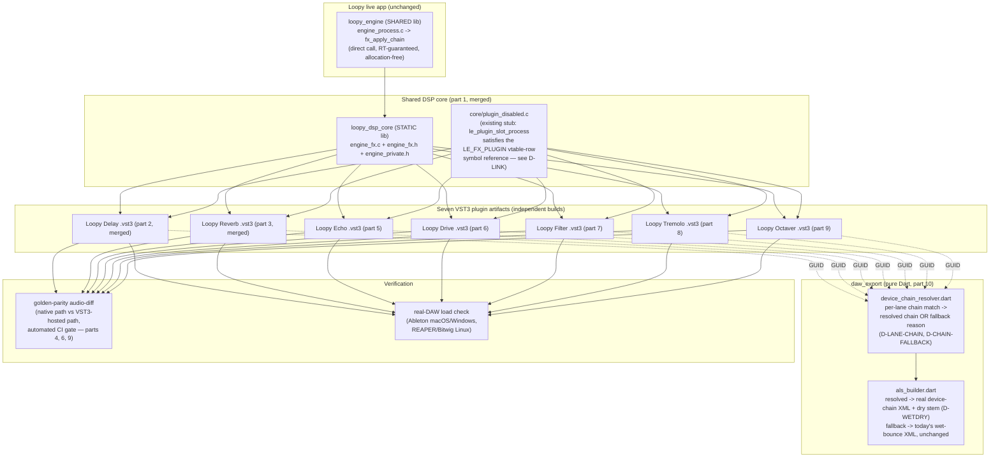
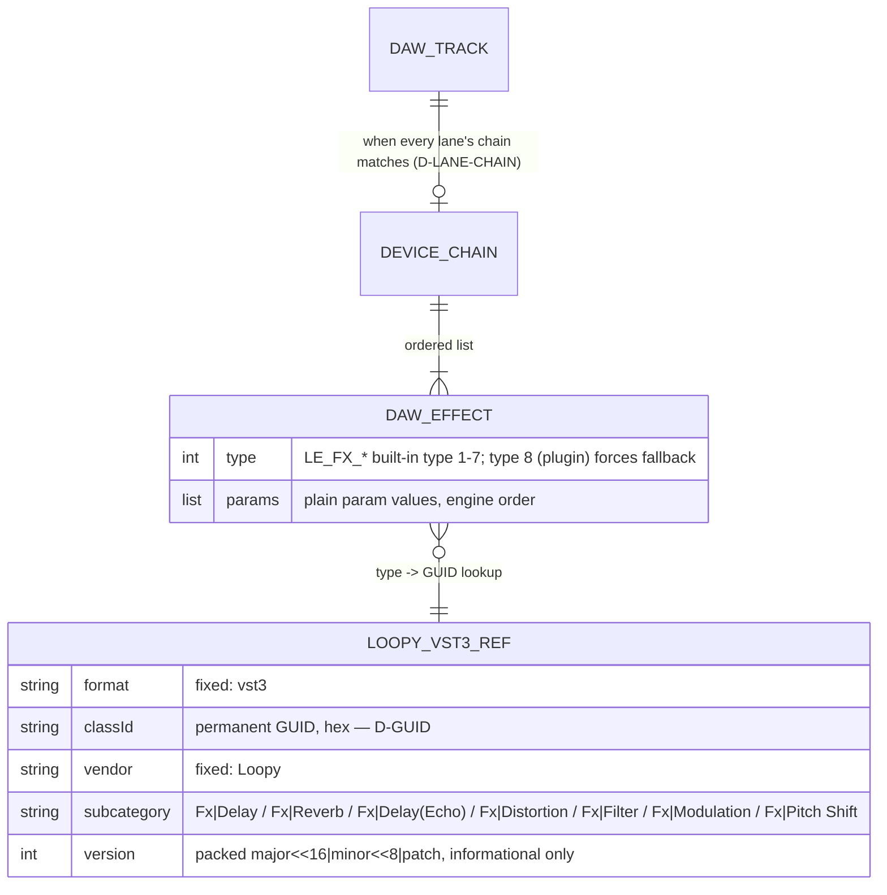

> **Umbrella plan — split into 17 parts.** This file holds the shared design,
> decisions (D-*), data model, edge cases, and acceptance criteria that every
> part references. The concrete work is in the standalone `-part-N` files
> below; each is independently mergeable and cites this umbrella for shared
> design:
>
> - [part 1 — shared DSP-core CMake split](./2026-07-08-feat-loopy-fx-vst3-plugins-part-1-plan.md) *(merged)*
> - [part 2 — Loopy Delay VST3 plugin (macOS)](./2026-07-08-feat-loopy-fx-vst3-plugins-part-2-plan.md) *(merged)*
> - [part 3 — Loopy Reverb VST3 plugin (macOS)](./2026-07-08-feat-loopy-fx-vst3-plugins-part-3-plan.md) *(merged)*
> - [part 4 — golden-parity audio-diff harness (Delay + Reverb)](./2026-07-08-feat-loopy-fx-vst3-plugins-part-4-plan.md) *(merged)*
> - [part 5 — Loopy Echo VST3 plugin (macOS)](./2026-07-08-feat-loopy-fx-vst3-plugins-part-5-plan.md)
> - [part 6 — Loopy Drive VST3 plugin (macOS) + harness generalization](./2026-07-08-feat-loopy-fx-vst3-plugins-part-6-plan.md)
> - [part 7 — Loopy Filter VST3 plugin (macOS)](./2026-07-08-feat-loopy-fx-vst3-plugins-part-7-plan.md)
> - [part 8 — Loopy Tremolo VST3 plugin (macOS)](./2026-07-08-feat-loopy-fx-vst3-plugins-part-8-plan.md)
> - [part 9 — Loopy Octaver VST3 plugin (macOS)](./2026-07-08-feat-loopy-fx-vst3-plugins-part-9-plan.md)
> - [part 10 — daw_export: real Loopy VST3 device chains in .als](./2026-07-08-feat-loopy-fx-vst3-plugins-part-10-plan.md)
> - [part 11 — export-flow device-chain feedback + re-export](./2026-07-08-feat-loopy-fx-vst3-plugins-part-11-plan.md)
> - [part 12 — macOS code signing + notarization (all seven)](./2026-07-08-feat-loopy-fx-vst3-plugins-part-12-plan.md)
> - [part 13 — Windows plugin port + signing (all seven)](./2026-07-08-feat-loopy-fx-vst3-plugins-part-13-plan.md)
> - [part 14 — Linux plugin port (all seven)](./2026-07-08-feat-loopy-fx-vst3-plugins-part-14-plan.md)
> - [part 15 — macOS app installer](./2026-07-08-feat-loopy-fx-vst3-plugins-part-15-plan.md)
> - [part 16 — Windows app installer](./2026-07-08-feat-loopy-fx-vst3-plugins-part-16-plan.md)
> - [part 17 — Linux app packaging](./2026-07-08-feat-loopy-fx-vst3-plugins-part-17-plan.md)
>
> **Scope amendment (2026-07-08).** This umbrella originally piloted just
> Reverb + Delay (the old D-SCOPE) with a stock-Ableton-device-approximation
> export path assumed for the other five effects. The
> [all-effects VST3 + DAW export brainstorm](../brainstorm/2026-07-08-all-effects-vst3-plus-daw-export-brainstorm-doc.md)
> extended this to all seven built-in effects (D-ALL-EFFECTS) and dropped the
> stock-device approximation entirely — it was never built, and
> `daw_export`'s only export paths are now a real Loopy VST3 device chain or
> today's existing wet-bounce-only fallback (D-NO-STOCK-DEVICES). **Parts
> 1-4 are unchanged and already merged** (Delay, Reverb, the golden-parity
> harness for those two). **Parts 5-17 are new or renumbered**: old part 5's
> "`useLoopyPlugins` toggle between stock-device and real-plugin export"
> design is fully replaced by new part 10's per-lane device-chain resolution;
> old parts 6-12 (export toggle UI, signing, platform ports, installers) are
> the same shape scaled from two plugins to seven, now at parts 11-17.
>
> Source: [Loopy FX as VST3 plugins brainstorm (2026-07-08)](../brainstorm/2026-07-08-loopy-fx-vst3-plugins-brainstorm-doc.md)
> and its extension, the
> [all-effects VST3 + DAW export brainstorm (2026-07-08)](../brainstorm/2026-07-08-all-effects-vst3-plus-daw-export-brainstorm-doc.md).
> Grounded by a local codebase research pass (engine internals, CMake structure,
> vendored SDK contents, `daw_export`'s manifest/corpus/model internals), an
> official VST3 SDK documentation pass, a build/signing best-practices pass,
> and a user-flow analysis. Three scope questions left open by the original
> brainstorm were put to the user and are locked below: **all three
> platforms** are in scope for this plan (not macOS-first), **the full
> signed-installer pipeline** is in scope (not deferred), and export feedback
> is surfaced in-app (not API-only). The all-effects amendment resolved its
> own remaining open questions during this planning pass — see D-CHAIN-SOURCE
> for the `armSnapshot`-only decision.

## feat: Loopy FX as VST3 plugins — all 7 effects + real .als export — Extensive (umbrella)

## Overview

Package all **seven** of Loopy's built-in DSP effects — Drive, Filter, Delay,
Tremolo, Octaver, Echo, Reverb — as real, standalone VST3 plugin bundles
("Loopy Delay", "Loopy Reverb", "Loopy Echo", "Loopy Drive", "Loopy Filter",
"Loopy Tremolo", "Loopy Octaver") that wrap the *exact same* kernel source
(`engine_fx.c`) Loopy's own live engine already runs. `packages/daw_export`
then references these real plugins when exporting a captured performance to
Ableton Live (`.als`): a channel whose lanes all share an identical,
fully-representable effects chain gets that chain exported as a live,
editable Ableton device chain referencing Loopy's own plugins by permanent
GUID, with the arrangement clip sourced from the dry stem so the effects
aren't applied twice. A channel whose lanes disagree, or whose chain
contains something this feature can't honestly represent (a third-party
hosted plugin, or a future effect type), falls back to **today's existing,
unmodified wet-bounce export** — no stock-Ableton-device approximation layer
exists or is being built; that path was reconsidered and dropped before any
code was written (see the amendment note above).

The seven plugin bundles are built, signed, and verified on **all three**
platforms Loopy ships on (macOS, Windows, Linux) and distributed by riding
inside Loopy's own app installer — which does not exist yet for **any**
platform in this repo today (confirmed: no `.pkg`/`.dmg`, `.msi`/`.exe`, or
`.deb` packaging exists; the app is currently only ever run from dev builds).
Building that installer/signing infrastructure from scratch is therefore a
first-class, large part of this plan's scope, not an incidental detail.

Loopy's own live signal path is **unchanged**: `engine_fx.c` keeps running
directly in `fx_apply_chain`, exactly as today. The VST3 build is a second,
independent artifact — the app never loads its own plugins at runtime.

**Out of scope (explicit):** CLAP format (Ableton doesn't host CLAP, no
target host needs it); a custom plugin GUI (host-generated generic parameter
list only); retroactively relinking `.als` files exported before these
plugins existed (a `.als` is a static snapshot — see
[D-NOOP-UPGRADE](#decisions)); third-party hosted-plugin export
(`DawEffectType.plugin` stays silently dropped from device chains — a
pre-existing, separate gap, [documented here](../../packages/daw_export/test/corpus/README.md));
FX-parameter automation mid-performance (a user riding a Delay's Feedback
knob live) — chain state is captured at arm-time only, matching
`fx_chains.dart`'s existing precedent ([D-CHAIN-SOURCE](#decisions)).

## Problem Statement

`daw_export`'s current export always bounces a track's effects to audio (the
wet stem) and writes a human-readable text summary (`fx-chains.txt`) — a
performer who reopens the exported project in Ableton gets **no live,
editable devices at all**, for any of the seven effects. Confirmed by direct
inspection: `als_builder.dart`'s `<DeviceChain>` block
([als_builder.dart:111-190](../../packages/daw_export/lib/src/als_builder.dart))
emits only `<Mixer>` (volume/activator automation) — no device or plugin XML
exists anywhere in the package today, and no stock-device mapping
(`_delayDeviceXml`, etc.) was ever built. The original, narrower framing of
this problem — Ableton's own stock devices being a poor sonic match for
Loopy's DSP — motivated the original two-plugin pilot but was superseded
once that pilot proved the wrapper pattern was fast and mechanical to
replicate (part 3 was essentially a copy-adapt of part 2); building five more
real plugins costs less and delivers exact parity, where a stock-device
approximation layer would have cost more (a 7-device corpus instead of a
2-plugin one, plus per-effect param-range translation guesswork with no
honest Ableton equivalent for effects like Octaver's pitch-shift algorithm)
for a strictly worse result.

Nothing in the engine prevents fixing this precisely, because the DSP is
**already isolated behind a clean, minimal, cross-TU C API** —
[`engine_fx.h`](../../packages/loopy_engine/src/core/engine_fx.h) exposes
exactly `le_fx_prepare` (allocate a slot's buffers), `le_fx_entry_reset`
(reset a slot before use), `fx_apply_chain` (process — reusable at chain
length 1 for a single effect), and `le_fx_defaults` (default normalized
params) — with the per-kernel functions (`fx_delay`, `fx_reverb`, `fx_drive`,
`fx_filter`, `fx_tremolo`, `fx_octaver`, `fx_echo`) already
`static`/private to `engine_fx.c`. This is exactly the seam a VST3 wrapper
needs: instantiate one `le_fx_state`, use slot 0, and drive it through this
existing public surface — no reimplementation, no reach into internals.

A second, independent gap sits on the `daw_export` side: even once the
plugins exist, nothing reads a lane's effects chain into `daw_export`'s
model. `DawTrack`
([daw_project.dart:35-64](../../packages/daw_export/lib/src/daw_project.dart))
has no effects field; `DawManifestReader.read` never reads the manifest's
`effects` key. A Loopy channel's lanes can also each carry an independently
different effects chain
([`Lane.effects`](../../packages/looper_repository/lib/src/models/lane.dart#L21)),
while an Ableton track has exactly one device chain — a structural mismatch
this plan must resolve honestly rather than silently drop or guess at
([D-LANE-CHAIN](#decisions)).

The one real build obstacle on the plugin side: `engine_fx.c` compiles
directly into the `loopy_engine` **SHARED** library target today
([CMakeLists.txt:14-60](../../packages/loopy_engine/src/CMakeLists.txt)), not
a separate linkable library — a second (VST3 plugin) target can't consume it
without either duplicating the source list or extracting it into something
both targets link. [Part 1](./2026-07-08-feat-loopy-fx-vst3-plugins-part-1-plan.md)
(already merged) resolved this once, cleanly, as a pure build-mechanics
refactor with zero DSP behavior change.

The vendored VST3 SDK
([packages/loopy_engine/third_party/vst3sdk](../../packages/loopy_engine/third_party/vst3sdk))
was checked in for **hosting** third-party plugins ([2026-06-23 plugin-hosting
stack](./2026-06-23-feat-vst3-clap-plugin-hosting-plan.md)) and contains only
`base/`, `pluginterfaces/`, `public.sdk/` — it has the plugin-*authoring* base
classes (`vstcomponent`, `vstsinglecomponenteffect`, `vsteditcontroller`,
`vstparameters`, `pluginfactory`) but **no** vendored CMake helper modules
(`SMTG_Add*.cmake`), **no** `samples/` directory to copy a working plugin
template from, and **no** `validator` tool — confirmed by direct inspection.
Parts 2/3 already proved this can be hand-rolled once; parts 5-9 reuse that
scaffolding directly.

Finally, **no app-installer or code-signing infrastructure exists in this
repo for any platform** — a `find` for `.pkg`/`.dmg`/`.msi`/installer scripts
turns up nothing but Raspberry Pi kiosk deploy scripts. The brainstorm's "ship
via Loopy's own installer" decision presupposes infrastructure that this plan
must also build, on all three platforms, as parts 15-17.

## Proposed Solution

**Shared DSP core, dual path** (unchanged architecture from the original
pilot, over the rejected alternative of routing built-in effects through the
existing `IPluginHost`/`le_plugin_slot` in-process hosting path, which is
documented "best effort" — not RT-guaranteed like `engine_fx.c`'s kernels).



### The wrapper seam (parts 2, 3, 5-9)

Each plugin instantiates one `le_fx_state` (zero-initialized; self-contained,
no engine-startup dependency beyond what `engine_fx.h` documents) and drives
it entirely through the existing public API, at slot 0:

```c
le_fx_prepare(&fx, /*slot=*/0, LE_FX_DELAY, cap);   // once, on activate
le_fx_entry_reset(&fx, 0);                           // once, before first block
// per process() block:
int32_t types[LE_FX_MAX] = { LE_FX_DELAY };
float params[LE_FX_MAX][LE_FX_PARAMS] = { { time, feedback, mix, 0 } };
fx_apply_chain(&fx, sampleRate, cap, l, r, /*count=*/1, types, params);
```

No reimplementation, no reach into `fx_delay`/`fx_reverb`/`fx_drive`/
`fx_filter`/`fx_tremolo`/`fx_octaver`/`fx_echo` (all stay `static`/private to
`engine_fx.c`) — bit-exact parity is structural, not maintained by manual
diligence. The seven `LE_FX_*` type constants live at
[loopy_engine_api.h:216-229](../../packages/loopy_engine/src/core/loopy_engine_api.h):
`LE_FX_DRIVE=1, LE_FX_FILTER=2, LE_FX_DELAY=3, LE_FX_TREMOLO=4,
LE_FX_OCTAVER=5, LE_FX_ECHO=6, LE_FX_REVERB=7, LE_FX_PLUGIN=8` (the last is
the third-party hosted-plugin slot, out of scope here per
[D-CHAIN-FALLBACK](#decisions)).

### Why the split matters at the CMake layer ([D-LINK](#decisions))

`engine_fx.c`'s `LE_FX_PLUGIN` vtable row (`fx_plugin_process`, for
*third-party hosted* plugin slots) calls `le_plugin_slot_process`
**unconditionally** — confirmed by direct inspection, no `#ifdef` guard. A
plugin TU that links the whole `engine_fx.c` object therefore has an
unresolved symbol at link time even though a single-built-in-effect plugin
never exercises that vtable row. The engine already solves exactly this for
non-hosting builds (Linux's `LOOPY_ENABLE_PLUGINS=OFF` default): a stub
implementation at
[`core/plugin_disabled.c:50`](../../packages/loopy_engine/src/core/plugin_disabled.c).
Every VST3 plugin CMake target links this same existing stub — zero new
code, zero hosting-stack coupling, reusing a pattern the engine already
proved.

## Decisions

Resolves both brainstorms' Open Questions, the locked planning-time scope
questions, and the user-flow analysis findings.

| # | Topic | Decision |
|---|-------|----------|
| **D-DUAL** | Architecture fork (brainstorm) | **Shared DSP core, dual path.** `engine_fx.c` is not modified; Loopy's live signal path keeps calling it directly (RT-guaranteed); the VST3 build is a second, independent consumer of the same source. Rejected: routing built-ins through `IPluginHost` (would downgrade them to the hosting path's documented "best effort" RT contract). |
| **D-LINK** | CMake symbol dependency | `engine_fx.c` extracted into a `loopy_dsp_core` STATIC lib (part 1), linked `PRIVATE` by both `loopy_engine` and every VST3 target. Every VST3 target additionally links the existing `core/plugin_disabled.c` stub to satisfy `le_plugin_slot_process` (unconditionally referenced by the `LE_FX_PLUGIN` vtable row) — reusing the engine's own existing non-hosting-build pattern, not new code. |
| **D-SEAM** | Wrapper API surface | Every plugin drives DSP **only** through `engine_fx.h`'s existing public surface (`le_fx_prepare`, `le_fx_entry_reset`, `fx_apply_chain`, `le_fx_defaults`) at slot 0 of a private `le_fx_state` — never reaches into `static` per-kernel functions. |
| **D-GUID** | Plugin identity stability | Each plugin's VST3 class GUID is minted **once**, at first implementation (part 2 Delay, part 3 Reverb, part 5 Echo, part 6 Drive, part 7 Filter, part 8 Tremolo, part 9 Octaver), and **never changes again** — including across DSP-affecting updates, including internal/dogfood builds before any public release (a `.als` project references a plugin purely by GUID; changing it silently breaks every existing export). A DSP-behavior change that must not silently apply to old renders is versioned **internally** (a private state flag selecting old/new kernel behavior under the same GUID), never by minting a new GUID. Each plugin's build ships an automated **GUID-drift regression test** asserting its class ID constants match their hardcoded expected values. |
| **D-PARAM** | Parameter mapping | Params registered via `Vst::RangeParameter` with each effect's real plain range, matching `TrackEffectType`'s existing defaults ([track_effect.dart:72-131](../../packages/loopy_engine/lib/src/track_effect.dart) — Drive: Drive/Level; Filter: Cutoff/Resonance; Delay: Time/Feedback/Mix; Tremolo: Rate/Depth; Octaver: Shift/Tone/Mix/Mode; Echo: Time/Feedback/Mix; Reverb: Size/Damping/Mix). `normalizedParamToPlain`/`plainParamToNormalized` use the **same linear mapping** `engine_fx.c`'s own normalized-param convention already assumes, so Ableton automation and Loopy's own UI agree on what a given value means. |
| **D-NOGUI** | Editor (brainstorm) | No custom plugin editor, for any of the seven. Relies on the host's (Ableton's) generic auto-generated parameter list, matching how the existing hosting stack already leans on host/SDK facilities over custom UI. |
| **D-HARNESS-GENERIC** | Golden-parity harness width (all-effects amendment) | The part-4 harness (`host_harness.h`) is hardcoded to exactly 3 params per effect — fine for Delay/Reverb/Echo, too narrow for Drive/Filter/Tremolo (2 params) and Octaver (4 params). Part 6 widens `ParamSpec`/`ParamCombo`/`ParityConfig` to a variable-width shape (max 4, Octaver's width) **once**, proven behavior-preserving by re-running the existing Delay/Reverb/Echo parity tests unmodified against the widened harness; parts 7-9 then reuse it without further changes. |
| **D-ALL-EFFECTS** | Pilot boundary (all-effects amendment, supersedes the original D-SCOPE) | **All seven built-in effects get real VST3 plugins** — Drive, Filter, Delay, Tremolo, Octaver, Echo, Reverb (parts 2, 3, 5-9) — not just the original Reverb+Delay pilot. This *is* the "named follow-up" the original plan deferred. CLAP remains out of scope (Ableton doesn't host it; no target host needs it). |
| **D-LANE-CHAIN** | Per-lane vs. per-track chain resolution (all-effects amendment) | A Loopy channel can have multiple lanes with independently different effects chains ([`Lane.effects`](../../packages/looper_repository/lib/src/models/lane.dart#L21)), but an Ableton track has exactly one device chain. A device chain is emitted for a channel **only when every captured lane's effects chain is identical**; otherwise the whole track falls back to today's existing wet-bounce/no-devices export ([D-NO-STOCK-DEVICES](#decisions)). |
| **D-CHAIN-FALLBACK** | Fallback trigger conditions (all-effects amendment, "honest degrade") | Beyond [D-LANE-CHAIN](#decisions)'s mixed-chain case, two further conditions trigger the same whole-track fallback rather than a silently-incomplete chain: a chain containing a third-party hosted plugin (`LE_FX_PLUGIN`/`type: 8` in the manifest — pre-existing, separate export gap, unaffected by this plan), and any effect entry this feature can't confidently represent (a forward-compat guard for effect types added after this plan, if any). |
| **D-WETDRY** | Arrangement-clip source when a chain is emitted (all-effects amendment) | When a device chain is resolved for a channel, its arrangement clip switches from the wet stem (`stems/wet/`) to the **dry** stem (`stems/dry/` — already captured today, per `DawManifestReader`'s existing wet-then-dry-fallback logic) so Ableton doesn't apply the effects twice (once baked into wet audio, once via the live chain). If the dry stem is unexpectedly missing for a channel that otherwise resolved a chain, fall all the way back to today's wet-preferred, no-device-chain behavior — never silently double-apply effects. |
| **D-CHAIN-SOURCE** | Effects data source (all-effects amendment, resolves the original brainstorm's open question) | Effects are read from `armSnapshot` **only**, matching the already-shipped `fx_chains.dart` precedent ([fx_chains.dart:53-59](../../packages/daw_export/lib/src/fx_chains.dart)) and the manifest format doc's own documented semantics ([performance-manifest-format.md:136-139](../../docs/design/performance-manifest-format.md)): a disarm snapshot never carries `effects`, and in-performance chain edits are logged to `events.log`, not re-snapshotted. No reader in this codebase reconciles that log today; building that reconciliation (and, with it, FX-parameter automation export) is an explicit, unscoped future follow-up, not assumed here. |
| **D-NO-STOCK-DEVICES** | `daw_export` fallback design (all-effects amendment, supersedes the original D-FALLBACK) | The stock-Ableton-device-approximation system originally planned as the export fallback (Delay→Ableton Delay, Reverb→Ableton Reverb, etc., with a `useLoopyPlugins` toggle selecting between it and real plugins) was **never built** and is now dropped entirely, before any code existed for it. `daw_export` has exactly two export paths: a real Loopy VST3 device chain (when [D-LANE-CHAIN](#decisions)/[D-CHAIN-FALLBACK](#decisions) resolve one), or today's existing, unmodified wet-bounce export — the sole fallback. |
| **D-EXPORT-FEEDBACK** | Export-flow UX (all-effects amendment, supersedes the original D-EXPORT-UX) | Since [D-NO-STOCK-DEVICES](#decisions) leaves nothing for a user to toggle between, there is **no export-mode toggle**. Instead, the performance-completion flow surfaces a **per-track summary** (part 11): live-plugin-chain vs. bounced-audio, with a specific, distinct reason shown for each of the three fallback cases ([D-CHAIN-FALLBACK](#decisions)) — closing the original flow-analysis gap of a silent, undiscoverable degrade. |
| **D-REEXPORT** | Recovery action (brainstorm, retained) | A minimal **re-export** action (part 11) regenerates `.als` + `fx-chains.txt` (not audio) from an already-finalized performance's persisted capture directory — useful independent of any toggle (e.g. after a Loopy update, or simply to re-run generation without re-recording). |
| **D-SIGN** | Signing posture per platform | macOS: ad-hoc dev-signed for local build/test (parts 2, 3, 5-9); Developer ID + hardened runtime + notarization for distribution (part 12, all seven bundles). Windows: Authenticode + RFC3161 timestamp on each `.vst3` DLL itself, not just the installer (part 13). Linux: no code-signing convention exists for VST3 in the wild — skip; trust rides the package manager, matching industry norm. |
| **D-DIST** | Distribution model (brainstorm) | All seven plugin bundles install to the OS's standard VST3 folder automatically as part of installing/updating the Loopy app (parts 15-17) — no separate plugin download, always version-matched to the app's own DSP. |
| **D-UNINSTALL** | Uninstall posture (flow-analysis gap) | Uninstalling Loopy **leaves all seven VST3 plugin bundles in place** by default (industry norm — DAW plugins routinely outlive their installer's host app); removal is not built as part of this plan. Consequence: a previously-exported "real plugin" `.als` keeps working on that machine even after Loopy is uninstalled. |
| **D-NOOP-UPGRADE** | Old exports vs. new plugin availability (flow-analysis gap) | Installing a Loopy version that ships these plugins for the first time (or adds new ones) **never retroactively modifies** any previously-exported `.als` (there is no relinking mechanism, and none is built — Ableton has no API for a foreign app to rewrite an existing project). |
| **D-VALIDATE** | Verification model | Two-tier, per platform, for all seven plugins: (1) automated golden-parity audio-diff — a fixed test signal through the native `engine_fx.c` path and the VST3-hosted path, diffed to a float tolerance (parts 4, 6, 9, CI gate); (2) manual real-DAW load-and-listen — Ableton Live on macOS/Windows; **REAPER or Bitwig on Linux** (Ableton has no native Linux build). |
| **D-PLATFORM** | Platform scope (locked scope decision) | All three platforms (macOS, Windows, Linux) are in this plan's scope, per explicit user choice — accepted knowingly given no installer infra exists on any platform yet. |

## Data Model

New, small, VST3-native identity model — deliberately **not** a reuse of the
existing third-party `PluginRef`
([loopy_engine/lib/src/track_effect.dart:181-221](../../packages/loopy_engine/lib/src/track_effect.dart)),
because these are first-party plugins referenced only from `daw_export`'s pure
Dart model, never inserted into a Loopy `TrackEffect` chain at runtime — no
`unavailable`/`unsupported`/`versionChanged` D-MISS machinery applies (since
these are Loopy's own plugins wrapping the always-current app DSP under a
permanently stable GUID, D-GUID's internal-versioning approach already avoids
that problem).



- `packages/daw_export/lib/src/loopy_vst3_plugins.dart` (new, part 10): seven
  `const LoopyVst3Ref` values keyed by `LE_FX_*` type, carrying the class
  GUIDs minted in parts 2, 3, 5, 6, 7, 8, 9 — hardcoded constants, not
  runtime-discovered, since `daw_export` is a pure Dart package with no
  engine dependency.
- `packages/daw_export/lib/src/daw_effect.dart` (new, part 10): `DawEffect`
  parses the manifest's `TrackEffect.toJson()` shape
  ([performance-manifest-format.md:80-139](../../docs/design/performance-manifest-format.md))
  independently — no import of `looper_repository`/`loopy_engine`, matching
  this package's existing own-input-model rule.
- `DawTrack` ([daw_project.dart](../../packages/daw_export/lib/src/daw_project.dart))
  gains `deviceChain: List<DawEffect>?` (null = fallback) and
  `deviceChainFallbackReason: DeviceChainFallback?` (part 10).
- `packages/daw_export/lib/src/device_chain_resolver.dart` (new, part 10): a
  pure function resolving a channel's per-lane chains to either a
  `List<DawEffect>` or a `DeviceChainFallbackReason`
  (`mixedLaneChains`/`thirdPartyPlugin`/`unrepresentedEffectType` —
  [D-LANE-CHAIN](#decisions)/[D-CHAIN-FALLBACK](#decisions)).
- `als_builder.dart` gains a `_deviceChainXml(List<DawEffect>, ...)` emitter
  (new, part 10), built from part 10's corpus capture — the **only** device
  XML path; the originally-planned stock-device mapping
  (`_delayDeviceXml`/etc.) was never built and is not being added
  ([D-NO-STOCK-DEVICES](#decisions)).

## Part Sequence

Seventeen parts. **Parts 1-4 are already merged.** **Critical path (new
work):** 1 → 5 → 6 → {7, 8, 9} → 10 → 11. **Parallel lanes:** 12 (macOS
signing) needs all seven plugins (2, 3, 5-9); 13 (Windows port) and 14
(Linux port) each need part 1 plus all seven plugins and can run in parallel
with each other and with 10/11; 15/16/17 (installers) each depend on their
platform's signing/port part (12/13/14 respectively).

| Part | Title | Scope | Deps | Size |
|---|---|---|---|---|
| **1** | `feat(dsp): shared DSP-core CMake split` | *(merged)* Extracted `engine_fx.c` into a `loopy_dsp_core` STATIC library. | — | S |
| **2** | `feat(vst3): Loopy Delay VST3 plugin (macOS)` | *(merged)* `LE_FX_DELAY` wrapper, Time/Feedback/Mix. | 1 | M |
| **3** | `feat(vst3): Loopy Reverb VST3 plugin (macOS)` | *(merged)* `LE_FX_REVERB` wrapper, Size/Damping/Mix. | 2 | M |
| **4** | `feat(vst3): golden-parity audio-diff harness` | *(merged)* Delay+Reverb only; fixed 3-param width (widened in part 6). | 2, 3 | L |
| **5** | `feat(vst3): Loopy Echo VST3 plugin (macOS)` | `LE_FX_ECHO` wrapper, Time/Feedback/Mix; shares Delay's fixed ring sizing and 3-param width — no harness changes needed. | 1 | M |
| **6** | `feat(vst3): Loopy Drive VST3 plugin (macOS)` | `LE_FX_DRIVE` wrapper, Drive/Level; widens `host_harness.h` to a variable param count (max 4) once, proven non-regressive against parts 2/3/5's existing parity tests. | 1, 4 | M |
| **7** | `feat(vst3): Loopy Filter VST3 plugin (macOS)` | `LE_FX_FILTER` wrapper, Cutoff/Resonance; reuses part 6's generalized harness unchanged. | 1, 6 | M |
| **8** | `feat(vst3): Loopy Tremolo VST3 plugin (macOS)` | `LE_FX_TREMOLO` wrapper, Rate/Depth; LFO block-boundary phase parity check. | 1, 6 | M |
| **9** | `feat(vst3): Loopy Octaver VST3 plugin (macOS)` | `LE_FX_OCTAVER` wrapper, Shift/Tone/Mix/Mode (4 params — exercises the harness's upper bound); hardest kernel, investigates pitch-shift latency reporting. | 1, 6 | L |
| **10** | `feat(daw): export real Loopy VST3 device chains in .als` | Replaces the original part 5. `DawEffect`/`deviceChain` model, `device_chain_resolver.dart` (D-LANE-CHAIN/D-CHAIN-FALLBACK), dry-stem arrangement-clip swap (D-WETDRY), `loopy_vst3_plugins.dart` (7 refs), `daw_export`'s first-ever real corpus capture + device XML emitter. | 2, 3, 5, 6, 7, 8, 9 | L |
| **11** | `feat(app): export-flow device-chain feedback + re-export` | Replaces the original part 6's toggle. Per-track live-vs-bounced summary with fallback reasons; re-export action (D-REEXPORT). | 10 | M |
| **12** | `feat(vst3): macOS code signing + notarization (all seven)` | Formerly part 7, scope widened to all seven bundles. | 2, 3, 5, 6, 7, 8, 9 | M |
| **13** | `feat(vst3): Windows plugin port + signing (all seven)` | Formerly part 8, scope widened. | 1, 2, 3, 5, 6, 7, 8, 9 | L |
| **14** | `feat(vst3): Linux plugin port (all seven)` | Formerly part 9, scope widened. | 1, 2, 3, 5, 6, 7, 8, 9 | M |
| **15** | `feat(app): macOS app installer` | Formerly part 10; installs all seven signed bundles. | 12 | L |
| **16** | `feat(app): Windows app installer` | Formerly part 11; installs all seven signed bundles. | 13 | L |
| **17** | `feat(app): Linux app packaging` | Formerly part 12; installs all seven bundles. | 14 | M |

> **First-contributor candidates:** part 5 (Echo — simplest of the new
> plugins, no harness changes, closest to already-proven Delay work) and
> part 14 (Linux port — no macOS/Windows-specific tooling needed).

## Edge Cases

**Old exports / upgrade** — a `.als` exported before a given plugin existed
keeps opening exactly as it does today (wet-bounce, unaffected —
[D-NOOP-UPGRADE](#decisions)); a recipient with **no Loopy install at all**
sees any referenced "Loopy `<Effect>`" **absent** from Ableton's plugin list
entirely (offline/missing-plugin placeholder — distinct failure mode from
"an older/newer version installed," which per [D-GUID](#decisions) should
just work since the GUID never changes).

**Device-chain resolution** — a channel whose lanes have different effects
chains falls back to wet-bounce with a specific, surfaced reason
([D-LANE-CHAIN](#decisions), part 11's summary); a chain containing a
third-party hosted plugin falls back the same way (pre-existing gap,
unaffected); an effect type this feature doesn't recognize (forward-compat)
falls back the same way; a channel with no effects at all gets no fallback
callout, since there's nothing lost. If a channel resolves a chain but its
dry stem is unexpectedly missing, the whole channel falls back to today's
wet-preferred behavior rather than risk double-applying effects
([D-WETDRY](#decisions)).

**Re-export** — a user re-exports after a Loopy update or simply to
regenerate without re-recording (D-REEXPORT); this reflects whatever the
manifest's `armSnapshot` effects data + the currently-installed plugin set
resolve to at re-export time, which can differ from the original export if
plugins were added since.

**Uninstall** — user uninstalls Loopy; previously-exported "real plugin"
`.als` files keep working on that machine because all seven plugin bundles
are left in place ([D-UNINSTALL](#decisions)).

**Identity/build** — a refactor accidentally changes a class GUID (caught by
each plugin's drift regression test, [D-GUID](#decisions)); a VST3 target
fails to link `le_plugin_slot_process` if the `plugin_disabled.c` stub is
omitted ([D-LINK](#decisions) — should fail loudly at build time, not
silently); the part 6 harness generalization silently breaks an
already-passing Delay/Reverb/Echo parity test (caught by requiring those
three tests pass unmodified against the widened harness, part 6's own
acceptance gate).

**Cross-platform** — a Linux-exported `.als` referencing "Loopy Reverb"
opens identically for a macOS/Windows collaborator who has Loopy installed
there (GUIDs are platform-agnostic); Linux verification substitutes
REAPER/Bitwig for Ableton ([D-VALIDATE](#decisions)).

**DSP parity** — mono-in signal through the stereo-bus plugin wrapper must
match `engine_fx.c`'s own mono-seeds-l-equals-r behavior (proven by the
golden-parity diff, not by inspection alone, parts 4/6/9); Octaver's
pitch-shift algorithm may introduce processing latency that must be reported
to the host for correct delay compensation, investigated in part 9.

## Success Criteria

```success-criteria
GOAL: A performer can export a captured performance to Ableton Live and get a project that references real, signed Loopy VST3 plugins for all seven built-in effect types whenever a channel's effects chain can be honestly represented as a live device chain — sonically identical to what they heard live — on macOS, Windows, and Linux, installed automatically by Loopy's own app installer, with today's wet-bounce export remaining the sole, unmodified fallback for channels that can't be represented (mixed-lane chains, third-party plugins, or unrepresented effect types).

SUCCESS CRITERIA:
- All seven plugins wrap engine_fx.c's kernels through the existing engine_fx.h public API only (no per-kernel-function reimplementation) | verify: manual grep packages/loopy_engine/vst3/{delay,reverb,echo,drive,filter,tremolo,octaver}/ for calls to fx_delay/fx_reverb/fx_echo/fx_drive/fx_filter/fx_tremolo/fx_octaver (must be zero — only le_fx_prepare/le_fx_entry_reset/fx_apply_chain/le_fx_defaults) and confirm engine_fx.c is unmodified (git diff against origin/master shows no changes to core/engine_fx.c)
- The shared DSP-core CMake split (part 1) is a pure refactor and the existing native engine test suite passes unchanged | verify: bash packages/loopy_engine/src/test/run_native_tests.sh
- Golden-parity audio-diff proves the VST3-hosted path is bit-exact (within float tolerance) with the native engine_fx.c path for all seven effects, and the part 6 harness generalization does not regress the pre-existing Delay/Reverb/Echo parity results | verify: bash packages/loopy_engine/src/test/run_native_tests.sh
- All seven plugins load and produce correct, automatable sound in a real Ableton Live instance on macOS and Windows, and in REAPER or Bitwig on Linux | verify: manual 1. build+install all seven plugins on each platform 2. insert each into a Live/REAPER/Bitwig track 3. confirm the generic parameter list matches each effect's documented params 4. play audio through each and confirm no clicks/dropouts 5. automate one parameter per plugin and confirm it responds
- Class GUIDs are permanently fixed and covered by a drift regression test for all seven plugins | verify: bash packages/loopy_engine/src/test/run_native_tests.sh
- daw_export resolves a real device chain for a channel whose lanes share an identical, fully-representable effects chain, referencing the correct plugin GUIDs by type, with its arrangement clip sourced from the dry stem | verify: flutter test packages/daw_export
- A channel with mixed-lane chains, a third-party hosted plugin, or an unrepresented effect type exports byte-for-byte identically to today's wet-bounce/no-devices behavior (regression guard) | verify: flutter test packages/daw_export
- The app's export-completion flow shows a per-track live-vs-bounced summary with a specific reason for each of the three fallback cases, and a re-export action regenerates .als/fx-chains.txt without re-recording | verify: manual 1. complete a performance capture with a mixed-lane channel and a fully-chained channel 2. open the export/completion sheet 3. confirm the summary correctly distinguishes both tracks with the right fallback reason 4. use re-export and confirm audio files are untouched
- All seven plugin bundles are code-signed appropriately per platform (macOS Developer ID + notarized; Windows Authenticode + timestamped; Linux unsigned per platform norm) and a fresh install passes Gatekeeper/SmartScreen without warnings | verify: manual 1. codesign --verify --deep --strict on each macOS bundle 2. notarytool history shows Accepted 3. signtool verify /pa on each Windows .vst3 4. install on a clean macOS/Windows VM and confirm no Gatekeeper/SmartScreen block
- Loopy's app installer (new, all 3 platforms) installs all seven plugin bundles into the OS's standard VST3 folder automatically, and uninstalling Loopy leaves them in place | verify: manual 1. run each platform's installer on a clean machine/VM 2. confirm all seven .vst3 bundles appear in the standard VST3 folder 3. open a DAW and confirm they're listed 4. uninstall Loopy 5. confirm the plugins remain and a previously-exported .als referencing them still opens correctly
- Static analysis and formatting stay clean across the app and packages | verify: flutter analyze && dart format --set-exit-if-changed .

NON-GOALS:
- CLAP plugin builds — no target host needs it.
- Custom plugin GUI/editor — host-generated generic parameter list only, D-NOGUI.
- Retroactively relinking .als files exported before a given plugin existed — D-NOOP-UPGRADE.
- Third-party hosted-plugin (DawEffectType.plugin) export — pre-existing, separate gap, unaffected.
- FX-parameter automation mid-performance — chain state is captured at arm-time only, D-CHAIN-SOURCE.
- A user-facing toggle to force bounced-audio export when a chain would otherwise resolve — not requested; the export path is automatic, D-EXPORT-FEEDBACK.
- A plugin-removal/relinking flow for uninstalled Loopy — D-UNINSTALL keeps plugins in place instead.

VERIFICATION COMMAND: bash packages/loopy_engine/src/test/run_native_tests.sh && flutter analyze && dart format --set-exit-if-changed . && flutter test packages/daw_export
```

## Testing Strategy

- **Engine (C/C++).** The existing native CHECK/`main()`-registered harness
  (`run_native_tests.sh`) grows one GUID-drift test and one golden-parity
  test per new plugin (parts 5-9); part 6 additionally re-runs the
  pre-existing Delay/Reverb/Echo parity tests unmodified against the
  generalized harness as its own regression gate.
- **`daw_export` (Dart).** Part 10: `device_chain_resolver_test.dart` (all
  three fallback reasons, identical-chain resolution across N lanes,
  no-effects case); corpus-driven tests against the new device-chain XML
  capture (`daw_export`'s first-ever real corpus fixture); a regression test
  proving a `deviceChain: null` track's `<DeviceChain>` XML stays
  byte-for-byte unchanged.
- **App (Dart/Flutter).** Part 11: widget/bloc tests for the export summary
  (all three fallback reasons + the no-effects case) and a re-export test
  proving `.als`/`fx-chains.txt` regenerate from a persisted capture
  directory without touching audio files.
- **Manual, per platform/part.** Real-DAW load-and-listen checks per
  [D-VALIDATE](#decisions) — parts 2, 3, 5-9 (macOS/Ableton), 13
  (Windows/Ableton), 14 (Linux/REAPER or Bitwig); signing/notarization
  verification per part (12, 13); clean-machine/VM installer verification
  per part (15, 16, 17).

## Risks & Mitigations

| Risk | Mitigation |
|------|-----------|
| The part 6 harness generalization (fixed-3 → variable-width) subtly breaks the already-shipped Delay/Reverb/Echo parity tests | Those three tests must pass **unmodified** against the widened harness as part 6's own acceptance criterion — a structural refactor with an existing regression suite as the gate, not a rewrite trusted by inspection. |
| Hand-rolled CMake plugin packaging (no vendored SMTG helpers) gets the `.vst3` bundle structure subtly wrong for one of the five new effects | Parts 5-9 copy-adapt parts 2/3's already-proven scaffolding directly rather than re-deriving it; the VST3 `validator` tool's absence from the vendored SDK means manual real-DAW load-and-listen (D-VALIDATE) remains the primary gate. |
| Octaver's pitch-shift kernel has internal buffering the wrapper fails to report as plugin latency, causing an audible sync bug in Ableton (delay compensation misaligned) | Part 9 explicitly investigates `fx_octaver`'s buffering and, if non-zero, wires `getLatencySamples()` — flagged as a first-class task, not assumed away. |
| The per-lane device-chain resolution (part 10) picks the wrong "identical chain" semantics (e.g. order-sensitivity, float-precision param comparison) and silently emits a chain that doesn't match what was actually played | `device_chain_resolver.dart` is a small, independently unit-tested pure function with explicit test coverage for near-miss cases (same effects, different param values; same effects, different order) as part of part 10's acceptance criteria. |
| The real hosted-VST3-device `.als` XML shape (`<PluginDevice>` or otherwise) is genuinely unknown until the first corpus capture, and a chain of N devices may order/nest differently than a single device | Part 10's corpus capture explicitly includes both a single-effect chain and a multi-effect chain, not just one device in isolation, specifically to surface ordering/nesting behavior before the XML emitter is written. |
| Building three platforms' full signed-installer pipelines from scratch is a much larger undertaking than the plugin DSP wrapping itself (locked scope decision, accepted knowingly) | Parts 12/15, 13/16, 14/17 are each independently sequenced and mergeable per platform — a partially-complete platform (e.g. macOS fully signed+installed, Windows/Linux still local-dev-only) is a valid, shippable intermediate state. |
| A future refactor accidentally changes a plugin's class GUID, silently breaking every existing export referencing it | Automated GUID-drift regression test (D-GUID) per plugin in the native suite, not a documentation-only convention. |
| No existing macOS/Windows/Linux app-installer precedent in this repo to follow | Parts 15-17 are scoped as "first installer for this app," explicitly sized L/L/M rather than assumed small; best-practices research grounds the approach rather than inventing it from scratch. |

## Out of Scope

- CLAP plugin builds.
- Custom native plugin GUI/editor.
- Exporting Loopy's engine *as* a plugin beyond these seven effects (the
  inverse-direction "Loopy as a DAW plugin" idea is out of scope entirely —
  distinct from this feature, which exports individual *effects*).
- Retroactive relinking of pre-existing `.als` exports.
- Third-party hosted-plugin (`DawEffectType.plugin`) export — pre-existing,
  separate gap.
- FX-parameter automation mid-performance — D-CHAIN-SOURCE.
- A user-facing export-mode toggle — D-EXPORT-FEEDBACK, D-NO-STOCK-DEVICES.
- A dedicated plugin-removal/uninstall flow (plugins are left in place).

## Documentation Plan

- `docs/PROGRESS.md`: feature entry noting all seven effects, the real
  device-chain export (and its per-lane fallback conditions), all 3
  platforms, and signed installers.
- `packages/loopy_engine/third_party/README.md`: note on the VST3 SDK's dual
  use (hosting *and* now authoring) and what's vendored vs. hand-rolled
  (no SMTG CMake helpers, no `validator`).
- `packages/daw_export/test/corpus/README.md`: new section documenting the
  package's first-ever real device-XML capture (single- and multi-effect
  chains) and methodology, alongside the existing (unused, since stock
  devices were dropped) structural-feature capture list.
- New `packages/loopy_engine/vst3/README.md`: plugin-authoring build
  instructions per platform, GUID registry for all seven plugins
  (documenting D-GUID's permanence contract explicitly so a future
  contributor doesn't regenerate one by accident).

## References & Research

### Internal

- Original brainstorm: [2026-07-08-loopy-fx-vst3-plugins-brainstorm-doc.md](../brainstorm/2026-07-08-loopy-fx-vst3-plugins-brainstorm-doc.md)
- All-effects amendment brainstorm: [2026-07-08-all-effects-vst3-plus-daw-export-brainstorm-doc.md](../brainstorm/2026-07-08-all-effects-vst3-plus-daw-export-brainstorm-doc.md)
- DSP kernels + chain runner: [engine_fx.c](../../packages/loopy_engine/src/core/engine_fx.c) (`fx_drive`:41, `fx_filter`:49, `fx_delay`:71, `fx_tremolo`:91, `fx_octaver`:470, `fx_echo`:537, `fx_reverb`:660, `fx_apply_chain`:978, `LE_FX` vtable:946-963, `fx_plugin_process`:909 + unconditional `le_plugin_slot_process` call:916, defaults:862-903)
- Effect-type enum: [loopy_engine_api.h:216-229](../../packages/loopy_engine/src/core/loopy_engine_api.h)
- Public wrapper seam: [engine_fx.h](../../packages/loopy_engine/src/core/engine_fx.h) (`le_fx_prepare`, `le_fx_entry_reset`, `fx_apply_chain`, `le_fx_defaults`)
- `le_fx_state` + opaque plugin-slot pointer: [engine_private.h:153-169](../../packages/loopy_engine/src/core/engine_private.h)
- Non-hosting-build stub (reused for D-LINK): [core/plugin_disabled.c:50](../../packages/loopy_engine/src/core/plugin_disabled.c)
- Effect param metadata (true source of truth — not the looper_repository re-export): [track_effect.dart:72-131](../../packages/loopy_engine/lib/src/track_effect.dart)
- Existing third-party `PluginRef` model (not reused — see [Data Model](#data-model)): [loopy_engine/lib/src/track_effect.dart:181-221](../../packages/loopy_engine/lib/src/track_effect.dart)
- `daw_export`'s current, device-XML-free `<DeviceChain>` emission: [als_builder.dart:111-190](../../packages/daw_export/lib/src/als_builder.dart)
- `DawTrack` model (no effects field today): [daw_project.dart:35-64](../../packages/daw_export/lib/src/daw_project.dart)
- `DawManifestReader` (never reads `effects`; wet-then-dry stem fallback): [manifest_reader.dart:25-141](../../packages/daw_export/lib/src/manifest_reader.dart)
- `fx_chains.dart`'s armSnapshot-only precedent (D-CHAIN-SOURCE): [fx_chains.dart:53-59](../../packages/daw_export/lib/src/fx_chains.dart)
- Manifest format doc (`effects`, arm-only semantics): [performance-manifest-format.md:80-139](../../docs/design/performance-manifest-format.md)
- Per-lane independent effects chains, confirming D-LANE-CHAIN's premise: [lane.dart:11-66](../../packages/looper_repository/lib/src/models/lane.dart)
- Corpus methodology (no captures exist yet, for any device shape): [test/corpus/README.md](../../packages/daw_export/test/corpus/README.md)
- Superseded decisions this plan reverses ("no `.als` annotation mirroring", "recreating Loopy FX as Ableton devices" as a non-goal): [2026-07-05-feat-performance-recording-daw-export-plan.md:263-267,500,553-555](./2026-07-05-feat-performance-recording-daw-export-plan.md)
- Export finalize call site (re-export entry point, part 11): [performance_recorder_cubit.dart](../../lib/performance/cubit/performance_recorder_cubit.dart)
- Pattern precedent (umbrella + parts, dual-path architecture, macOS-first sequencing rationale): [2026-06-23-feat-vst3-clap-plugin-hosting-plan.md](./2026-06-23-feat-vst3-clap-plugin-hosting-plan.md)
- Golden-parity offline renderer precedent (reused in part 4, widened in part 6): [perf_render.c](../../packages/loopy_engine/src/core/perf_render.c)
- Existing (fixed-width) golden-parity harness to be generalized: `packages/loopy_engine/vst3/test/host_harness.h`

### External

- Steinberg VST3 SDK (MIT, 3.8+): `steinbergmedia/vst3_public_sdk` `samples/vst/adelay` (AudioEffect+EditController split reference), `source/vst/vstparameters.h` (`RangeParameter`), `plugininterfaces/vst/ivsteditcontroller.h` (`normalizedParamToPlain`/`plainParamToNormalized`)
- Steinberg VST3 Developer Portal: "Plugin Locations" (per-OS standard install paths), "Validator command line", "Guideline for replacing a VST2 plugin with VST3" (GUID/compatibility guidance underlying D-GUID)
- `vst3_pluginterfaces/iplugincompatibility.h` — `IPluginCompatibility` (alternate to GUID-changing for breaking updates, informing D-GUID's internal-versioning choice)
- Blue Cat Audio blog, "VST3 Plug-In ID Changes on Mac" — real-world GUID-stability failure mode
- JUCE CMake API docs (`github.com/juce-framework/JUCE`) — shared-code static-library pattern informing part 1's CMake design
- Melatonin, "How to code sign and notarize macOS audio plugins in CI" — macOS plugin-specific signing/notarization pitfalls (part 12)
- Microsoft Learn, "Authenticode Signing for Game Developers" — Windows signing/timestamping practice (part 13)
- Tracktion `pluginval` (`github.com/Tracktion/pluginval`) — considered as a CI validation layer given the vendored SDK's `validator` is absent
