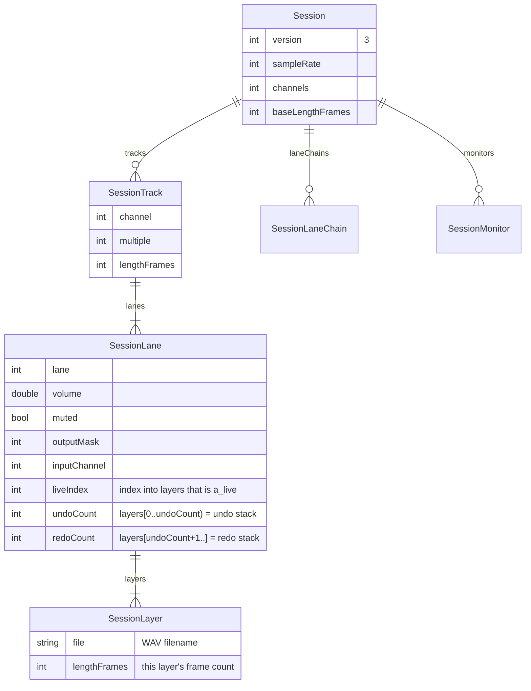

# feat: persist full session audio fidelity — all lanes + all overdub layers

**Type:** enhancement (architecture) · **Detail level:** Extensive · **Date:** 2026-07-11

> **Note:** After technical review this plan was split into **4 parts** (the big
> Part 2 was re-cut along the C-vs-Dart seam). See the `-part-N` files in this
> directory — they carry the folded-in review fixes and supersede the "Part 1/2/3"
> sections below (kept here as the shared background/design record):
> - [part 1 — multi-lane audio round-trip (manifest v3)](2026-07-11-feat-session-overdub-layer-fidelity-part-1-plan.md)
> - [part 2 — overdub-layer export/import, engine only (C)](2026-07-11-feat-session-overdub-layer-fidelity-part-2-plan.md)
> - [part 3 — overdub-layer persistence, FFI + Dart wiring](2026-07-11-feat-session-overdub-layer-fidelity-part-3-plan.md)
> - [part 4 — hardening, fuzzer & docs](2026-07-11-feat-session-overdub-layer-fidelity-part-4-plan.md)

## Problem

Saving a session today collapses each track to a **single mono lane-0 stem** — the
sum of every overdub pass mixed in place. Two capabilities are silently lost on
save/reload:

1. **Overdub layers.** Per-pass undo/redo snapshots exist only as RAM `pool[]`
   slots ([`engine_private.h:255`](packages/loopy_engine/src/core/engine_private.h#L255),
   [`:498`](packages/loopy_engine/src/core/engine_private.h#L498)). A reloaded
   session has `undoDepth == 0` — you cannot undo overdubs or recover an earlier
   take.
2. **Non-primary lanes.** `_capture()` and the engine's `le_engine_export_track`
   read **lane 0 only**
   ([`session_repository.dart:294`](packages/session_repository/lib/src/session_repository.dart#L294),
   [`engine_session.c:22`](packages/loopy_engine/src/core/engine_session.c#L22)).
   A multi-lane track loses lanes 1..N entirely.

**Goal (agreed scope: "Everything"):** a saved session round-trips full audio
fidelity — every lane, every overdub layer, and the undo/redo stack state — so a
reloaded session is byte-identical to the live rig, including working undo/redo.
The flattened `mixdown.wav` is retained for preview/compat.

## Background — how the engine actually stores overdubs

Verified in code; the design hinges on these facts.

- A **lane** ([`le_lane`](packages/loopy_engine/src/core/engine_private.h#L184))
  owns `float* pool[LE_POOL_SLOTS]` buffers, an `a_live` index (the buffer the
  audio thread plays/records), and `a_len`. Buffers are lazily allocated and
  quantized to loop length ([`:69`](packages/loopy_engine/src/core/engine_private.h#L69)).
- A **track** ([`le_track`](packages/loopy_engine/src/core/engine_private.h#L240))
  owns `lanes[LE_MAX_LANES]`, `lane_count`, and the **shared** undo/redo stacks
  `undo_stack[]`/`redo_stack[]` of pool indices. The same slot index names the
  snapshot in **every lane in lockstep**
  ([`:247`](packages/loopy_engine/src/core/engine_private.h#L247)).
- An **overdub layer is a full pre-pass image** of the whole loop, not an
  additive delta ([`:255`](packages/loopy_engine/src/core/engine_private.h#L255)).
  So the complete state of one lane is the ordered set of buffers:
  `undo_stack[0..undo_count)` → `a_live` → `redo_stack[0..redo_count)`.
- Undo just swaps which slot is `a_live`; redo swaps back. Persisting undo/redo
  therefore means **persisting the pool buffers + the stack ordering**, then
  rebuilding both on load.

**Precedent to reuse:** the performance-capture path already stages *retired*
layers to numbered per-lane files + a sidecar manifest
([`layer_staging_ring.h`](packages/loopy_engine/src/core/layer_staging_ring.h),
`perf_drain.c`, `performance_repository`). Its file/manifest shape (numbered
`lane_pcm[i]` buffers keyed by `(channel, lane, slot, generation)`) is the
template for the session bundle's layer files. Session save is control-thread
*synchronous* (not a live-drain ring), so we reuse the **format**, not the ring.

## Current vertical slice (all touch points)

| Layer | Symbol / file | Today | Needs |
|---|---|---|---|
| Engine export | `le_engine_export_track` / `_track_lane` ([engine_session.c:22](packages/loopy_engine/src/core/engine_session.c#L22),[:37](packages/loopy_engine/src/core/engine_session.c#L37)) | lane-0 / any-lane **live only** | enumerate + export every pool layer per lane |
| Engine import | `le_engine_import_track` ([:54](packages/loopy_engine/src/core/engine_session.c#L54)) | lane-0 live, resets redo, EMPTY only | rebuild all lanes + pool + undo/redo stacks |
| Engine commit | `le_engine_commit_session` ([:102](packages/loopy_engine/src/core/engine_session.c#L102)) | establishes master | unchanged |
| FFI/Dart | `AudioEngine.exportTrack/exportTrackLane/importTrack/commitSession` ([audio_engine.dart:377](packages/loopy_engine/lib/src/audio_engine.dart#L377)) | mono lane-0 in/out | layer-aware in/out + generated bindings |
| Manifest | `Session`/`SessionTrack` v2 ([session.dart:198](packages/session_repository/lib/src/models/session.dart#L198)) | one `stem` per track | v3: `lanes[]` each with ordered `layers[]` |
| Repo I/O | `SessionRepository.save/read/_capture` ([session_repository.dart:193](packages/session_repository/lib/src/session_repository.dart#L193)) | one WAV/track + mixdown | per-lane per-layer WAVs + mixdown |
| Apply DTO | `SessionRig`/`SessionRigTrack` ([session_rig.dart:6](packages/looper_repository/lib/src/models/session_rig.dart#L6)) | `pcm` (lane 0) | lanes → layers |
| Apply path | `LooperRepository.applySession` ([looper_repository.dart:785](packages/looper_repository/lib/src/looper_repository.dart#L785)) | import lane-0 pcm, mix on lane 0 | import full track, restore per-lane mix + undo/redo |
| App bridge | `session_cubit.dart`, `session_mapping.dart` | manifest ↔ rig (lane 0) | manifest ↔ rig (lanes+layers) |

## Target bundle layout (schema v3)

The manifest is the **single source of truth**; WAV files stay opaque (named by
index, meaning carried in JSON). `mixdown.wav` is unchanged.

```
sessions/<slug>/
  session.json              # manifest v3
  mixdown.wav               # flattened preview (retained, unchanged)
  track0_lane0_L0.wav       # ordered layer buffers, per (track,lane)
  track0_lane0_L1.wav
  track0_lane0_L2.wav
  track0_lane1_L0.wav
  track1_lane0_L0.wav
  ...
```

### Manifest model change (ERD)



**Ordering invariant:** for each lane, `layers` is `undo_stack` (oldest→newest)
then the `live` buffer then `redo_stack` (nearest→farthest). `liveIndex ==
undoCount`; `layers.length == undoCount + 1 + redoCount`. Per-track mix (volume,
muted) migrates onto **per-lane** fields (lane 0 mirrors the old `SessionTrack`
mix on read of a v2 bundle).

## Backward compatibility

`Session.fromJson` ([session.dart:216](packages/session_repository/lib/src/models/session.dart#L216))
already version-gates. Extend the ladder:

| Bundle version | Load behavior |
|---|---|
| **v1** | one lane-0 live layer, no undo/redo, empty chains (as today) |
| **v2** (`stem` per track) | synthesize one `SessionLane`(lane 0) with one live `SessionLayer(stem)`; mix from `SessionTrack` → lane 0 |
| **v3** (`lanes[]`) | full multi-lane, multi-layer restore |
| **> v3** | `SessionUnsupportedVersion` (unchanged) |

Writing stays single-version (v3). Round-trip tests must cover v1→load, v2→load,
v3→save→load identity.

---

# Implementation — split into 3 independently-mergeable PRs

Each part ships with its own tests and leaves `master` green. Parts are ordered
so each is useful alone; Part 2 depends on Part 1's manifest/DTO shape.

## Part 1 — Multi-lane audio round-trip (manifest v3, live buffers only)

Fixes the lane-0-only limitation without touching undo/redo. After this, a
multi-lane track saves and reloads every lane's *current* audio; `undoDepth`
is still 0 on reload (Part 2 adds it).

**Engine (C):**
- [ ] Add `le_engine_import_track_lane(channel, lane, pcm, frames)` — fills a
      specific lane's live slot of an EMPTY track (mirror of the lane-0 body in
      [`le_engine_import_track`](packages/loopy_engine/src/core/engine_session.c#L54)),
      and grows `lane_count` to cover the highest imported lane.
- [ ] Keep `le_engine_import_track` as the lane-0 convenience wrapper.
- [ ] Unit tests in the engine C/round-trip harness: import lanes 0..N, export
      each, assert PCM identity + `lane_count`.

**FFI/Dart:**
- [ ] Regenerate `loopy_engine_bindings.dart`; expose
      `AudioEngine.importTrackLane(channel, lane, pcm)`; implement in
      `native_audio_engine.dart` + `mock_audio_engine.dart`.

**session_repository:**
- [ ] `_capture()`: iterate lanes `0..laneCount`, `exportTrackLane` each;
      build `SessionTrack.lanes: [SessionLane(...)]` with one live `SessionLayer`.
- [ ] New models `SessionLane` / `SessionLayer` + `toJson`/`fromJson`; bump
      `Session.formatVersion = 3`; add v2→lanes migration in `SessionTrack.fromJson`.
- [ ] `save()`: write `track{c}_lane{l}_L0.wav` per lane; manifest v3; mixdown
      unchanged (still sums lane-0-equivalent live buffers — see risk R3).
- [ ] `read()`: decode every lane's layer file into `SessionBundle`
      (typedef gains per-lane PCM).
- [ ] Tests: v2 bundle loads (lane 0), v3 multi-lane save→read identity.

**looper_repository:**
- [ ] `SessionRigTrack`: replace `pcm` with `lanes: [SessionRigLane]`
      (pcm + volume + muted + outputMask + inputChannel).
- [ ] `applySession`: import each lane via `importTrackLane`, restore per-lane
      mix through cached setters (drop the "lane-0-only" note at
      [looper_repository.dart:837](packages/looper_repository/lib/src/looper_repository.dart#L837)).
- [ ] Tests: multi-lane apply drives every lane; mix lands per lane.

**App bridge:** `session_mapping.dart` / `session_cubit.dart` map manifest lanes
↔ rig lanes.

## Part 2 — Overdub layer + undo/redo persistence

Adds the pool layers and stack reconstruction on top of Part 1's per-lane shape.

**Engine (C) — export:**
- [ ] `le_engine_track_layer_counts(channel, *undo, *redo)` — publishes
      `undo_count`/`redo_count` for the track (shared across lanes).
- [ ] `le_engine_export_layer(channel, lane, ordinal, out, max)` where `ordinal`
      walks `undo_stack[0..undo_count)` → `a_live` → `redo_stack[0..redo_count)`.
      Reads a specific pool slot's buffer + its `a_len`-equivalent length.
      Control-thread only, track not capturing (same safety as export today).

**Engine (C) — import (the hard part):**
- [ ] `le_engine_import_track_full(channel, LayerSpec)` — into an EMPTY track,
      reconstruct: allocate one pool slot per layer per lane
      (`le_lane_ensure_slot`), fill buffers, set `a_live` = live slot, populate
      `undo_stack`/`redo_stack` with the slot indices in lockstep across lanes,
      set `a_undo_depth`/`a_redo_depth`, `a_len`, `lane_count`. Must respect
      `LE_POOL_SLOTS` (reject/clamp — see risk R1). Pairs with
      `le_engine_commit_session` to establish the master.
- [ ] Extend the C round-trip harness: record K overdub passes, export layers,
      import into a fresh engine, assert (a) live PCM identity, (b) `undo_depth`
      matches, (c) undo K times reproduces each pre-pass image, (d) redo restores.

**FFI/Dart:** regenerate bindings; `AudioEngine` gains layer count/export/import;
implement in native + mock engines.

**session_repository:**
- [ ] `_capture()`: per lane, export all layers; write `..._L{n}.wav`; populate
      `SessionLane.layers` + `liveIndex`/`undoCount`/`redoCount`.
- [ ] `save()`/`read()`: per-layer file I/O.
- [ ] Retain `_awaitLayersSettled()` gate ([session_repository.dart:381](packages/session_repository/lib/src/session_repository.dart#L381))
      — never capture mid-drain.

**looper_repository:**
- [ ] `SessionRigLane`: carry ordered `layers` + partition; `applySession` calls
      `importTrackFull` then `commitSession`; drop the multi-import loop's
      lane-0 assumption. Reloaded track reports correct `undoDepth`.
- [ ] Tests: save with undo history → load → `undo()`/`redo()` reproduce takes.

## Part 3 — Hardening, capability surface & docs

- [ ] **Round-trip property/fuzz test** (mirror the control/FX-state fuzzers): random
      record/overdub/undo/redo/lane sequences → save → load → assert full-state
      identity (PCM per layer, stack depths, per-lane mix/routing). Wire into CI.
- [ ] `exportStems` ([session_repository.dart:279](packages/session_repository/lib/src/session_repository.dart#L279))
      exports all lanes (live) — align with Part 1.
- [ ] Bundle-size guardrail: log/telemetry for layer count × size; decide the
      `LE_POOL_SLOTS`-overflow policy from R1.
- [ ] Docs: `docs/design/` note on the v3 bundle format (cross-link the perf
      event-log format doc); update the stale "multi-lane stems are a follow-up"
      comments across the four files.

---

## User-flow / edge cases to cover

- [ ] **Empty session** — zero tracks: no master, no layer files (unchanged
      ghost-grid guard, [session_repository.dart:338](packages/session_repository/lib/src/session_repository.dart#L338)).
- [ ] **Track with 0 undo layers** (recorded, never overdubbed) — one live layer,
      `undoCount == 0`.
- [ ] **Undone-into-the-past track** at save (live != newest) — `redoCount > 0`;
      reload must preserve redo.
- [ ] **Undone-to-empty track** — persists as no `SessionTrack` (matches
      `_capture` skipping non-playing/stopped), or as an empty entry? → decide
      in review; today it is skipped.
- [ ] **Sample-rate mismatch on load** — existing `SessionSampleRateMismatch`
      refusal ([session_repository.dart:247](packages/session_repository/lib/src/session_repository.dart#L247))
      covers layers too (all files share one rate).
- [ ] **Lane with no input** (`inputChannel == -1`) but audio present — restore
      buffer, leave input unbound.
- [ ] **Layer count > `LE_POOL_SLOTS`** on load — reject loudly (R1).

## Risks & open questions (for `/plan-technical-review`)

- **R1 — Pool cap.** `LE_POOL_SLOTS == 256`
  ([engine_private.h:57](packages/loopy_engine/src/core/engine_private.h#L57)).
  Live rigs evict the oldest undo layer past the cap; a loaded session cannot
  exceed it either. Confirm import rejects/clamps rather than overflowing the
  stack arrays.
- **R2 — Storage blow-up.** Full fidelity = `Σ layers × lanes × loopLen` floats.
  A deeply-overdubbed multi-lane track can be large. This is the honest cost of
  "recover every layer"; flag whether a save-time opt-out ("flatten on save") is
  wanted. Default: always full, since that was the agreed scope.
- **R3 — Mixdown semantics.** With real lanes, should `mixdown.wav` sum all lanes
  (true mix) instead of the lane-0 approximation
  ([session_repository.dart:349](packages/session_repository/lib/src/session_repository.dart#L349))?
  Recommend: sum all lanes' live buffers at their gains in Part 1.
- **R4 — Import atomicity.** `import_track_full` touches many slots before commit;
  a mid-rebuild failure must leave the track EMPTY, not half-filled. Build into a
  scratch, publish on success.
- **R5 — ABI/bindings.** New FFI ⇒ regenerate `loopy_engine_bindings.dart` and
  keep `mock_audio_engine` / the three test fakes
  (`fake_audio_engine`, `fake_session_engine`, `fake_performance_engine`) in sync.

## Acceptance criteria

- [ ] A multi-lane track with N overdub passes, saved and reloaded, is
      **byte-identical** per lane and per layer.
- [ ] After reload, `undo()`/`redo()` reproduce every pre-pass take;
      `undoDepth`/`redoDepth` match the pre-save engine.
- [ ] v1 and v2 bundles still load (as live-only, lane-0) with no error.
- [ ] `mixdown.wav` still produced; `SessionSampleRateMismatch` still enforced.
- [ ] New round-trip fuzz test green in CI; all existing session/looper/engine
      tests pass.

## Post-plan next step

Recommend `/plan-technical-review` — it runs the plan-splitting and user-flow
agents to validate the 3-part split, the pool-cap/storage risks, and the
undo/redo restore semantics before any code is written.
