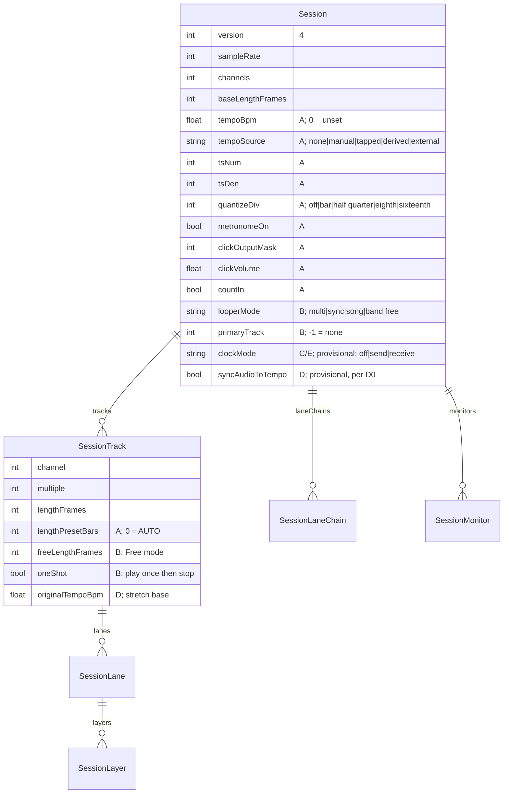

> **Note:** This plan has been split into parts. This file is the **index**
> (architecture, decisions D1–D20, manifest schema, success criteria, risks —
> everything every phase needs). The per-phase PR breakdowns for `/build` live
> in the `-part-N` files in this directory:
> [part 1: core grid](2026-07-22-feat-tempo-aware-looper-modes-part-1-plan.md) ·
> [part 2: five modes](2026-07-22-feat-tempo-aware-looper-modes-part-2-plan.md) ·
> [part 3: clock send](2026-07-22-feat-tempo-aware-looper-modes-part-3-plan.md) ·
> [part 4: time-stretch](2026-07-22-feat-tempo-aware-looper-modes-part-4-plan.md) ·
> [part 5: clock receive](2026-07-22-feat-tempo-aware-looper-modes-part-5-plan.md)

## feat: tempo-aware engine + five looper modes — Extensive (index)

## Overview

Bring loopy to parity with the Sheeran Looper X tempo system: BPM (30–300; a
deliberate superset of the Sheeran's manual-verified 30–280) with all 17
manual-verified time signatures (2/4–7/4, 5/8–15/8), a synthesized routable
click (4-value click mode) with configurable count-in measures, tap tempo,
musical quantization (1 bar, 1/2, 1/4, 1/8, 1/16 note), the five looper modes
(Multi, Sync, Song, Band, Free), MIDI clock send and receive, per-track length
presets (AUTO / 1–64 bars with tempo detection), and pitch-preserved
time-stretch (0.5×–2×, Signalsmith Stretch).

> **Manual verification (2026-07-22):** the plan was cross-checked against the
> Sheeran Looper X User Guide v1.0.0 after initial drafting; the normative
> transcription and the resulting corrections live in
> [2026-07-22-song-mode-spec.md](2026-07-22-song-mode-spec.md) §1/§4. Where a
> D-decision below conflicts with that spec, the spec wins.

**The invariant that governs everything:** today's tempo-free workflow becomes
**Multi mode with all grid features off**, and that path stays **bit-identical**
to current behavior — the existing native + Dart suites pass unchanged at every
merge (the "acceptance gate: invisibility" pattern proven by the ASIO
device-backend seam, `docs/PROGRESS.md:346-370`).

Delivery is five phases of stacked PRs — **26 PRs total** — each independently
green:

| Phase | Part file | PRs | Contents | Depends on |
|-------|-----------|-----|----------|------------|
| **A** | part 1 | 8 | Core grid in Multi: tempo, time signatures, click + count-in, tap tempo, musical quantize, loop↔tempo sync, length presets, `.als` real tempo | — |
| **B** | part 2 | 9 | Five modes: `InteractionMode` rename, mode enum, per-track clocks (Free), primary track, Sync divisions, Song sections, Band groups, pedal protocol v2, manifest v4 completion | A (except B0/B1) |
| **C** | part 3 | 2 | MIDI clock **send** (loopy as master) | A |
| **D** | part 4 | 4 | Time-stretch (Sync Audio to Tempo) | A |
| **E** | part 5 | 3 | MIDI clock **receive** (loopy as slave) | C, D |

Sequencing notes (from plan review): **B0** (the `InteractionMode` rename) and
**B1** (the Song-mode spec doc) have **no Phase-A dependency** — land them
early, before or alongside A1, to minimize rebase churn on the rename. Within
Phase A, A2 and A3 are **siblings off A1**, not a chain. Keep stacks shallow
(≤3 open at once) per the squash-merge landmine playbook.

> **Phase-order change vs. brainstorm (approved 2026-07-22):** the brainstorm
> had receive inside Phase C and stretch in D. Adopting the Sheeran slave
> restrictions (manual tempo disabled + *Sync Audio to Tempo forced on* while
> slaved) makes receive depend on stretch, so receive moves to Phase E.

### Tracking contract for this series

- Every PR carries **`Part of #263`** in the body — **only the final Phase E
  PR carries `Closes #263`** (an early `Closes` would auto-close the epic on
  squash-merge).
- Default autonomy per PR type, unless a PR's part file says otherwise:
  engine-core PRs (bit-identical gate + native tests prove them) →
  `autonomy:auto`; app-UI PRs (taste) → `autonomy:merge-gate`; firmware →
  `autonomy:blocked-verify`.
- Labels per `docs/TRACKING.md`: `stage:in-review` + `ci:*` + `review:pending`
  on every PR; `ready-to-merge` only when CI is green and `/code-review` is
  clean.

## Problem Statement

Loopy was deliberately converted to a tempo-free looper in `2f0513a` (−1,706
lines): metronome, count-in, tap tempo, loop↔tempo sync, and quantize-start
arming were deleted, leaving one master loop length set by the first recording
and a boolean loop-top quantize. That architecture cannot express any of the
Sheeran Looper X's tempo system:

- There is **one** `le_loop_clock` (`length` + `position` only,
  `packages/loopy_engine/src/core/loop_clock.h:17-20`); every track derives its
  playback position from it (`engine_process.c:1732-1737`), so
  independent-length un-synced tracks (Free mode) are inexpressible.
- Quantize is a boolean loop-top snap (`LE_CMD_ARM`/`LE_CMD_DISARM`,
  `engine_commands.c:646-746`) — no beat/bar/subdivision grid exists.
- The native MIDI input layer **drops real-time bytes** (`midi.c:84,99-100`) —
  0xF8 clock is never delivered; no clock code exists anywhere.
- The pedal wire protocol carries mode as a **single bit**
  (`pedal_codec.dart:78-79`), documented as a hard ceiling
  (`pedal_mode.dart:6-18`).
- The session manifest (v3, `session.dart:430`) has no tempo/mode fields;
  `.als` export hardcodes 120 BPM (`daw_project.dart:18-28`).

The re-opening of the tempo-free decision is a deliberate owner call recorded
on issue #263. The old stack is **reference, not revert**: the engine has since
gained lanes, monitors, and performance recording, so everything is
re-implemented against the current core.

## Proposed Solution

### Architecture

Five architectural elements, layered so the grid-off Multi path never executes
new code:

1. **Tempo grid module** (`packages/loopy_engine/src/core/tempo_grid.c/.h`,
   new). Pure-value math over `{bpm, ts_num, ts_den, sample_rate}`:
   frames-per-beat-unit, frames-per-bar, subdivision boundary lookup
   (`next_boundary(pos, subdivision)`), loop-length↔BPM derivation. No engine
   state; unit-testable in isolation like `loop_clock`. **Beat unit = the
   time-signature denominator note** (in 7/8 the click and quantize grid run on
   eighth notes) — verify against the Sheeran manual's tempo chapter during A1
   review and adjust the constant if it counts quarters instead.

2. **Grid state on `le_engine`** — new atomics
   (`a_tempo_bpm_bits, a_ts_num, a_ts_den, a_metronome_on, a_count_in,
   a_counting_in, a_current_beat, a_loop_bars, a_sync_tempo,
   a_quantize_div, a_armed_*`, `a_tempo_source`, `a_clock_mode`,
   `a_looper_mode`, `a_primary_track`), published through `le_snapshot`
   exactly like the deleted stack (reference: `2f0513a`,
   `engine_private.h` block + `engine_snapshot.c:138-179`). All default to
   grid-off values. Because `le_snapshot` lives in the ffigen entry-point
   header, **any struct growth includes the bindings regen + `dart format` in
   the same PR** — the gate on engine-only PRs is "zero Dart *behavior*
   change" (regenerated-but-unused bindings are expected), not "zero Dart-side
   diff".

3. **Click as a routable source** — a synthesized voice (sine 1000/1500 Hz,
   30 ms linear decay, amp 0.25, per the recovered `2f0513a` implementation)
   with its **own output mask + volume** (`LE_CMD_SET_CLICK_OUTPUT`,
   `LE_CMD_SET_CLICK_VOLUME`), defaulting to **no master outputs** until
   assigned. Insertion point (deliberate, resolves a review-caught
   contradiction): the click is summed into its masked output channels
   **after `perf_tap_master_frame`** in the per-frame chain
   (`mix_tracks → mix_monitors → master_bus → perf_tap → [click] → viz_tap →
   advance`, `engine_process.c:2018-2054`). Consequences, all intended: the
   click is excluded from performance capture **by construction**; it
   bypasses master gain and the limiter (its own volume control is the only
   gain stage — the click must stay audible and constant regardless of master
   moves); it is absent from output metering and bounces/export.

4. **Per-track clocks, engaged only in Free mode** — each `le_track` gains its
   own `le_loop_clock` + iteration counter. In Multi/Sync/Song/Band these are
   dormant and all playback derives from the master `e->clock` exactly as
   today (`seg_base` math untouched → bit-identical). In Free mode, the
   per-frame path branches to the per-track clocks — implemented as **small
   extracted helpers** (e.g. `advance_track_clock_frame`, mirroring the
   `le_loop_clock_tick` API) so the diff inside the hot-path mega-functions
   (`mix_tracks_frame`, `advance_transport_frame`) is a single guarded call,
   keeping the "provably inert when off" property reviewable by inspection.
   Chosen over "master clock + per-track offsets" because offsets cannot
   express *different lengths*, only different phases. Viz reads per-track
   length/position in Free mode; performance recording is wall-clock
   (`perf_render.c` has zero clock references) and needs no change.

5. **MIDI clock terminates in native code.** Send: a 24-PPQN emitter driven by
   the audio-thread grid position, pushing 0xF8/FA/FC through the existing
   verbatim `le_midi_out_send` path. Receive (Phase E): a follower in
   `src/midi/` that timestamps 0xF8 arrivals, smooths tempo, and feeds the
   engine directly via lock-free state — **Dart only ever sees derived state**
   (BPM, locked/lost). A Dart-side follower would have fatal jitter; the
   current real-time-byte drop (`midi.c:84`) is lifted only for the follower.

### UI conventions (binding on every UI PR: A5, B5c, C2, D3, E3)

New widgets consume `LooperTheme` ThemeExtension tokens — no pixel or color
parameters in widget APIs; extract widget classes (no `_build` methods); every
new widget ships a widget test; `lib/common` never imports features. Tempo,
click, quantize, and count-in controls live in the **looper feature's own
settings surface** (new `lib/looper/view/tempo_settings_section.dart` wired
into `lib/looper/view/settings_page.dart`), not in `lib/audio_setup/` — that
feature is device/routing-oriented and keeps only the existing grid-off
quantize toggle.

### Decisions resolved at planning

These close the brainstorm's open questions plus the gaps found in flow
analysis. Items marked **(user-approved)** were confirmed 2026-07-22.

| # | Decision |
|---|----------|
| D1 | **(user-approved)** Full signature set from day one — manual-verified as **17 signatures**: 2/4, 3/4, 4/4, 5/4, 6/4, 7/4, 5/8–15/8 (den 4 → num 2–7; den 8 → num 5–15; nothing else). Engine math is generic over `ts_num/ts_den`; the deleted stack's only 4/4 assumption was one `LE_BEATS_PER_BAR` define. Tempo clamp stays 30–300 (superset of the Sheeran's 30–280 — documented deviation). |
| D2 | **(user-approved)** `.als` export emits real tempo as a Phase A tail item (`DawProject.tempoBpm` already threads through). **Bar-aligned clips split out** as a follow-up issue — they need loop-start offsets and wall-clock→grid mapping. |
| D3 | **(user-approved)** Slaved restrictions per Sheeran: manual tempo disabled + Sync Audio to Tempo forced on while receiving clock → **receive is Phase E**, after stretch. |
| D4 | **(user-approved)** Mode is a session-level choice, **locked while any track has content**; switching with content requires an explicit clear-all confirmation in the app UI; mode switching is **not** a pedal action. Kills the 5×5 transition matrix. |
| D5 | **(user-approved)** Click is routable with own mask/volume, **default: no master outputs**; summed post-`perf_tap_master_frame` (Architecture §3), so it is excluded from performance capture and export by construction and bypasses master gain/limiter. Manual correction: click is a **4-value mode**, not a boolean — Off / Rec (recording+overdub) / Rec-1st-layer / Play+Rec (§5.9.1); `a_metronome_on` becomes `a_click_mode`. |
| D6 | **Tempo lock:** manual BPM and time signature are locked while any grid-recorded content exists (Sheeran behavior); cleared-all unlocks. Phase D relaxes the BPM lock to the 0.5×–2× stretch window. Derived tempo **survives** clearing its source loop (the `2f0513a` "dead tempo" lesson); clearing all tracks *offers* a tempo reset, never forces it. |
| D7 | **Tempo-source precedence:** `TempoSource { none, manual, tapped, derived, external }`. external > (manual \| tapped, last writer wins) > derived. If tempo is set, an AUTO-preset recording **rounds to whole bars of the existing grid** and never re-derives. AUTO derives only from `TempoSource.none`; derivation picks the BPM in 30–300 yielding a whole bar count in the current signature, tie-break nearest 120. |
| D8 | **Quantized actions (v1 table):** record start — quantized; record end — quantized, **round to nearest** unit, min 1 unit, capture continues to the boundary when rounding up; overdub start — quantized; overdub end — layer boundary as today; stop/mute — immediate. Granularity change while armed re-evaluates the pending arm immediately (may fire on the next subdivision); disarm always available. |
| D9 | **Count-in:** fires only when the transport is idle (first/defining recording); once anything plays, quantize governs. Record-press during count-in cancels; stop cancels. Auto-record (input threshold) and count-in are mutually exclusive in UI; if a loaded session has both, **count-in wins** and auto-record is cleared. Pedal/UI show a distinct counting-in state with a beat countdown (a bar of 15/8 at 30 BPM is long). Manual correction: count-in length is a **configurable number of measures** (default 1), not fixed at one bar (§5.9.1). |
| D10 | **Naming:** existing `LooperMode` (record/play) → **`InteractionMode`** in a standalone mechanical PR (B0, no Phase-A dependency, lands first), preserving the persisted token strings under `looper.default_mode` (no migration). The five-mode enum then takes the freed name: Dart `LooperMode { multi, sync, song, band, free }`, C `le_looper_mode`. The two never coexist. |
| D11 | **Pedal protocol v2:** protocol version byte bumps to 0x02; flags byte gains a 3-bit mode field + counting-in bit; **bidirectional degrade policy** — app reads firmware version first; against v1 firmware it emits v1 frames (mode collapsed to the legacy bit, tempo state invisible) and surfaces an "update pedal firmware" notice; v2 firmware parses v1 frames (version byte discriminates). Contract test gains fixtures for all four app/firmware pairings. |
| D12 | **Manifest v4** is specified in full in Phase A (schema below) with fields phase-marked; the loader tolerates absent later-phase fields. Later-phase field **names** (`songSections`, `bandGroups`, `clockMode`, `syncAudioToTempo`) are **provisional pending B1/D0 review** — renaming them there is not a breaking change to this plan. The app always writes v4 once on this code (documented: a re-saved session is unreadable to pre-v4 builds; the v3 version gate already rejects future versions cleanly, `session.dart:398-423`). |
| D13 | **Stretch layer architecture (validated by the D0 spike):** keep original per-layer buffers; stretch each layer from its **original** at ratio `original_tempo / current_tempo`; never stretch stretched output; undo peels layers each at its own native rate. Doubles peak memory for stretched content — budgeted in the spike. |
| D14 | **Clock-receive robustness (Phase E):** >250 ms without 0xF8 = clock-lost → freewheel at last smoothed tempo; in-flight recordings finalize on the frozen grid; MIDI Stop = transport stop (distinct from loss). Downbeat: bar 1 beat 1 = first MIDI Start; SPP not honored in v1; slave-enable against an already-running clock anchors the downbeat at the enable moment, with a manual "re-align downbeat" `LooperAction`. The per-mode arming table is now transcribed (song-mode-spec §3): clock-not-running → armed tracks start on MIDI Start (playback cannot start/stop otherwise); running+Multi → next downbeat; running+Sync/Band → primary-track top; **receive is inactive in Song/Free** (entering them while slaved drops to internal clock with a notice). |
| D15 | **Clock send (Phase C):** MIDI Start is sent at the loop downbeat (end of count-in), never at count-in start; ticks free-run at the set BPM while the transport is stopped (matches DAW expectations; check the manual's behavior at C1 review). Clock mode is a tri-state `off / send / receive` — send and receive are mutually exclusive. Manual correction: **send operates only in Multi/Sync/Band** (§6.2.2) — no clock output in Song/Free. |
| D16 | **Sync divisions** (track at 1/2, 1/4 of primary) are new engine work — the `seg_base` multiple math cannot express them; Phase B extends the derivation. Length-preset pickers become context-restricted in Sync/Band (only valid multiples/divisions of the primary selectable). |
| D17 | **Length presets:** a 1–64-bar preset auto-finalizes at exactly N bars (extends the existing fixed-multiple auto-finalize, `engine_process.c:1445`); an early record-press closes at the quantized boundary instead (disarms the preset). Preset changes on a recorded track are inert until re-record. N bars × signature × 30 BPM is validated against `max_loop_frames` **before** recording starts, with an error surfaced. Manual refinement (§5.9.3 matrix, song-mode-spec §1): AUTO+click-off derives tempo *and* bars; AUTO+click-on derives bars only; **N-bars+click-off derives the tempo from recording-length ÷ N**; N-bars+click-on auto-finishes at N bars. In Sync/Band the preset applies only to the first-recorded track. Presets unavailable while clock receive is on. |
| D18 | **Primary track (Sync/Band):** designation persists if the primary is cleared/undone-to-empty (its grid survives per D6); re-crowning is an explicit user action; **no auto-reassignment** (surprising on stage). Crown UI per the brainstorm (Wave-view style). |
| D19 | **Song mode spec**: DRAFTED from the manual — [2026-07-22-song-mode-spec.md](2026-07-22-song-mode-spec.md) (plan-gate, awaiting review). Key outcomes: a section **is a track** (8 sections in loopy Song mode; 1 primary + 7 in Band); no advance gesture exists (sections start/stop via their own track presses); Band section starts/stops quantize to the primary cycle; one session tempo confirmed; per-track **One Shot** flag enters Phase B scope; Feedback/Decay stays out of scope. **No engine work for Song (B4) before the spec is approved.** |
| D20 | **New `LooperAction` inventory** (controller mapping + pedal + settings stay in sync): `tapTempo` (returns), `toggleMetronome`, `cancelArm`, `realignDownbeat` (E), `crownPrimary` (B). (`advanceSection` dropped — the manual has no such gesture; sections are driven by direct track presses, song-mode-spec §2 Q2.) |

### Manifest v4 schema



v3 sessions load with every new field defaulted → Multi, grid off, no
migration loss.

## Implementation Phases

Per-phase PR breakdowns, tasks, and file lists live in the part files (links
in the note at top). Summary:

- **Part 1 (Phase A), 8 PRs:** A1 grid+state, A2 click+count-in, A3 musical
  quantize (A2/A3 siblings off A1), A4a FFI seam, A4b repository plumbing,
  A5 app UI, A6 length presets, A7 manifest v4 + `.als` tempo.
- **Part 2 (Phase B), 9 PRs:** B0 rename (lands first, no A dependency),
  B1 Song-mode spec doc (early), B2a mode field, B2b per-track clocks
  (highest-risk PR of the series — isolated review), B3 Sync+Band+primary,
  B4 Song engine, B5a codec v2, B5b firmware (`blocked-verify`), B5c app UI.
- **Part 3 (Phase C), 2 PRs:** C1 native 24-PPQN emitter, C2 UI.
- **Part 4 (Phase D), 4 PRs:** D0 spike (hard gate), D1 vendoring,
  D2 engine integration, D3 UI.
- **Part 5 (Phase E), 3 PRs:** E1 native follower, E2 slave restrictions +
  downbeat arming, E3 UI. The final E PR carries `Closes #263`.

## Alternative Approaches Considered

- **Big-bang rework branch** — rejected: unreviewable at this scale; the
  repo's squash-merge landmines make one giant long-lived branch risky.
- **Modes-first, tempo-second** — rejected: Sync/Band are meaningless without
  a grid; orders dependencies backwards.
- **Master clock + per-track offsets for Free mode** — rejected: offsets
  express phase, not length; Free needs independent lengths (§Architecture 4).
- **Dart-side MIDI clock follower** — rejected: UI-thread jitter makes a
  musical clock follower unusable; native follower feeding the engine
  directly (§Architecture 5).
- **Redefining Free mode as "today's loopy"** — rejected in brainstorm: today
  is structurally Multi; Sheeran Free (independent un-synced tracks) is a
  genuinely new capability, and parity means adopting its semantics.
- **Keep receive in Phase C with drift semantics** — rejected (user call
  2026-07-22): contradicts the adopted Sheeran slave restrictions.

## Success Criteria

```success-criteria
GOAL: Loopy reaches Sheeran Looper X tempo-system parity (grid, five modes, clock I/O, length presets, time-stretch) while today's tempo-free workflow remains bit-identical as Multi-with-grid-off.

SUCCESS CRITERIA:
- Bit-identical gate: the pre-existing native engine + MIDI suites pass unchanged on every PR of every phase | verify: bash packages/loopy_engine/src/test/run_native_tests.sh
- Every new engine behavior in the D1–D20 decision table has a named C test (tempo/lock/precedence, click routing + perf-capture exclusion, quantize table incl. rounding + races, Free-mode independent clocks, divisions, presets, clock send timing, stretch integrity, follower freewheel), compiled into the same suite | verify: bash packages/loopy_engine/src/test/run_native_tests.sh
- ASAN-clean: the same suites pass under AddressSanitizer | verify: EXTRA_CFLAGS="-fsanitize=address -fno-omit-frame-pointer -g" bash packages/loopy_engine/src/test/run_native_tests.sh
- Pedal protocol contract holds across all four app/firmware version pairings (v1/v2 × v1/v2; runs inside the native-tests CI job) | verify: gcc -std=c11 -Wall -I firmware/loopy_pedal firmware/test/test_pedal_protocol.c firmware/loopy_pedal/pedal_protocol.c -o /tmp/pedal_protocol_tests && /tmp/pedal_protocol_tests
- App analyzes clean and all Dart suites pass with the CI coverage gates (root ≥90, daw_export 100) | verify: /Users/Tomas/development/flutter/bin/flutter analyze && /Users/Tomas/development/flutter/bin/flutter test --coverage
- v3 session loads as Multi/grid-off with zero data loss; v4 round-trips every phase-marked field (session_repository suite) | verify: /Users/Tomas/development/flutter/bin/flutter test packages/session_repository
- .als export emits the session tempo instead of the hardcoded 120 (daw_export suite) | verify: /Users/Tomas/development/flutter/bin/flutter test packages/daw_export
- Click routed off-master by default: a rendered count-in contains no click energy on master outputs and none in a performance recording (native test) | verify: bash packages/loopy_engine/src/test/run_native_tests.sh
- Grid-off Multi UI is visually unchanged; new tempo/mode UI matches the app design language and the UI-conventions section (LooperTheme tokens, widget classes, widget tests) | verify: manual 1. regenerate screenshot goldens on the author machine 2. eyeball diff grid-off screens against pre-branch goldens 3. review new tempo/mode screens
- External device locks to loopy's clock (Phase C) and loopy locks to an external master under the Sheeran restrictions (Phase E) | verify: manual 1. slave Ableton to loopy, confirm bar-locked over 5 min 2. master Ableton over USB-MIDI, confirm loopy records bar-locked, tempo controls disabled 3. stop the master mid-record, confirm freewheel finalize
- Pedal shows mode + counting-in on v2 firmware; v1 firmware degrades per D11 with an update notice | verify: manual 1. flash v2 firmware, cycle modes, record with count-in 2. flash v1 firmware, confirm legacy frames + app notice

NON-GOALS:
- Bar-aligned .als clips + performance-timeline musical export (follow-up issue, D2)
- SPP (song position pointer) honoring in clock receive v1 (D14)
- Compound-meter accent groupings (12/8 as 4×3) — v1 accents beat 1 only
- Any change to LE_MAX_TRACKS, banks-as-presentation, or the lanes/monitors/perf-recording architectures
- Windows/Linux-specific audio backend work (this feature is platform-agnostic engine + Dart)

VERIFICATION COMMAND: bash packages/loopy_engine/src/test/run_native_tests.sh && EXTRA_CFLAGS="-fsanitize=address -fno-omit-frame-pointer -g" bash packages/loopy_engine/src/test/run_native_tests.sh && gcc -std=c11 -Wall -I firmware/loopy_pedal firmware/test/test_pedal_protocol.c firmware/loopy_pedal/pedal_protocol.c -o /tmp/pedal_protocol_tests && /tmp/pedal_protocol_tests && /Users/Tomas/development/flutter/bin/flutter analyze && /Users/Tomas/development/flutter/bin/flutter test --coverage
```

## Dependencies & Prerequisites

- **Signalsmith Stretch** (MIT) vendored in Phase D — license-compatible with
  the repo's GPLv3 (precedent: ASIO/VST3 vendoring).
- **Sheeran Looper X manual** — normative reference for Song mode (B1),
  §6.2.1 downbeat arming (B1/E2), BPM beat-unit semantics (A1), and
  clock-send-while-stopped behavior (C1).
- **Pedal hardware + 32U4 toolchain** for B5b firmware verification
  (device-gated).
- ffigen regen after every `loopy_engine_api.h` change, followed by
  `dart format` (format-drift gotcha, `ffigen.yaml:2-8`).

## Risk Analysis & Mitigation

| Risk | Mitigation |
|------|------------|
| Bit-identical gate silently eroded by shared-path edits | Dormant-by-default design (per-track clocks, click bus, grid checks all no-op when off) with extracted helpers keeping hot-path diffs to single guarded calls; the full old suite runs on every PR; ASAN job; fuzz job already covers control sequences |
| Stretch CPU blows the audio-thread budget on 8 tracks × lanes | D0 spike is a hard gate before D1–D3 are specced; worker-thread render with crossfade fallback is the escape hatch |
| Pedal field bricked by protocol mismatch | D11 degrade policy + 4-pairing contract fixtures in CI; firmware PR (B5b) labeled `autonomy:blocked-verify` |
| Song mode semantics guessed wrong | B1 spec transcribed from the manual and reviewed before any engine work (D19) |
| Squash-merge stack landmines (child merge-refs, deleted branches) | Follow the recorded landmine playbook; keep stacks shallow (≤3 open at once); A2/A3 land as siblings off A1, not chained |
| Manifest v4 forward-compat surprises | Full schema fixed in A7 with phase-marked optional fields (later-phase names provisional per D12); loader tests simulate absent-field and future-version files |
| `InteractionMode` rename churn colliding with parallel work | B0 is standalone, mechanical, and lands **before A1** |

## Resource Requirements

Single developer + agent sessions; no new infrastructure. Hardware needed
only for B5b (pedal) and C/E manual verification (DAW or clock-capable
device). Estimated shape: **26 PRs** across five phases; A and B dominate.

## Future Considerations

- Bar-aligned `.als` clips + musical-grid performance export (follow-up
  issue from D2).
- Compound-meter accent patterns; SPP support in receive.
- RPi floor-console variant inherits all of this through the engine seam.
- Ableton Link is architecturally adjacent to the Phase E follower if ever
  wanted.

## Documentation Plan

- `docs/PROGRESS.md`: new tempo-system section + test-count updates per phase.
- `docs/MIDI_FOOT_CONTROLLER.md`: protocol v2 frame layout + degrade policy.
- `docs/TRACKING.md` flow: issue #263 moves `stage:plan` → `stage:plan-review`
  with this document; each phase's PRs carry `stage:in-review` + gates.
- Session manifest v4 documented in `session.dart` doc comments (the v3 doc
  comment already promises tempo fields that don't exist — fix it).

## References & Research

### Internal References

- Brainstorm: `docs/brainstorm/2026-07-22-tempo-aware-looper-modes-brainstorm-doc.md`
- Deleted tempo stack (reference implementation): commit `2f0513a` — commands,
  click, tap, sync math, 13 C tests + Dart tests recoverable via
  `git show 2f0513a`
- Loop clock: `packages/loopy_engine/src/core/loop_clock.h:17-30`, single
  instance `engine_private.h:636`
- Quantize arm machinery: `packages/loopy_engine/src/core/engine_commands.c:519-746`
- Mix/advance order (click insertion point): `packages/loopy_engine/src/core/engine_process.c:2018-2054`
- Multiple auto-round-up (preset seed): `engine_process.c:224-256,1445`
- Snapshot surface: `packages/loopy_engine/src/core/engine_snapshot.c:138-179`
- MIDI real-time drop (lifted for follower): `packages/loopy_engine/src/midi/midi.c:84,99-100`
- Command enum free slots: `packages/loopy_engine/src/core/loopy_engine_api.h:86-194`
- Pedal codec + 1-bit ceiling: `packages/pedal_repository/lib/src/pedal_codec.dart:76-106`,
  `pedal_mode.dart:6-18`; firmware `firmware/loopy_pedal/pedal_protocol.h`
- Session v3: `packages/session_repository/lib/src/models/session.dart:377-462`
- `.als` tempo threading: `packages/daw_export/lib/src/daw_project.dart:18-28`,
  `als_builder.dart:434-468`
- `LooperMode` (rename target): `lib/looper/model/looper_mode.dart:8-23` + ~40 sites
- Interface-segregation pattern to follow: `packages/loopy_engine/lib/src/audio_engine.dart:643-654`
- Bit-identical gate precedent: ASIO seam, `docs/PROGRESS.md:346-370`

### External References

- Sheeran Looper X user manual (modes chapter, §6.2.1, tempo chapter)
- Signalsmith Stretch: https://github.com/Signalsmith-Audio/signalsmith-stretch (MIT)
- MIDI 1.0 real-time messages (0xF8 clock at 24 PPQN, 0xFA/0xFB/0xFC)

### Related Work

- Issue: #263 (this plan; final Phase E PR carries `Closes #263`)
- Phased-delivery precedent: VST3 hosting stack PRs #71–#78
- Long-loop + ASAN safety net: PR #254 (`ef9cdd0`)
- Quantize boolean (existing seed): current `LE_CMD_ARM`/`DISARM` stack
