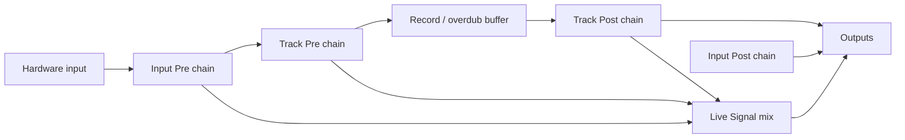

## feat: Sheeran-style FX racks (Pre/Post, Live Signal, presets) - Extensive

> **Note:** This plan has been split into parts. See the `-part-N` files in this
> directory. `/build` should target a part plan, not this epic index.
>
> - [Part 1 — Engine](2026-07-26-feat-sheeran-style-fx-racks-pre-post-part-1-plan.md)
> - [Part 2 — Domain + migration](2026-07-26-feat-sheeran-style-fx-racks-pre-post-part-2-plan.md)
> - [Part 3 — FX page](2026-07-26-feat-sheeran-style-fx-racks-pre-post-part-3-plan.md)
> - [Part 4 — Presets](2026-07-26-feat-sheeran-style-fx-racks-pre-post-part-4-plan.md)
> - [Part 5 — Hardening + export](2026-07-26-feat-sheeran-style-fx-racks-pre-post-part-5-plan.md)
>
> Phase 5 (pedal / bounce / lane overrides) stays as child issues on #351.

> Source brainstorm: [docs/brainstorm/2026-07-26-sheeran-style-fx-racks-pre-post-brainstorm-doc.md](../brainstorm/2026-07-26-sheeran-style-fx-racks-pre-post-brainstorm-doc.md)
> Issue: [#351](https://github.com/tomassasovsky/loopy/issues/351)
> Branch (build): `feat/sheeran-style-fx-racks` (do **not** land on Control Center host-features)
> Autonomy: `autonomy:plan-gate` — stop after plan for human direction approval
>
> Supersedes as **primary FX mental model**: always-dry capture + snapshot-on-record
> from [unified input FX](2026-06-22-feat-unified-input-fx-routing-plan.md) / FX screen
> redesign. Snapshot may remain briefly as a migration bridge, then retire.
>
> Related: VST3 epic [#194](https://github.com/tomassasovsky/loopy/issues/194),
> Sheeran tempo/modes [#263](https://github.com/tomassasovsky/loopy/issues/263).

## Overview

Redesign Loopy’s audio FX toward **Sheeran Looper X parity**.

**Near-term MVP (parts 1–3):** Input + Track **Pre/Post chains** (true Pre bake,
Post playback-only), **Live Signal** `Auto` / `Off` / `On`, dedicated **FX page**
in Loopy’s design system. Domain model is **two chains per owner** (`pre[]` +
`post[]`) — UI may still present “rack slots” with a Pre/Post toggle.

**Later (parts 4–5 + child issues):** Full factory + user presets, export/undo
hardening, then pedal/expression, Bounce As Loop, per-lane overrides.

Happy-path song: **In2 → Track1**, **Delay Pre**, **Reverb Post**, Live Signal
Auto/On — hear both while recording; after stop, bypass Post → delay remains in
the loop, reverb gone.

This **replaces** the always-dry + snapshot-on-record primary model. It does
**not** revive the deleted historical `mon_fx` / stageless pre-post fields —
Pre is **write-path** processing; Post is **playback-path** processing.

## Problem Statement

Today Loopy is **insert-only, always-dry recording**:

1. Per-input **monitor** chain — live only, never written into the buffer.
2. Per-lane **playback** chain — filled by snapshot-copy of the monitor chain at
   record-from-empty.
3. No Pre bake, no Live Signal modes, no multi-rack Pre/Post split, no factory
   rack packs, no pedal/expression assign for FX.

That cannot express Sheeran’s Pre/Post or the user’s “delay printed / reverb
always” workflow without fragile manual chain surgery. Prior “commit/freeze” was
deferred; this plan makes **true Pre** a first-class engine path instead of a
sidecar freeze.

## Proposed Solution

### Resolved decisions (from brainstorm)

| # | Decision | Resolution |
|---|----------|------------|
| D1 | Product goal | Full Sheeran-style FX surface (not a thin approximation) |
| D2 | Recording | **True Pre bake** into record/overdub buffer |
| D3 | Ownership | **Input + Track**, each with Pre and Post chains |
| D4 | Granularity | **Track chains shared by all lanes**; per-lane overrides later |
| D5 | Monitoring | **Live Signal Auto / Off / On** |
| D6 | UI | **Dedicated FX page**; Signal stays routing/levels |
| D7 | Presets | **Full factory library** + user save/load (**part 4**, not MVP) |
| D8 | Implementation | **Evolve** `engine_fx` / repo / UI — no greenfield runtime |
| D9 | Autonomy | `plan-gate` until human approves direction |
| D10 | Chain shape | **Two lists per owner** (`pre[]`, `post[]`) — not ordered multi-racks each tagged Pre/Post |

### Plan-gate defaults (confirm or revise before part 1)

**Human must approve before `/build` part 1.**

| # | Topic | Proposed default |
|---|-------|------------------|
| P1 | Monitor composition | Live Signal On/Auto runs **Pre → Post** |
| P2 | Chain order | **Input Pre → Track Pre → buffer → Track Post**; **Input Post** = live/FOH only (never prints) |
| P3 | Overdub | Pre **reprints** into overdub write; undo restores prior PCM; Post never enters PCM |
| P4 | Migration | Input FX → Input **Post**; Lane FX → Track **Post** (lane 0 wins if lanes disagree). Retire snapshot-on-record after part 2 |
| P5 | Multi Live Signal On | **Sum**; soft CPU warning when over budget (**part 5**) |
| P6 | Clear track | Clears PCM; **keeps** Pre/Post + Live Signal |
| P7 | Mid-record Pre edit | Applies to **subsequent** written frames |
| P8 | VST3 | Built-ins first; plugins coordinate with #194 |
| P9 | Track → lanes | Track Pre/Post are sole track FX until lane overrides; applied on every lane of that track |
| P10 | Preset store | Factory: `assets/fx_racks/`; user: `local_storage_client` / app-support (+ `/data` on appliance). Not in `session_repository` |
| P11 | Live Signal focus | **UI-selected track** (monitoring focus), distinct from `primaryTrack` crown unless product later unifies them. Pushed via `le_engine_set_live_signal_focus` from Bloc → repo → engine |

### Signal model



## Technical Approach

### Architecture

**Native (`packages/loopy_engine`)** — see part 1

- Per input + per track: `fx_pre[]` + `fx_post[]` (+ Live Signal on tracks)
- Record writes Pre-wet; playback runs Track Post; Live Signal mixes Pre→Post
- Compat: `set_monitor_input_fx` / `set_lane_fx` → **Post** shims
- Tests via `bash packages/loopy_engine/src/test/run_native_tests.sh`

**Domain + session** — see part 2

- Extend `InputMonitor` / track with `preEffects` / `postEffects` + `LiveSignalMode`
- Session **formatVersion 5**; opaque encoding in `session_repository`; mapping in
  `lib/session/session_mapping.dart` (packages stay decoupled)
- Retire `_snapshotMonitorChainsOntoLanes` as primary after migration bridge

**App UI** — see part 3

- Dedicated FX page; Bloc/Cubit → repository (no widget→repo FX calls)
- Evolve `FxScope` for Pre vs Post; l10n both ARBs; Pre/Post copy

**Presets** — see part 4 (P10 paths)

**Hardening + export** — see part 5

**Child issues (not part plans):** pedal/expression, Bounce As Loop, lane overrides,
VST3-in-rack vs #194

### Implementation Phases

#### Phase 0 — Engine semantics (foundation) → **part 1**

- Tasks: see part 1 (approve **P1–P11**, two-chain native API, Pre bake, Live Signal,
  named cases in `test_engine_core.c`)
- Exit: `run_native_tests.sh` green; no UI required
- Effort: L

#### Phase 1 — Domain + migration

- Tasks:
  - [ ] Dart `FxRack` models + repository APIs
  - [ ] Session schema migration (Input FX → Input Post racks; Lane FX → Track Post)
  - [ ] Retire snapshot-on-record as primary; bridge old clients
  - [ ] Repository / bloc unit tests
- Exit: old sessions load; new sessions persist racks
- Effort: M

#### Phase 2 — Dedicated FX page

- Tasks:
  - [ ] FX page shell (input/track columns, slots, Pre/Post, Live Signal)
  - [ ] Edit drill-in (params, bypass, reorder)
  - [ ] Wire to repository; Signal page stops being primary FX editor
  - [ ] Widget tests + l10n
- Exit: happy path configurable end-to-end in UI (desktop/tests)
- Effort: L

#### Phase 3 — Factory + user presets

- Tasks:
  - [ ] Preset format + factory library content
  - [ ] Apply / save / load / persist UX
  - [ ] Tests for apply roundtrip
- Exit: factory packs browsable; user preset survives restart
- Effort: L (content-heavy)

#### Phase 4 — Hardening + export

- Tasks:
  - [ ] Clear/undo contracts; mid-record Pre edits
  - [ ] Multi Live Signal On policy + CPU soft limit/warning
  - [ ] `daw_export` / performance stems: Pre already in PCM; Post in chain manifest
  - [ ] Appliance xrun budget check where feasible
- Exit: export + undo criteria pass; docs updated (`PROGRESS.md`, RUNNING_ON_RPI as needed)
- Effort: M

#### Phase 5 — Pedal / bounce / lane overrides (follow-on)

- Tasks:
  - [ ] Pedal + expression assign
  - [ ] Bounce As Loop
  - [ ] Per-lane rack overrides
  - [ ] VST3-in-rack coordination with #194
- Exit: separate checklist on #351; may split to child issues
- Effort: L

### PR sequencing (suggested)

1. Engine Pre/Post + Live Signal (+ tests)
2. Repository models + migration
3. FX page UI
4. Presets
5. Hardening/export
6. Phase 5 child PRs

## Alternative Approaches Considered

| Approach | Why rejected |
|----------|----------------|
| Always-dry + scopes / snapshot “Pre” | Not Sheeran; no true print |
| UI-only Sheeran skin | Misleading; fails audio criteria |
| Greenfield FX graph package | Duplicates `engine_fx`; huge risk |
| Track-only racks (no Input racks) | User chose full input+track ownership |

## Success Criteria

Epic-level rollup. **Machine-checkable criteria live on each part plan** — `/build`
a part, not this file.

```success-criteria
GOAL: MVP (parts 1–3) delivers Sheeran-like Pre bake, Post playback, Live Signal, and an FX page for the delay-print / reverb-always happy path; parts 4–5 add presets and hardening.

SUCCESS CRITERIA:
- Part 1 engine suite green | verify: bash packages/loopy_engine/src/test/run_native_tests.sh
- Part 2 domain + session migration | verify: see part 2 VERIFICATION COMMAND
- Part 3 FX page tests | verify: see part 3 VERIFICATION COMMAND
- Part 4 presets (after part 3) | verify: see part 4 VERIFICATION COMMAND
- Part 5 export + contracts | verify: see part 5 VERIFICATION COMMAND
- Happy path (manual, after part 3+) | verify: manual 1) FX page: In2 Pre delay, Track1 Post reverb, Live Signal Auto 2) record 3) bypass Post 4) delay remains, reverb gone

NON-GOALS:
- Pixel-perfect Sheeran UI clone
- Proprietary Sheeran rack assets / IRs
- Blocking on VST3 epic #194 for built-in chains
- Tempo/mode Sheeran parity (#263)
- Landing on feat/control-center-host-features
- Pedal / Bounce As Loop / lane overrides in parts 1–5

VERIFICATION COMMAND: bash packages/loopy_engine/src/test/run_native_tests.sh
```

## Success Metrics

- Happy-path song configurable without manual post-record chain surgery
- Zero reliance on snapshot-on-record for new sessions after Phase 1
- Factory packs cover at least the Sheeran-class categories listed in Phase 3
- No appliance xrun regression beyond documented soft-limit warnings under
  multi Live Signal On stress (Phase 4)

## Dependencies & Prerequisites

- Existing `fx_apply_chain` / built-in Delay & Reverb DSP
- Plan-gate approval of **P1–P11** on #351 before part 1
- Session: `session_repository` + `lib/session/session_mapping.dart` (part 2)
- FX editor widgets / `FxScope` (part 3)
- After API edits: ffigen + format bindings (`docs/PROGRESS.md`)
- Part 4 appliance soak / multi Live Signal On: `blocked-verify` slice (part 5)

## Risk Analysis & Mitigation

| Risk | Mitigation |
|------|------------|
| Pre bake breaks undo/clear assumptions | Phase 0/4 explicit PCM-layer tests; clear keeps racks (P6) |
| CPU overload with many Live Signal On | Soft cap + warning (P5); document appliance limits |
| Migration surprises (“my input FX used to print”) | Default migrate to Post (P4); release note + FX page education |
| Scope explosion (presets + pedal + bounce) | Phased epic; Phase 5 child issues; plan-gate |
| Conflict with #194 plugin hosting | Built-ins first; plugin slots coordinated later |
| Wrong branch pollution | Build only on `feat/sheeran-style-fx-racks` |

## Resource Requirements

- Engine + Dart domain + UI + preset content authorship
- Human plan-gate review (audio semantics + migration defaults)
- Later: appliance soak for Live Signal On CPU (blocked-verify for that slice)

## Future Considerations

- Per-lane overrides (Phase 5)
- Bounce As Loop / peel interactions
- Expression curves, MIDI CC learn
- Optional dual-buffer “un-Pre” (keep dry shadow) — YAGNI unless users demand
- Align naming with any future Control Center IA

## Documentation Plan

- [ ] Update `docs/PROGRESS.md` FX mental model section (retire snapshot-primary)
- [ ] FX page user-facing help / in-app Pre vs Post copy (l10n)
- [ ] Release notes for migration defaults
- [ ] Cross-link #351, brainstorm, this plan

## References & Research

### Internal References

- Brainstorm: `docs/brainstorm/2026-07-26-sheeran-style-fx-racks-pre-post-brainstorm-doc.md`
- Prior model: `docs/plan/2026-06-22-feat-unified-input-fx-routing-plan.md`
- FX UI: `docs/plan/2026-07-03-feat-fx-screen-redesign-plan.md`
- Engine process / FX: `packages/loopy_engine/src/core/engine_process.c`, `engine_fx.c`, `loopy_engine_api.h`
- Domain: `packages/looper_repository/lib/src/models/input_monitor.dart`, `lane.dart`, `looper_repository.dart`
- UI scaffolding: `lib/looper/view/fx_editor/`, `lib/looper/view/signal_graph/signal_fx_rack.dart`

### External References

- [Sheeran Looper X User Guide](https://cdn.inmusicbrands.com/sheeran/looper-x/Sheeran%20Looper%20X%20-%20User%20Guide%20-%20v1.0.0.pdf) — FX Pre/Post, Live Signal, bounce As Loop
- [HeadRush: Audio Routing and Troubleshooting](https://support.headrushfx.com/en/support/solutions/articles/69000852182-sheeran-looper-x-audio-routing-and-troubleshooting) — Live Signal On vs Auto; Pre prints

### Related Work

- Issue: #351
- VST3 epic: #194
- Tempo/modes Sheeran parity: #263
